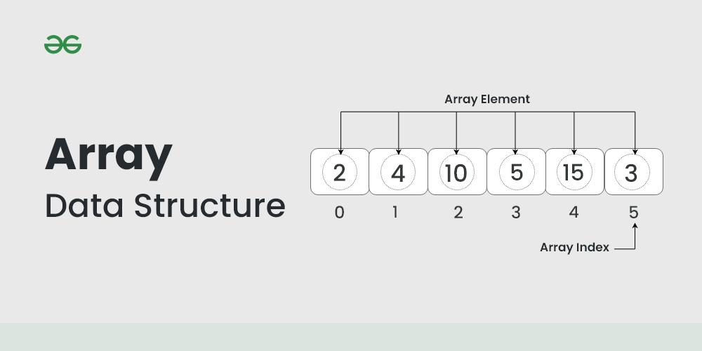
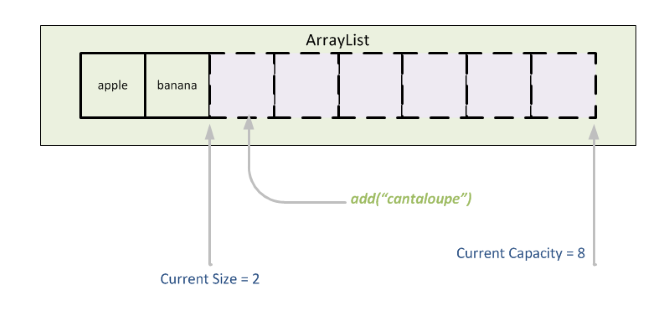

# 자료구조 개념 스터디

안녕하세요 김도겸입니다.  
자료구조의 기초 개념인 배열과 리스트를 공부하고 간단한 코드 예제로 구현해본 내용을 정리해보았습니다.  
( 예제는 JAVA를 활용하였습니다. )

<br>

**목차**

- **1. 배열 (Array)**
  - 개념
  - 장점 및 단점
  - 배열과 **배열 리스트 (ArrayList)**
  - 예제
- **2. 연결 리스트 (Linked List)**
  - 개념
  - 배열과 비교하기
  - **2-1. 단일 연결 리스트 (Singly Linked List)**
    - 예제
  - **2-2. 이중 연결 리스트 (Doubly Linked List)**
    - 개념
    - 특징
    - 예제
  - **2-3. 원형 연결 리스트 (Circular Linked List)**
    - 개념
    - 특징
    - 예제

<br><br>

## 1. 배열 (Array)

배열은 가장 기본적으로 먼저 배우는 자료구조로, 동일한 데이터 타입의 요소들을 고정된 크기를 가진 연속된 메모리 공간에 저장하는 **선형 자료구조**입니다.



배열은 만드는 순간부터 크기가 고정되고, 그 크기만큼의 연속된 메모리 주소를 할당받습니다.  
 배열은 구성하는 각각의 값을 <b>요소(element)</b>라 하고, 위치를 가리키는 0부터 시작하는 연속된 숫자는 <b>인덱스(index)</b>라고 합니다.  
 요소는 메모리 상에서 연속적으로 배치되어 있고, index를 활용하여 원하는 요소에 접근하고 탐색이 가능합니다.

  <br>

### 장점 및 단점

&nbsp; **장점**  
 &nbsp;&nbsp; 1. index를 이용하여 요소에 빨리 접근할 수 있어 검색 성능이 좋다.  
 &nbsp;&nbsp; 2. 참조를 위한 추가적인 메모리 할당이 필요하지 않다.  
 &nbsp;&nbsp; 3. 데이터의 크기가 확정적일 때 배열을 사용하는 것이 메모리나 처리속도 면에서 좋다.  
 &nbsp;&nbsp; 4. 연속된 메모리 공간에 존재하기 때문에 관리하기가 편하다.

&nbsp; **단점**  
 &nbsp;&nbsp; 1. 자료의 삽입과 삭제에 비효율적이다.  
 &nbsp;&nbsp; 2. 크기를 바꿀 수 없어 크기 초과 시 재할당이 필요하다.  
 &nbsp;&nbsp; 3. 메모리의 재사용이 불가능하다.

  <br>

### 배열과 배열 리스트(ArrayList)

앞서 설명드린 배열은 index를 활용한 빠른 접근이 유용하나, 크기를 바꿀 수 없는 것은 생각보다 제한이 많습니다.  
 특히 데이터의 삽입과 삭제가 자주 이루어지는 다양한 기능 개발 시에는 매우 비효율적으로 메모리를 할당해야 합니다.

이러한 단점을 일부 해결해주는 것이 바로 <b>배열 리스트(Array List)</b> 입니다.



배열 리스트는 메모리 상에 데이터가 비연속적으로 저장되며, 동적으로 크기를 조정하여 내부적으로 메모리를 재할당합니다.  
 배열과 같이 인덱스를 활용하여 검색 및 탐색이 쉬운 것이 장점이고 자동으로 크기가 조정되는 점이 장점이지만
내부구조에 따라 추가 메모리가 필요하고, 크기가 큰 데이터나 방대한 양의 삽입/삭제 작업의 경우 성능이 떨어진다는 단점이 있습니다.

> - 구현체가 존재하는 대표적인 언어는 JAVA와 C#이다.
> - js와 python 등의 언어는 array를 활용하면 동적 배열로 동작한다.

  <br>

### 예제

위에서 설명드린 배열과 배열 리스트를 간단히 구현한 예제입니다.
가장 기본이 되는 자료구조인 만큼 간단하게 사용 방법 정도를 예제로 들며 배열과 배열 리스트를 비교해보도록 하겠습니다.

```JAVA
public class ArrayTest {
    public static void main(String[] args) {
        // 배열 생성
        int[] numbers = new int[] {1, 2, 3, 4, 5};

        // 배열의 요소에 액세스
        int firstNum = numbers[0]; // 1
        int secondNum = numbers[1]; // 2

        System.out.println("first number: " + firstNum);
        System.out.println("second number: " + secondNum);

        // 배열의 요소에 값 할당
        numbers[2] = 8; // 2번째 인덱스의 값인 3이 8로 변경됨.

        // 반복문 활용으로 모든 값 참조
        for (int i = 0; i < numbers.length; i++) {
            int number = numbers[i];
            System.out.println(number);
        }


        int[] staticArray = {1, 2, 3, 4, 5};

        // 기존 정적 배열의 크기보다 1만큼 큰 배열 생성
        int[] extendedArray = Arrays.copyOf(staticArray, staticArray.length + 1);

        // 새로운 요소 추가
        extendedArray[staticArray.length] = 6;

        // 새로운 배열 출력
        System.out.println("확장된 정적 배열: " + Arrays.toString(extendedArray));
        // 확장된 정적 배열: [1, 2, 3, 4, 5, 6]


        // 삭제할 요소의 인덱스
        int indexToRemove = 2; // 3이라는 값을 삭제할 예정

        // 기존 정적 배열의 크기보다 1만큼 작은 배열 생성
        int[] reducedArray = new int[staticArray.length - 1];

        // 삭제할 요소 전까지의 요소들을 복사
        System.arraycopy(staticArray, 0, reducedArray, 0, indexToRemove);
        // 원본 배열인 staticArray의 0번째부터 indexToRemove - 1번째 요소까지를
        // 새로운 배열인 reducedArray의 0번째부터 indexToRemove - 1번째 위치에 복사

        // 삭제한 요소 이후의 요소들을 복사
        System.arraycopy(staticArray, indexToRemove + 1, reducedArray, indexToRemove, staticArray.length - indexToRemove - 1);
        // 원본 배열인 staticArray의 indexToRemove + 1번째부터 끝까지의 요소들을
        // 새로운 배열인 reducedArray의 indexToRemove번째부터 끝까지 위치에 복사합니다.

        // 새로운 배열 출력
        System.out.println("삭제된 정적 배열: " + Arrays.toString(reducedArray));
        // 삭제된 정적 배열: [1, 2, 4, 5]

    }
}

```

배열은 변수를 선언했을 때의 크기가 그대로 고정되고, 그 안의 데이터를 검색, 수정, 참조할 수 있습니다.
하지만 요소를 삭제하거나 삽입할 경우엔 새로운 배열에 기존 배열을 복사 하고 요소를 처리해주는 과정을 밟아야만 합니다.

```JAVA
import java.util.ArrayList;

public class ArrayListTest {
    public static void main(String[] args) {
        // 리스트 생성 (정수형)
        ArrayList<Integer> arrList = new ArrayList<Integer>();


        arrList.add(1);
        arrList.add(2);
        arrList.add(3);
        arrList.add(4);
        arrList.add(5);
        System.out.println("array list size: " + arrList.size()); // 삽입 후 길이 확인 => 5

        // 배열의 요소에 액세스
        int firstNum = arrList.get(0); // 1
        System.out.println("first number: " + firstNum);

        // 요소 삭제
        arrList.remove(3); // 3번째 인덱스의 값인 4 삭제

        System.out.println("array list size: " + arrList.size()); // 삭제 후 길이 확인 => 4

        // 배열의 요소에 값 할당
        arrList.set(2, 8); // 2번째 인덱스의 값인 3이 8로 변경됨.


        arrList.add(3, 9); // 3번째 인덱스 위치에 9 삽입.

        // 반복문 활용으로 모든 값 참조
        for (int i = 0; i < arrList.size(); i++) {
            int number = arrList.get(i);
            System.out.println(number);
        }
    }
}
```

배열 리스트는 변수를 선언한 이후에도 동적으로 크기가 할당되고, 배열에 비해 요소 삽입 및 요소 삭제도 쉽게 구현 가능합니다.

<br><br>

## 2. 연결 리스트 (Linked List)

### 연결 리스트란?

연결 리스트는 선형 자료구조의 하나로 데이터 요소를 연결된 노드(Node)로 표현하는 방식으로
물리적으로 각각의 데이터는 떨어져 저장되어 있지만 이를 화살표로 연결하여 데이터를 참조하고 관리하는 구조입니다.


연결 리스트는 헤드, 노드, 데이터, 포인터로 이루어져 있습니다.

> <b>헤드(Head)</b>: 연결리스트의 헤드는 연결리스트의 첫번째 노드 또는 첫번째 노드의 참조를 가리키는 포인터  
> <b>노드(Node)</b>: 데이터와 다음 노드를 가리키는 포인터로 구성되는 기본 구조  
> <b>포인터(Pointer)</b>: 연결 리스트의 다음 노드를 가리킴  
> <b>데이터(Data)</b>: 정보

각 노드는 포인터를 통해 다음 노드로 이동하며 접근할 수 있고, 삽입 및 삭제 시 요소를 이동할 필요 없이 주소를 업데이트하여 간단히 처리할 수 있습니다.

이러한 구조를 바탕으로 연결 리스트는 다양한 자료구조의 구현 방식으로 쓰이고 있습니다.

  <br>

### 배열과 비교하기

연결리스트는 배열과는 매우 대비되는 구조를 가지고 있습니다.  
 좀 더 이해하기 쉽도록 연결 리스트의 특징과 장단점을 배열과 비교해보도록 하겠습니다.


  <br>

**- 자료구조 형태 관점 -**

배열은 정적 자료구조로, 정한 크기만큼만 메모리를 할당받아 사용할 수 있습니다.  
 그렇기 때문에 해당 배열 크기 이상의 데이터는 저장할 수 없고, 요소의 수가 배열의 크기보다 적어도 할당된 배열의 크기는 변함이 없습니다.

연결리스트는 동적 자료구조로, 크기를 고정하지 않고 필요에 따라 메모리를 추가로 할당하거나 해제할 수 있습니다.  
 자유롭게 데이터의 삽입과 삭제가 가능하기 때문에 연결 리스트의 크기 또한 자유롭게 변동됩니다.

  <br>

**- 데이터 조회 성능 관점 -**

데이터 탐색 및 조회는 배열의 성능이 연결리스트보다 우세합니다.  
 배열은 연속된 메모리 주소를 할당받았기에 그에 맞게 순서에 따른 인덱스값이 각각의 요소마다 존재합니다.  
 이 인덱스값만 알게 된다면 다른 요소를 거쳐가지 않아도 바로 그 요소에 임의 접근이 가능합니다.

연결 리스트는 연속된 메모리 주소를 할당받지 않아 따로 따로 노드가 저장되어 있고,
이를 다음 데이터를 가리키는 포인터가 엮어주고 있습니다.  
 따라서 특정 데이터에 접근하기 위해서는 다음 데이터 주소를 따라 순차적으로 접근해야 합니다.

조회 성능의 경우엔 소량의 데이터를 접근하고 탐색하는 과정에선 크게 체감이 되진 않겠지만 방대한 양의 데이터를 다루게 되었을때는 성능 차이가 발생하게 됩니다.

  <br>

**- 데이터 삽입 및 삭제 성능 관점 -**

반대로 데이터의 삽입과 삭제는 배열보다 연결 리스트의 성능이 더 우세합니다.
배열은 연속된 형태의 크기가 고정된 형태이기 때문에 데이터를 삽입하거나 삭제를 해야하는 경우엔
해당 크기에 맞게 배열을 재할당하여 사용하여야 하기 때문에 매우 비효율적입니다.

하지만 연결리스트는 크기가 동적으로 할당되기 때문에 데이터를 삽입하거나 삭제하는 것이 매우 효율적으로 이루어집니다.

특별히 삽입과 삭제의 성능을 비교할 때에는 배열 리스트와도 비교할 수 있습니다.


배열과 달리 배열 리스트는 유동적으로 삽입/삭제가 이루어질 수는 있지만, 연결 리스트와는 성능을 비교하게 되면 여전히 연결 리스트가 우세합니다.

이유는 삽입과 삭제를 하는 과정과 방식에 차이가 있기 때문인데요.


배열 리스트에서 중간에 데이터를 삽입하거나 삭제를 하게된다면 나머지 뒤의 데이터의 위치를 계속 이동시켜주어야 합니다.
적은 수는 괜찮지만 빈번하게 삽입 삭제가 이루어지고, 양이 많을 수록 비효율적인 수행이 이루어집니다.


그에 반해 연결리스트는 서로 포인터로만 연결되어있을 뿐 배열리스트처럼 연속적으로 배치되어 있지 않습니다.  
 삽입과 삭제 시 그냥 포인터만 수정하여 데이터 간의 관계를 재연결시켜주면 됩니다.
빈번하게 삽입과 삭제가 이루어져도 문제없이 효율적으로 수행할 수 있습니다.

구현할 시스템의 기능이 어떤 역할을 하게 되는 지에 따라 성능 비교를 통해 적절하게 사용하는 것이 좋을 것 같습니다.

> 실무에서는 특별한 기능이 필요하지 않는 이상 배열 리스트를 주로 사용하고, 연결리스트의 경우엔 주로 다른 자료구조의 기반이 되어 다른 자료구조로 쓰이는 경우가 많습니다.

<br><br>

## 2-1. 단일 연결 리스트 (Singly Linked List)

단일 연결 리스트는 위에서 설명드린 연결 리스트를 그대로 구현한 기본 형태의 연결 리스트 구현체입니다.

기본적인 특징과 장단점은 위에서 설명드린 그대로이기 때문에 예제 코드로 넘어가보도록 하겠습니다.

  <br>

### 예제

**노드 구현**

```JAVA
  // Node 클래스 구현
  class sNode<E> {
      E data;
      sNode<E> next; // 다음 노드를 가리키는 참조변수 (포인터 역할)

      sNode(E data) {
          this.data = data;
          this.next = null;
      }

      public String toString() { // 노드의 내용 출력
          return String.valueOf(this.data);
      }
  }
```

가장 기본이 되는 Node 클래스를 구현합니다.

  <br>

**기본 구조 구현**

```JAVA
  class SLinkedList<E> {
      private sNode<E> head;
      private sNode<E> tail;
      private int size;;

      // 생성자
      public SLinkedList() {
          this.head = null;
          this.tail = null;
          this.size = 0;
      }
  }
```

연결리스트의 기본적인 구조입니다.  
 첫번째 노드와 마지막 노드를 가리키는 필드를 각각 head와 tail로 선언합니다.  
 이제 이 클래스에 기본 CRUD 기능을 구현해보겠습니다.

  <br>

**내부 메서드 구현**

```JAVA
  // 중간 노드 가져오기
  private sNode<E> getNode(int index) {
      sNode<E> x = head;
      for (int i = 0; i < index; i++)
          x = x.next;
      return x;
  }
```

CRUD 기능을 구현하기 전 중간 노드값을 가져오기 위해 사용할 getNode 메서드를 구현하였습니다.
for문으로 다음 노드를 계속 타고 들어가며 index 값에서 멈춰 해당 노드를 가져옵니다.

  <br>

**삽입 기능 구현**

```JAVA
  public void addFirst(E input) {
      Node newNode = new Node(input); // 노드 생성

      newNode.next = head; // 새로운 노드의 다음 노드로 헤드를 지정

      head = newNode; // head를 새로운 노드로 지정
      size++;

      if (head.next == null) {
          tail = head;
      }
  }

  public void addLast(E input) {
      Node newNode = new Node(input); // 노드 생성

      if (size == 0) { // 리스트의 노드가 없는 경우, 첫번째 노드로 추가하는 메소드 사용
          addFirst(input);
      } else {
          tail.next = newNode; // 마지막 노드의 다음 노드로 생성한 노드를 지정
          tail = newNode; // 마지막 노드를 갱신
          size++;
      }
  }

  public void add(int k, E input) {
      // k = 0이면 첫 번째 노드에 추가하는 것, addFirst 사용
      if (k == 0) {
          addFirst(input);
      } else {
          sNode<E> temp1 = getNode(k - 1); // k-1번째 노드를 temp1로 지정
          sNode<E> temp2 = temp1.next; // k번째 노드를 temp2로 지정

          sNode<E> newNode = new sNode<>(input);
          temp1.next = newNode; // temp1의 다음 노드로 새로운 노드를 지정
          newNode.next = temp2; // 새로운 노드 다음 노드로 temp2 지정
          size++;

          if (newNode.next == null){
              tail = newNode;
          } // 새로운 노드의 다음 노드가 없다면
          // 새로운 노드가 마지막 노드이기 때문에
      }
  }

  public void add(E input) {
      // 리스트의 노드가 없는 경우 addFirst, 존재할경우 addLast 메서드 사용
      if (size == 0) {
          addFirst(input);
      } else {
          addLast(input);
      }
  }
```

add, addFirst, addLast 기능을 구현하였습니다.

  <br>

**삭제 기능 구현**

```JAVA
  public Object removeFirst() {
      Node temp = head; // 첫번째 노드를 head로 지정
      head = temp.next; // head의 값을 두번째 노드로 변경

      Object returnData = temp.data; // 데이터 삭제 전 리턴할 값을 임시 변수에 담아둔다.
      temp = null;
      size--;
      return returnData;
  }

  public Object remove(int k) {
      if (k == 0) {
          return removeFirst();
      }

      Node temp = getNode(k - 1); // k-1번째 node를 temp의 값으로 지정

      Node todoDeleted = temp.next;
      // 삭제할 노드를 todoDeleted에 기록
      // 삭제 노드를 지금 제거하면 삭제 앞 노드와 삭제 뒤 노드를 연결할 수 없다.

      temp.next = temp.next.next;
      // 삭제 앞 노드의 다음 노드로 삭제 뒤 노드를 지정한다.

      Object returnData = todoDeleted.data;
      // 삭제된 데이터를 리턴하기 위해서 returnData에 저장한다.

      if (todoDeleted == tail) {
          tail = temp;
      }

      todoDeleted = null;
      size--;
      return returnData;
  }
```

removeFirst, removeLast, remove 기능을 구현하였습니다.

  <br>

**조회 기능 구현**

```JAVA
  public int size() {
      return size;
  }

  public Object get(int k) {
      Node temp = getNode(k);
      return temp.data;
  }


  public int indexOf(E data) {
      Node temp = head; // 탐색 대상이 되는 노드를 temp로 지정한다.
      int index = 0; // 탐색 대상의 엘리먼트

      while (temp.data != data) { // 탐색 값과 탐색 대상의 값을 비교
          temp = temp.next;
          index++;

          if (temp == null) { // 더 이상 탐색할 대상이 없다는 것
              return -1;
          }
      }

      return index;
  }
```

size, get, indexOf 기능을 구현하였습니다.

  <br>

**실행 코드**

```JAVA

  public class SinglyLinkedListTest {
      public static void main(String[] args) {
          SLinkedList<Integer> list = new SLinkedList<>();

          list.add(4); // 4
          list.addFirst(1); // 1-4
          list.addLast(2); // 1-4-2
          list.add(3); // 1-4-2-3
          list.add(3, 5); // 1-4-2-5-3
          list.set(3, 6); // 1-4-2-6-3
          list.removeFirst(); // 4-2-6-3
          list.remove(1); // 4-6-3

          System.out.println(list); // 4,6,3
          System.out.println(list.get(1)); // 6
          System.out.println(list.indexOf(6)); // 1
          System.out.println(list.size()); // 3

      }
  }

```

<br><br>

## 2-2. 이중 연결 리스트 (Doubly Linked List)

### 개념 및 특징

단일 연결 리스트는 데이터 탐색 시에 비효율적인 형태로 탐색하기 때문에 크기가 늘어나고, 양이 방대해질 수록 성능은 계속 떨어지게 될겁니다.  
 원인은 다음 노드를 가리키는 포인터만 존재하기 때문인데, 이를 해결하기 위해서 나온 것이 바로 이중 연결 리스트입니다.


이중 연결 리스트는 단일 연결 리스트에다 **이전 노드를 가리키는 포인터**를 추가한 구조입니다.  
 이전 노드를 가리키는 포인터가 있다는 것은 **단일 연결 리스트의 조회 방식을 절반으로 나눠서 할 수 있다는 것**을 의미합니다.  
 찾고자 하는 노드를 이전 노드를 가리키는 포인터를 활용하여 탐색하거나, 다음 노드를 가리키는 포인터를 활용하여 탐색할 수 있습니다.

> 하지만 이 구조 또한 여전히 순환 참조가 필요하기 때문에 인덱스를 가지고 임의 접근이 가능한 배열보다는 성능이 좋지 않습니다.

  <br>

### 예제

**노드 구현**

```JAVA
  // Node 클래스 구현
  class sNode<E> {
      E data;
      sNode<E> next; // 다음 노드를 가리키는 참조변수 (포인터 역할)

      sNode(E data) {
          this.data = data;
          this.next = null;
      }

      public String toString() { // 노드의 내용 출력
          return String.valueOf(this.data);
      }
  }
```

가장 기본이 되는 Node 클래스를 구현합니다.

  <br>

**기본 구조 구현**

```JAVA
  class SLinkedList<E> {
      private sNode<E> head;
      private sNode<E> tail;
      private int size;;

      // 생성자
      public SLinkedList() {
          this.head = null;
          this.tail = null;
          this.size = 0;
      }
  }
```

연결리스트의 기본적인 구조입니다.  
 첫번째 노드와 마지막 노드를 가리키는 필드를 각각 head와 tail로 선언합니다.  
 이제 이 클래스에 기본 CRUD 기능을 구현해보겠습니다.

  <br>

**내부 메서드 구현**

```JAVA
  // 중간 노드 가져오기
  private dNode<E> getNode(int index) {


      if (index < size / 2) {
          dNode<E> x = head;
          for (int i = 0; i < index; i++) {
              x = x.next;
          }
          return x;
      } else {
          dNode<E> x = tail;
          for (int i = size - 1; i > index; i--) {
              x = x.prev;
          }
          return x;
      }
  }
```

찾고자하는 데이터의 index값을 size의 절반값고 비교하여 작다면 맨 처음을 시작으로 인덱스값까지 다음 노드를 반복 참조하도록, 크다면 맨 끝을 시작으로 인덱스값까지 이전 노드를 참조하도록 구현하였습니다.

  <br>

**삽입 기능 구현**

```JAVA
  public void addFirst(E input) {
      dNode<E> newNode = new dNode<>(input); // 노드 생성

      newNode.next = head; // 새로운 노드의 다음 노드로 헤드를 지정

      if (head != null) {
          head.prev = newNode; // 기존에 노드가 있었다면 현재 헤드의 이전 노드로 새로운 노드를 지정
      }

      head = newNode; // head를 새로운 노드로 지정
      size++;

      if (head.next == null) {
          tail = head;
      }
  }

  public void addLast(E input) {
      dNode<E> newNode = new dNode<>(input); // 노드 생성

      if (size == 0) { // 리스트의 노드가 없는 경우, 첫번째 노드로 추가하는 메소드 사용
          addFirst(input);
      } else {
          tail.next = newNode; // 마지막 노드의 다음 노드로 생성한 노드를 지정
          newNode.prev = tail; // 새로운 노드의 이전 노드를 tail로 지정

          tail = newNode; // 마지막 노드를 갱신
          size++;
      }
  }

  public void add(int k, E input) {
      // k = 0이면 첫 번째 노드에 추가하는 것, addFirst 사용
      if (k == 0) {
          addFirst(input);
      } else {
          dNode<E> temp1 = getNode(k - 1); // k-1번째 노드를 temp1로 지정
          dNode<E> temp2 = temp1.next; // k번째 노드를 temp2로 지정

          dNode<E> newNode = new dNode<>(input);

          temp1.next = newNode; // temp1의 다음 노드로 새로운 노드를 지정
          newNode.next = temp2; // 새로운 노드 다음 노드로 temp2 지정

          if (temp2 != null) {
              temp2.prev = newNode;
          }

          newNode.prev = temp1;

          size++;

          if (newNode.next == null) {
              tail = newNode;
          }

          // 새로운 노드의 다음 노드가 없다면
          // 새로운 노드가 마지막 노드이기 때문에
      }
  }

  public void add(E input) {
      // 리스트의 노드가 없는 경우 addFirst, 존재할경우 addLast 메서드 사용
      if (size == 0) {
          addFirst(input);
      } else {
          addLast(input);
      }
  }

  public void set(int k, E data) {
      dNode<E> modifyNode = getNode(k);
      modifyNode.data = data;
  }
```

add, addFirst, addLast 기능을 구현하였습니다.  
 기존 단일 연결 리스트 구현 코드에서 prev를 이어주는 코드를 추가했습니다.

  <br>

**삭제 기능 구현**

```JAVA
  public E removeFirst() {
      dNode<E> temp = head; // 첫번째 노드를 head로 지정
      head = temp.next; // head의 값을 두번째 노드로 변경

      E returnData = temp.data; // 데이터 삭제 전 리턴할 값을 임시 변수에 담아둔다.
      temp = null;

      // 리스트 내에 노드가 있다면 head의 이전 노드를 null로 지정
      if (head != null) {
          head.prev = null;
      }

      size--;
      return returnData;
  }

  public E remove(int k) {
      if (k == 0) {
          return removeFirst();
      }

      dNode<E> temp = getNode(k - 1); // k-1번째 node를 temp의 값으로 지정

      dNode<E> todoDeleted = temp.next;
      // 삭제할 노드를 todoDeleted에 기록
      // 삭제 노드를 지금 제거하면 삭제 앞 노드와 삭제 뒤 노드를 연결할 수 없다.

      temp.next = temp.next.next;
      // 삭제 앞 노드의 다음 노드로 삭제 뒤 노드를 지정한다.

      if (temp.next != null) {
          // 삭제할 노드의 전후 노드를 연결
          temp.next.prev = temp;
      }

      E returnData = todoDeleted.data;
      // 삭제된 데이터를 리턴하기 위해서 returnData에 저장한다.

      if (todoDeleted == tail) {
          tail = temp;
      }

      todoDeleted = null;
      size--;
      return returnData;
  }

  public E removeLast() {
      return remove(size - 1);
  }
```

removeFirst, removeLast, remove 기능을 구현하였습니다.  
 삽입과 동일하게 기존 단일 연결 리스트 구현 코드에서 prev를 이어주는 코드를 추가했습니다.

  <br>

**조회 기능 구현**

```JAVA
  public int size() {
      return size;
  }

  public E get(int k) {
      dNode<E> temp = getNode(k);
      return temp.data;
  }


  public int indexOf(E data) {
      dNode<E> temp = head; // 탐색 대상이 되는 노드를 temp로 지정한다.
      int index = 0; // 탐색 대상의 엘리먼트

      while (temp.data != data) { // 탐색 값과 탐색 대상의 값을 비교
          temp = temp.next;
          index++;

          if (temp == null) { // 더 이상 탐색할 대상이 없다는 것
              return -1;
          }
      }

      return index;
  }
```

size, get, indexOf 기능을 구현하였습니다. (단일 연결리스트와 동일 )

  <br>

**실행 코드**

```JAVA

  public class DoublyLinkedListTest {
      public static void main(String[] args) {
          // 타입설정 int 타입만 적재 가능
          DLinkedList<String> dList = new DLinkedList<String>();

          dList.add("A"); // A
          dList.addFirst("B"); // A-B
          dList.addLast("C"); // A-B-C
          dList.add("D"); // A-B-C-D
          dList.add(3, "E"); // A-B-C-E-D
          dList.set(2, "F"); // A-B-F-E-D
          dList.removeFirst(); // B-F-E-D
          dList.remove(1); // B-E-D

          System.out.println(dList); // [A,E,D]
          System.out.println(dList.size()); // 3
          System.out.println(dList.get(1)); // E
          System.out.println(dList.indexOf("E")); // 1
      }
  }
```

<br><br>

## 2-3. 원형 연결 리스트 (Circular Linked List)

### 개념 및 특징

**원형 연결 리스트**는 모든 노드가 원으로 연결되어 있는 리스트로, 기존 연결 리스트의 첫번째 노드와 마지막 노드가 서로 연결되어 원을 형성하여 **포인터에 Null 값이 존재하지 않는 리스트**를 의미합니다.


**원형 단일 연결 리스트**일 경우에는 마지막 노드에 다음 노드를 가리키는 포인터가 첫번째 노드를 가리키는 구조로 이루어지고, **원형 이중 연결 리스트**일 경우에는 첫번째 노드에 이전 노드를 가리키는 포인터가 마지막 노드를, 마지막 노드에 다음 노드를 가리키는 포인터가 첫번째 노드를 가리키는 구조로 이루어집니다.  
 이러한 구조는 끝에서 다시 처음으로 이동 가능하기 때문에 고정된 순환 구조인 큐나 버퍼 구현에 유용하지만, 원형 구조를 유지하는 코드를 추가해야 하고, 무한 루프를 돌며 잘못된 탐색을 하지 않도록 주의해야한다는 점이 있습니다.

> 대표적인 예로는 미디어 플레이어의 플레이 리스트 반복재생 기능 등이 있습니다.

### 예제

예제는 원형 이중 연결 리스트를 기준으로 구현해보았습니다.  
 위 이중 연결 리스트 코드와 동일한 코드이기 때문에 수정된 부분들만 보여드리도록 하겠습니다.

```JAVA
public void addFirst(E input) {
    cNode<E> newNode = new cNode<>(input); // 노드 생성

    newNode.next = head; // 새로운 노드의 다음 노드로 헤드를 지정

    if (head != null) {
        head.prev = newNode; // 기존에 노드가 있었다면 현재 헤드의 이전 노드로 새로운 노드를 지정
    }

    head = newNode; // head를 새로운 노드로 지정
    head.prev = tail; // 갱신한 새로운 노드의 이전 노드를 tail로 지정

    size++;

    if (head.next == null) {
        tail = head;
    }

}

public void addLast(E input) {
    cNode<E> newNode = new cNode<>(input); // 노드 생성

    if (size == 0) { // 리스트의 노드가 없는 경우, 첫번째 노드로 추가하는 메소드 사용
        addFirst(input);
    } else {
        tail.next = newNode; // 마지막 노드의 다음 노드로 생성한 노드를 지정
        newNode.prev = tail; // 새로운 노드의 이전 노드를 tail로 지정

        tail = newNode; // 마지막 노드를 갱신
        tail.next = head; // 갱신한 마지막 노드의 다음 노드를 head로 지정

        size++;
    }
}
```

addFirst 메서드와 addLast 메서드를 수정하였습니다.  
 addFirst의 경우, 첫 노드 갱신 시 이전 노드로 마지막 노드를 지정해주도록 변경했고,  
 addLast의 경우, 마지막 노드 갱신 시 다음 노드로 첫 노드를 지정해주도록 변경하였습니다.

**삭제**

```JAVA
  public E removeFirst() {
      cNode<E> temp = head; // 첫번째 노드를 head로 지정
      head = temp.next; // head의 값을 두번째 노드로 변경

      E returnData = temp.data; // 데이터 삭제 전 리턴할 값을 임시 변수에 담아둔다.
      temp = null;

      // 리스트 내에 노드가 있다면 head의 이전 노드를 tail로 지정
      if (head != null) {
          head.prev = tail;
      }

      size--;
      return returnData;
  }
```

removeFirst 코드를 변경하였습니다.  
 리스트 내에 노드가 있다면 head의 이전 노드를 마지막 노드로 지정해주도록 변경하였습니다.

**_조회_**

```JAVA
public int indexOf(E data) {
      cNode<E> temp = head; // 탐색 대상이 되는 노드를 temp로 지정한다.
      int index = 0; // 탐색 대상의 엘리먼트

      // 탐색 값과 탐색 대상의 값을 비교
      for (int i = 0; i < size; i++) {
          if (temp.data != data) {
              temp = temp.next;
              index++;
          }
      }

      return index < size ? index : -1;
  }
```

indexOf 코드를 수정하였습니다.  
 while문으로 첫 노드부터 다음 노드가 null일 때까지 반복했던 코드를 for문으로 변경하였습니다.

<br><br>

배열과 배열 리스트, 연결리스트의 기본적인 구조, 개념, 구현 방식에 대해 알아보았습니다.  
 첫 번째 스터디 자료로써 가장 기본이 되고 추후 배울 다양한 자료구조에 있어 매우 필요한 개념을 기초부터 다시 배워 자료를 만드는 시간을 보낸 것 같아 뜻깊었습니다.

감사합니다.
