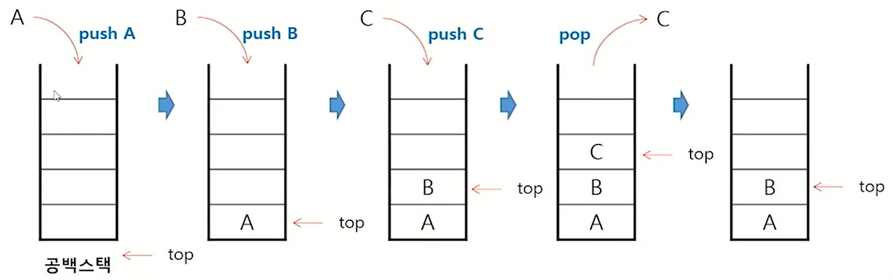
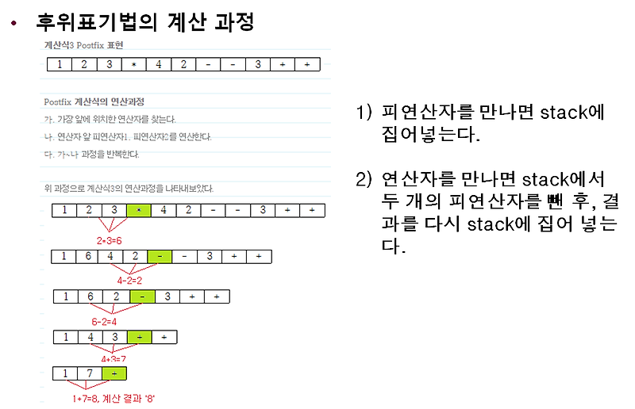
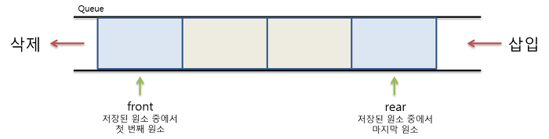
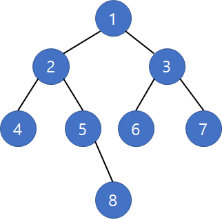

# 자료구조 개념 스터디

안녕하세요 김도겸입니다.  
이번 달 스터디는 스택과 큐를 공부하고 간단한 코드 예제로 구현해본 내용을 정리해보았습니다.

<br>

**목차**

- **1. 스택 (Stack)**
  - 개념 및 특징
  - 장점 및 단점
  - 예제
- **2. 큐 (Queue)**
  - 개념
  - 장점 및 단점
  - 예제

<br><br>

## 1. 스택 (Stack)

### 개념 및 특징

프로그래밍뿐만 아니라 게임 등의 다양한 분야에서 스택이라는 단어를 많이 들어보셨을 겁니다.


**Stack**의 사전적의미는 쌓아 올린다는 것을 의미하기 때문에 <b>데이터를 하나씩 차곡차곡 쌓아 올린 형태의 자료구조</b>를 말합니다.

스택은 같은 구조와 크기의 자료를 정해진 방향으로만 쌓을 수 있습니다.  
 스택에서의 값의 위치는 top의 위치가 결정하고, 최초의 top 위치는 -1입니다.
즉, -1이면 스택이 비어 있다는 뜻이고, 삽입될 때마다 1씩 증가합니다.  
 top을 통해 삽입하는 연산을 <b>push</b>, 삭제하는 연산을 <b>pop</b>이라고 합니다.



연산을 진행하게 되면 시간 순서에 따라 자료가 쌓여서 **_가장 마지막에 삽입된 자료가 가장 먼저 삭제된다._** 는 구조적 특징을 가지게 되고, 이러한 구조를 <b>후입선출(LIFO, Last-In-First-Out) 구조</b> 라고 합니다.

이러한 구조적 특징을 가진 스택을 활용하면 아래와 같은 분야에서 활용 가능합니다.

- 웹 브라우저 방문기록  
  방문한 순서대로 기록이 쌓이고 뒤로가기 버튼을 클릭할 경우 가장 나중에 열린 페이지부터 다시 보여줌.

- 실행 취소 (undo)  
  코딩, 문서화 작업 시 특정 행위를 하면 행위별로 쌓이고 실행취소를 통해 되돌아감.

- 재귀적 알고리즘  
  자기 자신을 계속 호출하는 재귀 알고리즘을 사용할때 계속 호출을 전달하여 쌓아놓고 종료 조건에 다다를 때 값을 반환한다.

- 후위 표기법 계산  
   흔히 사용하는 중위 표기법이 아닌 후위 표기법 연산 시 스택을 활용하여 연산한다.

  <br>

  > <br>
  > <b> 후위표기법 연산 과정 </b> <br>
  > <br>
  >  <br>
  > <br>

<br>

### 장점 및 단점

&nbsp; **장점**  
 &nbsp;&nbsp; 1. 구조가 단순해서 구현이 쉽다.  
 &nbsp;&nbsp; 2. 데이터 저장/읽기 속도가 빠르다.  
 &nbsp;&nbsp; 3. 백트래킹, 재귀적 문제 해결에 유용하다.

&nbsp; **단점**  
 &nbsp;&nbsp; 1. 한 번에 하나의 데이터만 처리 가능하다.  
 &nbsp;&nbsp; 2. 비효율적인 검색 과정을 거쳐야 한다.  
 &nbsp;&nbsp; 3. 단일 방향으로만 접근 가능하다.

<br>

### 예제

JAVA에는 stack이 구현된 구현체가 있지만 구조를 이해해보기 위해 두가지 방법으로 직접 구현해보도록 하겠습니다.

#### 배열로 구현해보기

```JAVA
class ArrayStack<T> {
    int top; // 인덱스
    int size; // 스택 배열의 크기
    Object[] stack;

    public ArrayStack(int size) {
        this.size = size;
        stack = new Object[size];
        top = -1;
    }

    public void push(T item) {
        stack[++top] = item;
    }

    public Object pop() {
        Object pop = stack[top];
        stack[top--] = null;

        return pop;
    }

    public Object peek() {
        return stack[top];

    }

    public int size() {
        int itemSize = top + 1;

        return itemSize;
    }
}


public class ArrayStackTest {
    public static void main(String[] args) {
        ArrayStack<Integer> arrStack = new ArrayStack<Integer>(5); // 크기가 5인 정수형 스택 선언

        arrStack.push(1);
        arrStack.push(2);
        arrStack.push(3);
        arrStack.push(4);
        arrStack.push(5);


        System.out.println(arrStack.pop() + " Pop!");
        System.out.println(arrStack.peek() + " Peek!");
        System.out.println(arrStack.pop() + " Pop!");
        System.out.println(arrStack.pop() + " Pop!");

        System.out.println("stack item size : " + arrStack.size());
    }
}

```

#### 연결리스트로 구현해보기

```JAVA
class Node<T> {
    private T item;
    private Node<T> node;

    public Node(T item) {
        this.item = item;
        this.node = null;
    }

    protected void linkNode(Node<T> node) {// 가르킬 노드를 지정
        this.node = node;
    }

    protected T getData() {
        return this.item;
    }

    protected Node<T> getNextNode() { // 다음 노드를 리턴
        return this.node;
    }
}


// LinkedListStack을 관리하는 클래스
class StackNodeManager<T> {
    Node<T> top; // 가장 최근에 들어온 노드를 가리킴
    int size = 0;

    public StackNodeManager() {
        this.top = null;
    }

    public void push(T data) {
        Node<T> node = new Node<T>(data); // 노드를 생성
        node.linkNode(top); // 새로 생성된 노드가 top이 가르키고 있는 노드를 링크로 연결하게 함
        top = node; // top의 값을 가장 최근에 생성된 node로 바꿈
        size++;
    }

    public T pop() {
        T data = top.getData();
        top = top.getNextNode(); // 현재 top이 가리키고 있는 노드를 가리키게 함
        size--;
        return data;
    }

    public T peek() {
        return top.getData();
    }


    public int size() {
        return size;
    }
}


public class LinkedListStackTest {
    public static void main(String[] args) {
        StackNodeManager<Integer> linkedListStack = new StackNodeManager<Integer>();

        linkedListStack.push(1);
        linkedListStack.push(2);
        linkedListStack.push(3);
        linkedListStack.push(4);
        linkedListStack.push(5);

        System.out.println(linkedListStack.pop() + " Pop!");
        System.out.println(linkedListStack.pop() + " Pop!");
        System.out.println(linkedListStack.pop() + " Pop!");

        System.out.println(linkedListStack.peek() + " Peek!");

        System.out.println("stack item size : " + linkedListStack.size());
    }
}

```

<br>

## 2. 큐 (Queue)

### 개념 및 특징


**Queue**의 사전적 의미는 줄을 서서 기다리는 것을 의미합니다.  
 스택이 쌓아놓은 블럭같다면 큐는 입구와 출구가 있는 통로같은 형태를 가지고 있는데,
이와 같이 <b>데이터를 하나하나씩 순서대로 줄을 세우고 차례대로 빠지는 형태의 자료구조</b>를 말합니다.

큐는 스택과 달리 한쪽 끝에서 삽입 작업이, 다른 쪽 끝에서 삭제 작업이 양쪽으로 이루어집니다.
이때 삭제연산만 수행하는 곳을 <b>front</b>, 삽입 연산만 이루어지는 곳을
<b>rear</b>로 정하여 각각의 연산작업만이 수행됨으로써 rear에서 이루어지는 삽입연산을 <b>인큐(enQueue)</b>, 프론트에서 이루어지는 삭제연산을 <b>디큐(dnQueue)</b>라고 부릅니다.  
 접근 방법은 가장 첫 원소와 끝 원소로만 가능하고 가장 먼저 들어온 front 원소가 가장 먼저 삭제됩니다.



연산을 진행하게 되면 **_먼저 삽입된 자료가 가장 먼저 삭제된다._**는 구조적 특징을 가지게 되고, 이러한 구조를 <b>선입선출(FIFO, First-In-First-Out) 구조</b>라고 합니다.

이러한 구조적 특징을 가진 큐는 아래와 같은 분야에서 활용 가능합니다.

- 대기번호표 시스템  
  은행, 음식점, 공공기관, 공연 등 일상생활 속 다양한 분야에서 흔히 볼 수 있는 대기번호표 시스템이 큐의 대표적인 활용 분야입니다.

- 프로세스 관리  
  CPU를 사용하기 위해 대기하는 프로세스는 큐에 저장되며, 우선 순위에 따라 처리 순서가 결정됩니다.

- 캐시(Cache) 구현  
  데이터의 연산 및 저장 시 버퍼에 데이터를 저장하고 버퍼에 들어온 task 순서대로 처리를 진행합니다.

- 너비 우선 탐색  
  그래프 탐색 알고리즘인 너비 우선 탐색을 구현할 때에 큐 자료구조가 사용됩니다.

  > <br>
  > <b> 너비우선탐색 </b> <br>
  > <br>
  > 너비우선 탐색은 맹목적 탐색방법중 하나로 시작 정점을 기반으로 인접한 모든 정점들을 우선 방문하는 방식으로 더 이상 방문하지 않은 정점이 없을때까지 반복 탐색하는 방식입니다. <br>
  > <br>
  >  <br>
  > 위 이미지와 같은 구조의 그래프를 너비우선탐색으로 탐색한다고 했을때, 큐로 구현하게 될 경우엔 아래와 같은 과정을 가집니다. <br>

  > 1. 시작점인 1을 큐에 삽입한다. <br>
  > 2. 그리고 1을 제거한 후 1과 연결된 2,3을 큐에 삽입한다. <br>
  > 3. 2를 제거해주고 2와 연결된 4,5를 큐에 삽입한다. <br>
  > 4. 3을 제거해주고 3과 연결된 6,7을 큐에 삽입한다. <br>
  > 5. 4를 제거 후 5를 제거하면서 5와 연결된 8을 큐에 삽입한다.
  > 6. 그리고 6,7,8 순서로 제거한다. <br>
  >    (제거를 한다는 것은 해당 정점에 연결된 정점이 있는 지 탐색후 제외한다는 것을 의미함.)
  >
  > <br>

<br>

### 장점 및 단점

&nbsp; **장점**  
 &nbsp;&nbsp; 1. 구조가 단순해서 구현이 쉽다.  
 &nbsp;&nbsp; 2. 데이터 접근, 삽입, 삭제가 빠르다.  
 &nbsp;&nbsp; 3. 순서 처리 및 비동기 처리 시 유용하다.

&nbsp; **단점**  
 &nbsp;&nbsp; 1. 삽입, 삭제를 계속할 경우 메모리 낭비가 발생한다.  
 &nbsp;&nbsp; 2. 비효율적인 검색 과정을 거쳐야 한다.  
 &nbsp;&nbsp; 3. 한 번에 하나의 데이터만 처리 가능하다.

<br>

### 예제

Queue도 마찬가지로 JAVA에는 구현체가 있지만 Stack과 동일하게 직접 구현해보도록 하겠습니다. (편의상 enqueue, Dequeue대신 push와 pop으로 구현하였습니다. )

#### 배열로 구현해보기

```JAVA

class ArrayQueue<T> {
    int MAX = 6;
    int front; // 머리 쪽에 위치할 index값, pop할때 참조하는 index
    int rear; // 꼬리 쪽에 위치할 index값, push할때 참조하는 index
    Object[] queue;

    public ArrayQueue() {
        front = rear = 0; // 초기값 0
        queue = new Object[MAX]; // 배열 생성
    }

    public boolean queueisEmpty() { // queue에 아무것도 들어있지 않은지 판단하는 함수
        return front == rear;
    }

    public boolean queueisFull() { // queue가 가득 차 공간이 없는지 판단하는 함수
        if (rear == MAX - 1) {
            return true;
        } else
            return false;
    }

    public int size() { // queue에 현재 들어가 있는 데이터의 개수를 return
        return rear - front;
    }

    public void push(T value) {
        if (queueisFull()) {
            System.out.println("Queue is Full");
            return;
        }
        queue[rear++] = value; // rear가 위치한 곳에 값을 넣어주고 rear를 증가시킨다.
    }

    public Object pop() {
        if (queueisEmpty()) {
            System.out.println("Queue is Empty");
            return -1;
        }
        Object popValue = queue[front++];
        return popValue;
    }

    public Object peek() {
        if (queueisEmpty()) {
            System.out.println("Queue is Empty");
            return -1;
        }
        Object popValue = queue[front];
        return popValue;
    }
}


public class ArrayQueueTest {
    public static void main(String[] args) {
        ArrayQueue<Integer> arrQueue = new ArrayQueue<Integer>();

        arrQueue.push(1);
        arrQueue.push(2);
        arrQueue.push(3);
        arrQueue.push(4);
        arrQueue.push(5);

        System.out.println("queue isFull : " + arrQueue.queueisFull());

        System.out.println(arrQueue.pop() + " Pop!");
        System.out.println(arrQueue.pop() + " Pop!");
        System.out.println(arrQueue.pop() + " Pop!");

        System.out.println(arrQueue.peek() + " Peek!");

        System.out.println(arrQueue.pop() + " Pop!");
        System.out.println(arrQueue.pop() + " Pop!");

        System.out.println("queue item size : " + arrQueue.size());
        System.out.println("queue isEmpty : " + arrQueue.queueisEmpty());
    }
}

```

#### 연결리스트로 구현해보기

```JAVA
class QueueNode<T> {
    T value; // 값을 넣음
    QueueNode<T> queueNode; // 다음 노드를 가리킴

    public QueueNode(T value) {
        this.value = value;
        queueNode = null;
    }

    public T getValue() {
        return value;
    }

    public QueueNode<T> getNextNode() {
        return queueNode;
    }

    public void setNextNode(QueueNode<T> queueNode) {
        this.queueNode = queueNode;
    }
}


class QueueNodeManager<T> { // 큐의 기능을 만들 클래스
    QueueNode<T> front, rear;

    public QueueNodeManager() {
        front = rear = null;
    }

    public boolean queueIsEmpty() {
        if (front == null && rear == null) {
            return true;
        } else {
            return false;
        }
    }

    public void push(T value) {
        QueueNode<T> queueNode = new QueueNode<T>(value);
        if (queueIsEmpty()) { // 큐안에 데이터가 없으면 첫번째 Node에 front와 rear를 연결
            front = rear = queueNode;
        } else {
            front.setNextNode(queueNode); // 큐 안에 데이터가 있으면 front를 다음 노드에 연결 후 front의 값을 마지막 노드로 삽입
            front = queueNode;
        }
    }

    public T pop() {
        if (queueIsEmpty()) {
            System.out.println("Queue is Empty");
            return null;
        } else {
            QueueNode<T> popNode = rear;
            rear = rear.getNextNode();
            return popNode.getValue();
        }
    }

    public T peek() {
        if (queueIsEmpty()) {
            System.out.println("Queue is Empty");
            return null;
        } else {
            return rear.getValue();
        }
    }

    public int size() {
        QueueNode<T> front2 = front;
        QueueNode<T> rear2 = rear;
        int count = 0;
        while (front2 != rear2 && rear2 != null) { // 큐가 비어있는 경우가 있을수도 있을때도 생각해야함
            count++;
            rear2 = rear2.getNextNode();
        }

        // 마지막 큐 개수까지 계산해야함
        if (front2 == rear2) {
            count++;
        }

        return count;
    }
}


public class LinkedListQueueTest {
    public static void main(String[] args) {
        QueueNodeManager<Integer> linkedListQueue = new QueueNodeManager<Integer>();

        linkedListQueue.push(1);
        linkedListQueue.push(2);
        linkedListQueue.push(3);
        linkedListQueue.push(4);
        linkedListQueue.push(5);

        System.out.println("queue item size : " + linkedListQueue.size());

        System.out.println(linkedListQueue.pop() + " Pop!");
        System.out.println(linkedListQueue.pop() + " Pop!");
        System.out.println(linkedListQueue.pop() + " Pop!");

        System.out.println(linkedListQueue.peek() + " Peek!");

        System.out.println("queue item size : " + linkedListQueue.size());
    }
}

```

<br>

## 두 가지로 구현해본 이유

스택과 큐를 배열과 연결리스트를 사용하여 구현해보았습니다.  
비교적 구조가 쉽고 간단해 구현해보는게 어렵진 않았는데요.  
구현 난이도가 낮아 두가지 방식으로 구현해본 것도 있지만 다른 이유가 몇 가지 있습니다.

배열을 사용하여 구현한 방식의 주요 특징은 **접근이 빠르다는 것과 구현이 쉽다**는 것입니다.
인덱스를 기반으로 접근하는 것이기 때문에 연결리스트로 구현한 방식보다 효율적이고 빠르게 접근이 가능하고, 코드 자체가 짧고 인덱스 값만 제대로 구하면 쉽게 구현이 가능하고 코드가 매우 직관적입니다.

반대로 연결리스트로 구현한 방식의 주요 특징은 **유연하다**는 것입니다.
노드와 포인터로 이루어져 있기 때문에 포인터 연결만 제대로 해주면 비연속적인 메모리 공간을 할당받기 때문에 매우 유연하게 구조 변경이 가능하고 동적인 크기를 가질 수 있습니다.

<br>

스택, 큐의 기본적인 구조, 개념, 구현 방식에 대해 알아보았습니다.  
자료구조의 기본이자 기틀이 되는 개념이기 때문에 심화적인 개념을 공부하기 전 간단히 리마인딩해보시면 좋을 것 같습니다.

감사합니다.
