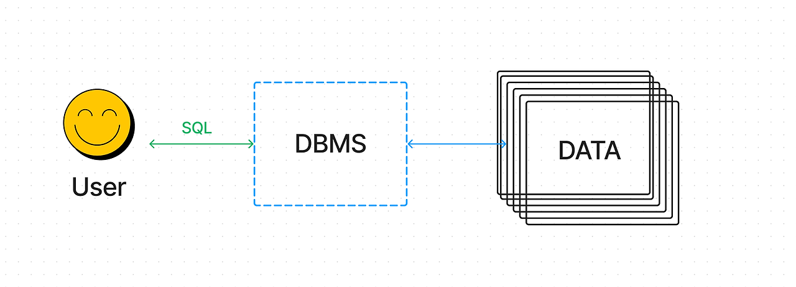
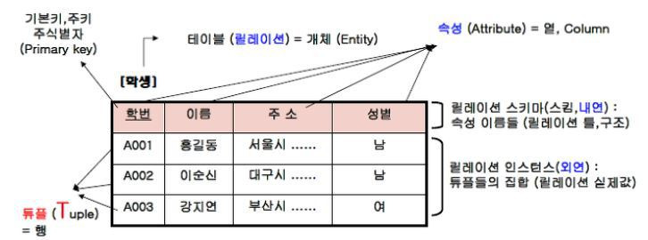

# RDBMS 스터디

안녕하세요 김도겸입니다.  
매월 2주차 스터디는 RDBMS로 주제를 선정하여 기본부터 차근차근 밟아나가보며 서버개발의 기반이 되는 데이터베이스 상식을 쌓아보려고 합니다.  
이번 주차에는 RDBMS의 기초 개념들과 간단한 용어 정리 등을 진행해보도록 하겠습니다.

<br>

## 데이터(Data)와 데이터베이스(Database)

시작하기 전에 가장 기반이 되는 개념인 <b>데이터</b>와 <b>데이터베이스</b>를 리마인드해보겠습니다.



<b>데이터</b>는 이론을 세우는데 기초가 되는 사실·자료이자 프로그램에서 운용될 수 있도록 기호화·숫자화된 자료들을 의미합니다.  
저희가 사용하는 모든 시스템에 있는 각종 자료들과 정보를 모두 데이터라고 할 수 있는 것입니다.

이러한 데이터를 얻고 저장하여 시스템과 사용자들이 공용할 목적으로 통합하기 위해 하나의 집합을 만들어 놓은 것이 바로 <b>데이터베이스</b>입니다.

데이터베이스가 만들어졌다면 우리는 이를 운영하고 관리하여야 합니다.
데이터는 계속 수정되어야 하고 필요에 따라 구조변경이 이루어져야 하기 때문이죠.  
이를 효율적으로 수행하기 위해 만들어진 시스템을 <b>DBMS</b>라고 합니다.

<br>

## RDB(Relational Database)와 RDBMS (Relational Database Management System)

위에서 기본적인 개념을 설명드렸으니 이제 본 주제로 넘어가보겠습니다.


<b>관계형 데이터베이스(RDB)</b>는 이 <b>관계형 데이터 모델에 기초를 둔 데이터베이스</b>를 의미합니다.

데이터의 관계를 조작 언어를 활용하여 구조를 변경할 수 있으며, 데이터의 독립성이 높고, 고수준의 데이터 조작언어를 사용하여 결합, 제약, 투영 등의 관계 조작에 의해 비약적으로 표현능력을 높일 수 있습니다.

<b>RDBMS</b>는 관계형 데이터베이스를 생성하고 수정하고 관리할 수 있는 소프트웨어를 말하며, <b>SQL(Structured Query Language)</b>을 사용하여 데이터베이스와 소통하며, 데이터의 무결성, 보안, 백업 등을 전체적으로 관리합니다.

> **관계형 데이터 모델**이란 데이터를 구성하는 방식 중 하나로, 모든 데이터를 **2차원의 테이블 형태**로 표현해주는 방식으로 데이터 간의 상관관계를 개체간의 관계를 표현한 것을 말합니다.

<br>

### 주요 특징

1. 모든 데이터를 2차원 테이블로 표현한다.
2. 테이블 row와 column으로 이루어진 기본 데이터 저장단위이다.
3. 상호 관련성을 가진 테이블의 집합이다.
4. 확장에 용이하다.
5. 설계도인 ERD를 작성함에 따라 DB를 만들고 이는 하나 이상의 테이블로 구성된다.

<br>

### 기본 구조

<br>



테이블(릴레이션) 은 위 사진과 같이 표같은 형태로 구성됩니다.  
흔히 쓰이는 엑셀의 시트처럼 구성되어 있고 각 테이블은 행과 열로 이루어져 있습니다.

위 사진에 나오는 명칭을 하나씩 설명드리도록 하겠습니다.

**속성(Attribute)**  
속성은 데이터베이스를 구성하는 가장 작은 단위로써 개체의 특성을 기술하고, 프로그래밍 언어에서의 변수명에 비교할 수 있습니다.  
속성의 개수를 <b>디그리(Degree)</b> 또는 <b>차수</b>라고 합니다.

> [학생] 테이블에서 차수는 4입니다.

<br>

**튜플(Tuple)**  
튜플은 테이블을 구성하는 각각의 행을 의미하며 속성의 모임으로 구성되어 있고,
튜플의 개수를 <b>카티널리티(Cardinality)</b> 또는 <b>기수</b>라고 합니다.

> [학생] 테이블에서 카디널리티는 3입니다.

<br>

**도메인(Domain)**  
하나의 속성이 취할 수 있는 같은 타입의 원자 값들을 의미하며 데이터베이스에 정의된 속성들이 취할 수 있는 데이터 속성의 제약 조건, 데이터 유형, 데이터의 길이, 데이터 허용 범위, 데이터의 기본 값, 데이터의 생성 규칙 등의 정의되어 있습니다.

> [학생] 테이블에서 '학번'의 도메인은 A001~A003입니다.  
> '성별' 속성의 도메인은 '남'과 '여'로, 그 외 값은 입력불가입니다.

**키(Key)**  
데이터베이스에서 조건에 만족하는 튜플을 찾거나 순서대로 정렬 시 기준이 되는 속성을 의미합니다. 인덱스 넘버나 ID 등 튜플마다의 고유한 값을 지니는 속성을 주로 키 값으로 설정합니다.

> 릴레이션 내에 중복된 튜플은 허용하지 않고, 한 속성의 값은 모두 같은 도메인 값을 가져야 한다는 것이 특징입니다.

<br>

### RDBMS의 장단점

**장점**

- 데이터의 일관성과 무결성 보장  
  -> 제약 조건을 통해 데이터 무결성과 일관성을 유지할 수 있습니다.

- 복잡한 데이터 관계 관리
  -> 테이블 간 관계를 쉽게 연결 지을 수 있어 복잡한 데이터도 관리가 용이합니다.

- 트랜잭션 관리  
  -> 트랙잭션 처리를 통해 신뢰성 높은 작업이 수행 가능합니다.

  ```
  1. 원자성(Atomicity) :  트랜잭션이 작업의 모든 단계를 완전히 수행하거나 아무 작업도 수행하지 않은 상태로 유지되어야 한다.
  2. 일관성(Consistency) : 트랜잭션이 데이터베이스에서 정의된 규칙과 제약 조건을 준수해야 함
  3. 고립성(Isolation) : 각 트랜잭션은 서로 영향을 주지 않고, 동시에 실행되는 다른 트랜잭션에 영향을 받지 않아야 한다.
  4. 지속성(Durablity) : 트랜잭션이 성공적으로 완료되면, 해당 트랜잭션에 의한 변경 내용은 영구적으로 저장되어야 한다
  ```

**단점**

- 설계 및 구현 복잡성  
  -> 초기 설계 단계에서 데이터베이스 스키마와 테이블 관계를 잘 정의해야 하기 때문에 서버의 성능과 프로젝트의 범위에 따라 시간이 많이 소요되고 범위가 클 수록 고숙련자의 도움이 필요할 경우가 많습니다.

- 성능 저하 가능성  
  -> 대량의 데이터를 처리할 시에 미숙련된 개발자의 쿼리를 사용할 경우 성능 저하의 가능성이 존재합니다.

- 수평적 확장이 어려움  
  -> 수평적 확장이란 여러 대의 서버를 추가하여 부하를 분산시키는 방식인데, 이는 RDB를 구축하는 과정에서의 초기 설정이 매우 복잡하고 데이터를 분산시키는 과정에서 일관성을 유지하는데 어려움이 있습니다.

<br><br>

감사합니다.
