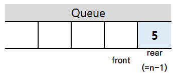
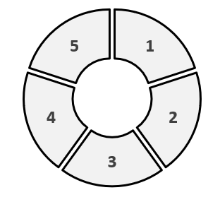
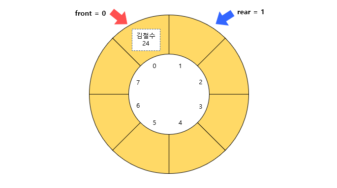
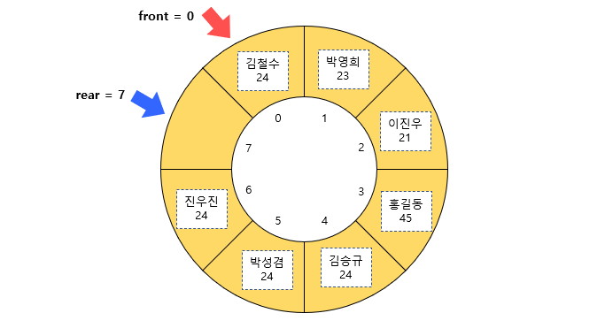
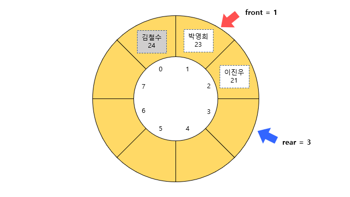
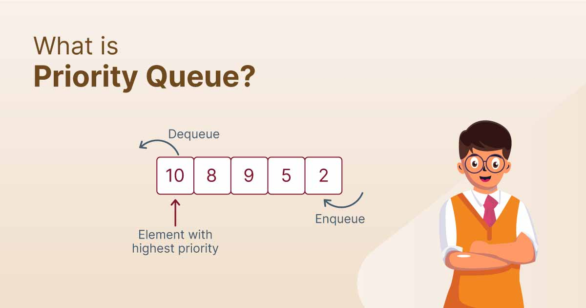
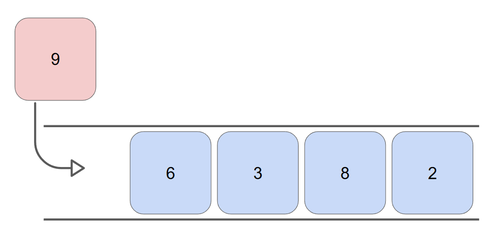
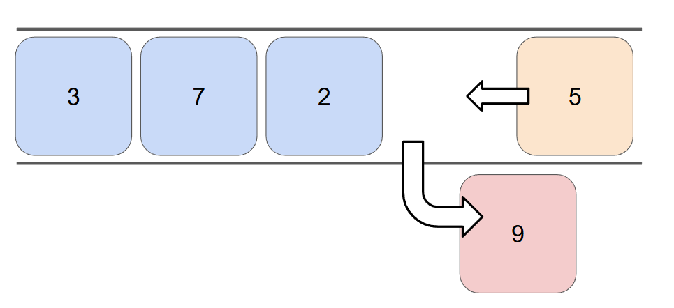

# 자료구조 개념 스터디

안녕하세요 김도겸입니다.  
이번 달 스터디는 순환 큐와 우선순위 큐를 공부하고 간단한 코드 예제로 구현해본 내용을 정리해보았습니다.

 

**목차**

- **1. 순환 큐 (Circular Queue)**
  - 개념 및 구조
  - 장점 및 단점
  - 예제
- **2. 우선 순위 큐 (Priority Queue)**
  - 개념 및 구조
  - 장점 및 단점
  - 예제

  

## 1. 순환 큐 (Circular Queue)

### Queue의 문제점

위 내용을 배우기 전에, 이전 시간에 배웠던 Queue를 다시 리마인딩해보겠습니다.

Queue는 데이터가 삽입되는 곳과 삭제되는 곳이 따로 존재하고, 선입선출 구조를 가진 <b>선형 자료구조</b>이므로 <b>선형 큐(Linear Queue)</b>라고도 불립니다.  
이를 배열을 활용하여 구현할 때는, 보통 삭제 때마다 실제로 데이터가 한 칸 앞으로 이동을 하는 것이 아닌 인덱스 단위로 큐의 연산 진행을 구현합니다.  
그렇게 구현된 큐로 삽입 및 삭제를 반복하다 보면, rear가 맨 마지막 인덱스를 가리키고 앞에는 비어있을 수 있지만 이를 꽉 찼다고 인식하면서 앞에 있던 공간을 사용 못하고 계속해서 빈 상태로 남아있는 상태가 되어버리는 문제점이 발생합니다.

 

### 개념 및 구조

<b>순환 큐(Circular Queue)</b>는 위에서 설명드린 선형 큐의 단점을 보완하기 위해 등장한 자료구조이며 사진을 보시는 것과 같이 원형으로 이루어져 있기 때문에 <b>원형 큐</b>라고도 불립니다.

기존의 큐의 기능과 기본적인 구조를 갖춘 상태로 앞에 있는 공간을 재활용할 수 있도록 rear가 계속해서 증가하여 일정 길이에 도달하게 되면 다시 첫 인덱스를 바라보도록 처음과 끝이 연결된 구조입니다.
큐와 동일하게 삭제연산만 수행하는 곳을 <b>front</b>, 삽입 연산만 이루어지는 곳을 <b>rear</b>로 정하여 각각의 연산작업만이 수행됨으로써 rear에서 이루어지는 삽입연산을 <b>인큐(enQueue)</b>, front에서 이루어지는 삭제연산을 <b>디큐(dequeue)</b>라고 부릅니다.

 

<b>연산 과정</b>

- <b>Enqueue (삽입)</b>

  

  rear의 포인터를 1 증가시키고 그 위치에 데이터 삽입이 이루어집니다.  
  실제 데이터는 rear가 가리키는 위치보다 1칸 적은 곳에 삽입되고, 만약 rear+1이 배열의 끝이고 포화상태가 아니라면 배열의 첫번째 인덱스에 데이터를 삽입합니다.  
  <b>(rear+1) % arraysize == front</b> 조건이라면 배열이 포화상태인 걸로 판단하고, Enqueue가 실행되지 않습니다.

- <b>포화 상태</b>

  

  삽입과 삭제가 이루어질 때 제대로 된 원형 큐의 구조를 이루기 위해서는 포화상태 여부를 판단해야 합니다.  
  데이터가 꽉 차 있는 경우에 삽입 시 rear의 포인터를 마지막 인덱스 값에서 첫번째 인덱스로 바꾸는 작업이 이루어지게 되는데, front와 rear가 같아지면서 공백상태로 판단되기 때문에, 원형 큐가 빈 것인지 모두 찬 것인지 구별할 수 없게 되는 문제가 발생하기 때문입니다.  
  위 사진처럼 front와 rear의 인덱스 차이가 한 칸만큼 날 때 포화상태라고 판단합니다. 사실상 데이터는 다 채워진 것이 아닌 하나가 비워진 상태인 것이죠.  
  이와 같은 상태에선 삭제가 이루어지지 않을 때까지 데이터 삽입이 이루어지지 않게 됩니다.  

  > 한 칸도 낭비하고 싶지 않다면 모든 공간을 사용할 수 있도록 구현할 수 있지만 기본적인 구조는 위와 같습니다.

- <b>Dequeue (삭제)</b>

  

  front의 포인터를 1 증가 시키고 그 위치의 데이터를 배열에서 가지고 옵니다.  
  실제 데이터는 rear가 가리키는 위치보다 1칸 적은 곳에 삭제되는 것이죠.  
  <b>rear==front</b> 조건이라면 배열이 공백상태인 걸로 판 단하고, Dequeue가 실행되지 않습니다.

 

### 장점 및 단점

&nbsp; **장점**  
 &nbsp;&nbsp; 1. 고정 크기의 큐에서 지속적인 운영이 가능하다.  
 &nbsp;&nbsp; 2. 배열을 효과적으로 사용하여 메모리 낭비를 최소화할 수 있다.  
 &nbsp;&nbsp; 3. FIFO의 특성인 순서 보장을 유지하면서 무한히 순환적으로 동작할 수 있다.

&nbsp; **단점**  
 &nbsp;&nbsp; 1. 크기가 초과되면 더 이상 요소를 삽입할 수 없으며, 크기를 동적으로 조정하기 어렵다.  
 &nbsp;&nbsp; 2. 한 번의 삽입과 삭제만 반복되면 메모리가 비효율적으로 사용될 수 있다.  
 &nbsp;&nbsp; 3. 중간 요소 접근이 비효율적이다.

 

### 예제

 

## 2. 우선순위 큐 (Priority Queue)

### 개념 및 구조

큐는 먼저 들어오는 데이터가 먼저 나가는 선입선출(FIFO)의 구조를 갖추고 있는데요.  
때때로 순서대로 입력은 받지만 출력은 원하는 순서대로 해야하는 상황이 존재합니다.  
일부 음식점에서 순서대로 주문을 받지만 빠르게 되는 음식이 먼저 나온다거나, 응급실에서 온 순서가 아닌 급한 순서의 환자부터 진료를 우선적으로 처리하는 구조와 같은 상황들과 같은 예를 들 수 있죠.  
그럴 때 필요한 구조가 바로 이번에 설명드릴 우선순위 큐입니다.

<b>우선순위 큐(Priority Queue)</b>는 명칭엔 큐라는 이름이 가졌으나 그 구조는 다릅니다.  
일반적인 큐와 달리 요소들이 <b>우선순위(priority)</b>가 기준이 되어, <b>우선순위가 높은 요소가 먼저 Dequeue</b>되는 자료구조입니다.  
즉 선입선출의 구조는 아니라는 것이죠.

 

우선순위 큐의 주요 구조적 특징은 아래와 같습니다.

- <b>우선 순위 기준 선정</b>: 숫자의 크기, 가중치, 중요도에 따라 순차적으로 우선순위를 지정된다.
- <b>요소 처리</b>: 기준에 따른 가장 높은 우선순위의 요소가 먼저 처리된다.
- <b>선형/비선형 구조 모두 가능</b>: 구현방식에 따라 선형구조가 될 수도, 비선형구조가 될 수도 있다.

> 개념적으로는 일반적인 큐처럼 선형적인 구조이지만 효율적인 구현과 빠른 이해를 위해서는 트리 구조(힙)를 활용하는 것이 합리적입니다.
> 힙에 대한 설명은 지난 시간에 발표 내용이 있어 넘어가도록 하겠습니다.

 

<b>연산 과정</b>

구현 방식에 따라 다양하게 연산 과정이 있지만 개념적 구조에 따르면 선형적 구조이기 때문에 이를 기준으로 연산 과정을 설명드리도록 하겠습니다.  
쉬운 예를 위해 최댓값을 기준으로 한 정수형 우선순위 큐를 만들었다고 가정하겠습니다.

- <b>Enqueue (삽입)</b>

  

  일반적인 큐와 동일하게 우선 순위와 관계 없이 요소가 들어오는 순서대로 저장됩니다.

 

- <b>Dequeue (삭제)</b>

  

  지정된 우선순위 기준에 따라 가장 우선순위에 해당하는 데이터를 탐색하여 삭제한 후 해당 데이터의 위치를 기준으로 한 칸씩 이동합니다.

 

### 장점 및 단점

&nbsp; **장점**  
 &nbsp;&nbsp; 1. 중요도에 따라 요소를 처리할 수 있어 삽입에 따른 무조건적인 순차적 구조를 지키지 않아도 된다.  
 &nbsp;&nbsp; 2. 빠른 최소/최대값 접근이 가능하다  
 &nbsp;&nbsp; 3. 배열, 힙(트리) 등 다양한 방법으로 구현이 가능하며 유연한 적용이 가능하다.

&nbsp; **단점**  
 &nbsp;&nbsp; 1. 중간 요소 접근이 비효율적이다.  
 &nbsp;&nbsp; 2. 전체 데이터의 정렬 형태의 접근은 어렵다.  
 &nbsp;&nbsp; 3. 삭제 시 재정렬 작업이 필요하므로, 데이터가 많아지면 성능 저하 가능성이 있다.

 

### 예제

 

원형 큐, 우선순위 큐의 기본적인 구조, 개념, 구현 방식에 대해 알아보았습니다.
다음 달 스터디부턴 정보처리기사 실기 시험 준비를 위한 공부 내용을 정리하여 발표해보도록 하겠습니다.

감사합니다.
