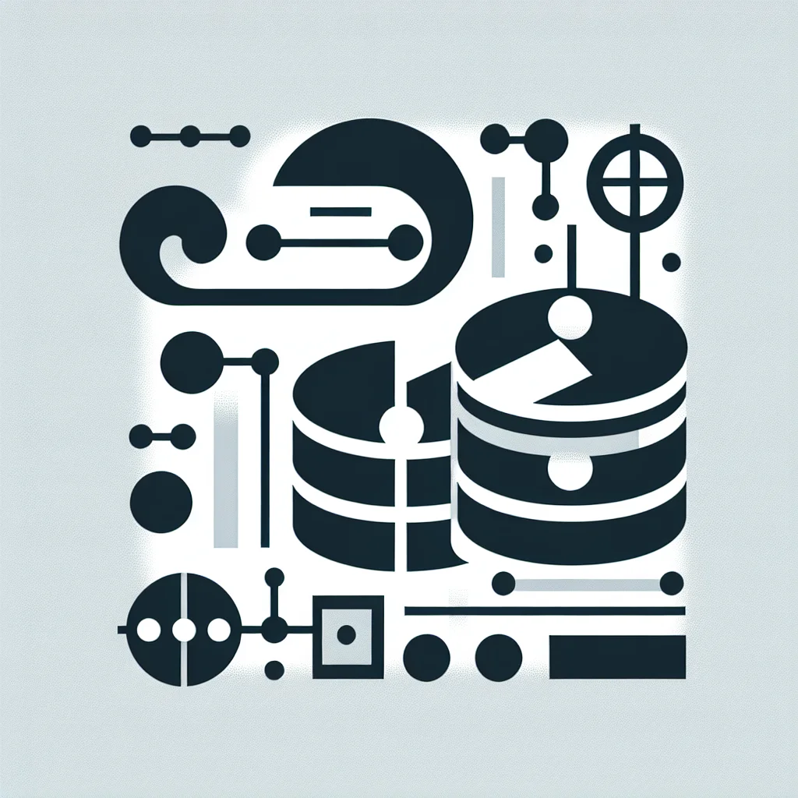
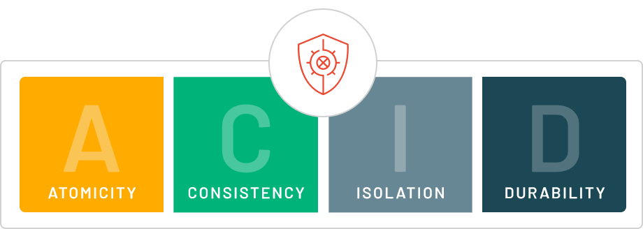

# RDBMS 스터디

안녕하세요 김도겸입니다.  
이번 달 2주차는 중요 개념인 트랜잭션 관리와 ACID 특성을 알아보도록 하겠습니다.

<br>

## 트랜잭션이란?

개발자라면 다른 개발 관련 지식 공부 중에서도 생각보다 자주 들어보셨을 개념일텐데요.  
개발을 하다보면 데이터를 접근하고 처리하는 과정 속에 많은 문제나 오류들이 발생하는 경우를 본 적이 있으실 겁니다.  
오류가 발생할 경우엔 원인을 빠르게 분석하여 빠르게 복구를 해야 합니다. 심지어 이미 서비스 운영이 되고있는 실제 DB는 더욱 시간이 생명이죠.  
이러한 사항들로 인해 개발자들이 가장 알아야하는 DB 상식 중 하나인 것이 바로 트랜잭션입니다.



트랜잭션(Transaction)의 사전적 정의는 거래이고, 데이터베이스 시스템에서는 **논리적인 작업 단위**를 의미합니다.  
기능을 사용하기 위한 요청을 보냈을때 요청에 대한 처리 후 응답을 보내는 과정이 존재하면서 데이터베이스에 접근하여 작업을 처리합니다.  
이 일련의 데이터베이스 작업을 하나의 단위로 묶어 처리하며, **모든 작업이 성공하거나 모두 실패**하는 것을 보장합니다.

### 트랜잭션이 중요한 이유

트랜잭션을 사용하는 것이 중요한 이유는 아래와 같습니다.

- 정확한 데이터를 유지해야하고 오류가 발생할 시 빠르게 복구 가능하다.
- 데이터베이스에 장애 발생 시 복구작업을 수행하는 것이 매우 효율적이다.
- 다수의 사용자가 동시에 사용 가능하도록 제어 작업을 용이하게 해주는 중요한 단위로 사용된다.

위와 같은 이유로 트랜잭션은 데이터베이스에 발생할 수 있는 여러가지 복합적인 문제들을 해결할 수 있습니다.  
복잡한 데이터 처리를 쉽게 간결화 할 수 있음은 물론, 보다 신뢰성이 높고 안정적인 데이터베이스를 갖춘 시스템을 제공할 수 있습니다.

<br>

## ACID 특성

위에서 설명드린 트랜잭션이 중요한 이유를 뒷받침하는 것이 바로 ACID 특성입니다.
트랜잭션이 성공적으로 처리되어 데이터베이스의 무결성, 일관성을 보장하려면 이 ACID 특성을 만족해야 합니다.



<b>1. Atomicty (원자성) </b>  
 트랜잭션을 구성하는 연산들이 모두 정상적으로 실행되거나 하나도 실행되지 않아야 한다는 것을 말합니다.  
 트랜잭션을 수행하다가 장애가 발생하여 작업을 완료하지 못했다면, 지금까지 실행한 연산들을 모두 취소하고 데이터베이스를 트랜잭션 작업 전의 상태로 되돌려 트랜잭션의 원자성을 보장해야 합니다.

`ex ) 상품을 구매하려고 하다 실패했을 경우 상품 재고량과 금액이 전부 복구된다.` <br>

<b>2. Consistency (일관성) </b>  
 트랜잭션이 성공적으로 수행된 후에도 데이터베이스가 일관성 있는 상태를 유지해야 한다는 것을 말합니다.
트랜잭션이 수행되기 전에 데이터베이스가 일관된 상태라면 트랜잭션의 수행이 완료된 후 결과를 반영한 데이터베이스도 또 다른 일관된 상태를 가져야 합니다.

`ex ) 상품을 판매하였을 때 판매한 개수와 재고의 총합이 진행 전 후 모두 같다.` <br>

<b>3. Isolation (격리성/독립성) </b>  
 현재 수행 중인 트랜잭션이 완료될 때까지 트랜잭션이 생성한 중간 연산 결과에 다른 트랜잭션이 접근할 수 없는 것을 말합니다.  
 시스템 상에서 여러 트랜잭션이 동시에 수행되지만 각 트랜잭션이 독립적으로 수행될 수 있도록 다른 트랜잭션의 중간 연산 결과에 서로 접근할 수 없어야 합니다.

`ex ) 판매 처리가 되고있는 상품에 구매 요청을 할 수 없다. ` <br>

<b>4. Durability (지속성/영속성)</b>  
 트랜잭션이 성공적으로 완료된 후 데이터베이스의 반영된 수행 결과는 어떠한 경우에도 손실되지 않고 영구적이어야 함을 말합니다.  
 해당 작업이 시스템 상에서 모두 수행이 되었다면 해당 상태는 영원히 보장되어야 합니다.

`ex ) 다음 판매 요청이 없다면 현재 상품 재고 상태는 계속 유지된다.` <br>

<br>

## COMMIT, ROLLBACK, SAVEPOINT 알아보기

트랜잭션을 관리하기 위해서는 COMMIT, ROLLBACK, SAVEPOINT 명령어를 사용합니다.  
이 명령어들은 데이터베이스의 상태를 제어하고, 트랜잭션의 결과를 반영하거나 취소하는 데 중요한 역할을 합니다.  
간단한 계좌 거래 예시를 통해 이 명령어들의 사용 방법을 알아보도록 하겠습니다.

### COMMIT

COMMIT 명령어는 현재 트랜잭션에서 수행된 모든 변경 사항을 데이터베이스에 영구적으로 저장하는 데 사용됩니다.  
이 명령어를 실행하면, 트랜잭션 내의 모든 작업이 완료되며, 이 변경사항을 되돌릴 수 없습니다.

```SQL

-- 트랜잭션 시작
BEGIN;

-- 계좌 A에서 1000원 출금
UPDATE accounts
SET balance = balance - 1000
WHERE account_id = 'A';

-- 계좌 B에 1000원 입금
UPDATE accounts
SET balance = balance + 1000
WHERE account_id = 'B';

-- 변경 사항을 확정
COMMIT;

```

위 예제를 실행하게 되면 A 계좌에선 1000원이 출금, 계좌 B엔 1000원이 입금되고 데이터베이스에 영구적으로 저장됩니다.

### ROLLBACK

ROLLBACK 명령어는 현재 트랜잭션에서 수행된 모든 변경 사항을 취소하고, 데이터베이스를 트랜잭션 시작 이전 상태로 되돌립니다.  
주로 오류가 발생했을 때 사용됩니다.

```SQL

-- 트랜잭션 시작
BEGIN;

-- 계좌 A에서 1000원 출금
UPDATE accounts
SET balance = balance - 1000
WHERE account_id = 'A';

-- 오류 발생: 계좌 B가 존재하지 않음
UPDATE accounts
SET balance = balance + 1000
WHERE account_id = 'B';

-- 오류가 발생했으므로 변경 사항을 취소
ROLLBACK;

```

위 예제를 실행하게 되었을 때, 계좌 B가 존재하지 않아 오류가 발생하게 되면 출금도 취소되어야 합니다.  
이를 ROLLBACK 명령어로 다시 되돌려지도록 처리합니다.

### SAVEPOINT

SAVEPOINT 명령어는 트랜잭션 내에서 특정 지점을 설정하여, 그 지점까지의 변경 사항을 저장할 수 있게 해줍니다.  
이 지점으로 되돌아가고 싶을 때 ROLLBACK TO SAVEPOINT 명령어를 사용합니다.

```SQL

-- 트랜잭션 시작
BEGIN;

-- 계좌 A에서 1000원 출금
UPDATE accounts
SET balance = balance - 1000
WHERE account_id = 'A';

-- SAVEPOINT 설정
SAVEPOINT sp1;

-- 계좌 B에 1000원 입금
UPDATE accounts
SET balance = balance + 1000
WHERE account_id = 'B';

-- 오류 발생 시 SAVEPOINT로 되돌리기
ROLLBACK TO sp1;

-- 변경 사항을 확정
COMMIT;

```

위 예제에서 SAVEPOINT sp1을 설정한 후 계좌 B에 입금하는 작업에서 오류가 발생하면 ROLLBACK TO sp1을 통해 계좌 A에서의 출금만 취소하고, 이후 COMMIT으로 변경 사항을 확정할 수 있습니다.

<br>

## 트랜잭션 관리

### 1. 트랜잭션의 상태


트랜잭션은 데이터베이스의 상태를 변경하는 작업의 최소 단위로, 다음과 같은 상태를 가집니다

1. **Active**: 트랜잭션이 실행 중.
2. **Partially Committed**: 작업이 완료되었으나 아직 커밋되지 않은 상태.
3. **Committed**: 트랜잭션이 성공적으로 완료되어 데이터베이스에 반영.
4. **Failed**: 트랜잭션이 실행 도중 오류가 발생.
5. **Aborted**: 트랜잭션이 실패하여 롤백된 상태.

<br>

### 2. 트랜잭션 수행 시 발생하는 문제들

트랜잭션 작업이 수행되면서 다양한 문제점들이 발생하곤 합니다.  
이 중 대표적으로 발생하는 문제들을 정리해보았습니다.

<b> DIRTY READ </b>  
트랜잭션이 작업이 완료되지 않았는데도, 즉 COMMIT되지 않은 변경 사항들을 다른 트랜잭션에서 볼 수 있게 되는 현상입니다.

<b> NON-REPEATABLE READ </b>
<b> PHANTOM READ </b>

### 3. 트랜잭션 격리 수준

위에서 설명드린 트랜잭션의 특징 ACID 중 격리성에 따라 트랜잭션 간에 독립 관계를 완전히 보장해야 합니다.  
하지만 그럴 경우 모든 트랜잭션을 차례로 처리해야 하고, 이는 성능의 하락으로 이어집니다.

트랜잭션 격리 수준은 동시에 여러 트랜잭션이 처리될 때 특정 트랜잭션이 다른 트랜잭션에서 변경하거나 조회하는 데이터를 볼 수 있도록 허용할지 말지의 정도를 결정하는 것입니다.

<b> 0 : READ UNCOMMITTED(커밋되지 않은 읽기) </b>  
&nbsp;&nbsp; 각 트랜잭션에서의 변경 내용이 COMMIT이나 ROLLBACK 여부에 상관 없이 다른 트랜잭션에서 값을 읽을 수 있습니다.  
&nbsp;&nbsp; 정합성에 문제가 많은 격리 수준이기 때문에 사용하지 않는 것을 권장합니다.

<b> 1 : READ COMMITTED (커밋된 읽기) </b>  
&nbsp;&nbsp;

<b> 2 : REPEATABLE READ (반복 가능한 읽기) </b>  
&nbsp;&nbsp;

<b> 3 : SERIALIZABLE (직렬화 가능) </b>
&nbsp;&nbsp;

<br><br>

감사합니다.
