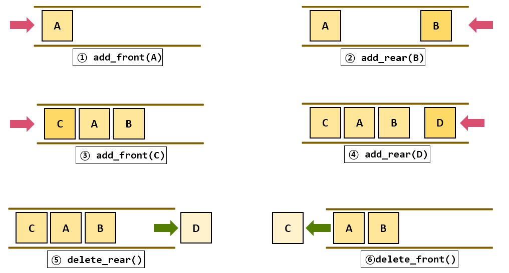
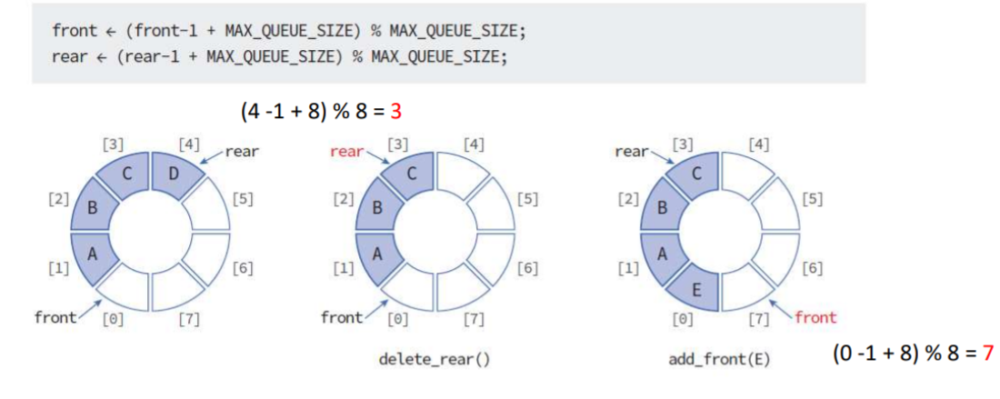

# 자료구조 개념 스터디

안녕하세요 김도겸입니다.  
이번 달 스터디는 덱에 대하여 공부하고 간단한 코드 예제로 구현해본 내용을 정리해보았습니다.

<br>

- **1. 덱 (Deque)**
  - stack과 queue를 합쳐보자!
  - 개념 및 구조
  - 장점 및 단점
  - 예제
- **2. 원형 덱 (Circular Deque)**
  - 덱의 한계
  - 개념 및 구조
  - 장점 및 단점
  - 예제

<br><br>

## 1. 덱 (Deque)

### 💡stack과 queue를 합쳐보자!

지난 스터디까지 해서 스택과 큐에 대해 배워보았습니다.


정리해보면 각각의 장단점이 있었고, 큐의 경우엔 다양한 형태로 변환되어 일반적인 형태의 선형 큐의 단점을 해결하기도 하였습니다.  
하지만 두 형태의 자료구조 모두 다른 끝의 데이터를 조작하는 것과 삽입과 삭제에 있어 정해진 위치에 정해진 연산만 가능해 비효율적이라는 문제는 있습니다.  
컴퓨터 과학자들은 이를 해결하기 위해 내세운 방안은 바로 **양방향에서 모두 유연하게 데이터를 조작 가능하도록 만들자** 였습니다.  
즉 상황에 따라 스택처럼 쓸 수도, 큐처럼 쓸 수도 있는 구조를 생각해낸 것이죠.

<br>

### 🚀 개념 및 구조


<b>덱(Deque)</b>은 양쪽 끝에서 삽입과 삭제가 모두 가능한 큐를 의미합니다.  
즉, 앞(front)과 뒤(rear)에서 데이터를 넣거나 뺄 수 있는 자료구조로 스택과 큐의 특성을 모두 가질 수 있습니다.  
덱은 일반적인 큐와 달리 삽입/삭제에 방향 제한이 없기 때문에 선형 자료구조 중 비교적 꽤 유연한 자료구조로 꼽을 수 있습니다.

> 덱의 기본적인 구조는 배열과 연결 리스트로 구현이 가능합니다.

<br>

<b>주요 연산</b>  
덱의 연산은 크게 두 가지로 삽입 연산과 삭제 연산이 존재하지만
조금 더 세분화하자면 front와 rear에서 삽입, 삭제가 가능하기 때문에 네 가지라고 보시면 되겠습니다.



- add_front: 덱의 맨 앞에 요소를 추가한다.
- add_rear: 덱의 맨 뒤에 요소를 추가한다.
- delete_front: 덱의 맨 앞 요소를 반환 후 삭제한다.
- delete_rear: 덱의 맨 뒤 요소를 반환 후 삭제한다.

<br>

### ✅ 장점 및 단점

&nbsp; **장점**  
 &nbsp;&nbsp; 1. 양쪽에서 삽입/삭제가 가능하여 유연한 양방향 데이터 처리가 가능하다.  
 &nbsp;&nbsp; 2. FIFO와 LIFO 방식을 모두 해결 가능하다.  
 &nbsp;&nbsp; 3. 덱은 양쪽 끝에서 O(1)로 삽입/삭제 가능하여 연산 속도가 빠름

&nbsp; **단점**  
 &nbsp;&nbsp; 1. 중간 요소 접근은 여전히 비효율적이다.  
 &nbsp;&nbsp; 2. 삽입과 삭제가 많을 경우 불필요한 메모리 낭비가 발생할 가능성이 있다.  
 &nbsp;&nbsp; 3. 복잡한 구조로 인해 필요 이상의 연산이 수행될 수 있다.

<br>

### 🛠️ 구조의 변형

덱은 위에서 설명드렸듯이 양쪽에서 데이터를 삽입/삭제가 가능하도록 되어 있습니다.  
삽입과 삭제가 자유로워야 하는 구조이거나 양방향 탐색이 필요하거나, 이전 데이터를 다시 확인해야 하는 경우 등엔 유용하게 쓰일 수 있습니다.  
하지만 특정 상황에서 삭제만을 유연하게 해야 하거나, 삽입만 유연하게 해야 하는 기능들을 구현하기 위해 덱에 제한을 부여하여 구조를 효율적으로 변형합니다.  
이를 각각 <b>입력 제한 덱(Input-Restricted Deque), 출력 제한 덱(Output-Restricted Deque)</b> 이라고 합니다.

| **구분**                | **일반적인 덱(Deque)**                                                                                                    | **입력 제한 덱(Input-Restricted Deque)**                                                                                                | **출력 제한 덱(Output-Restricted Deque)**                                                                                                                    |
| ----------------------- | ------------------------------------------------------------------------------------------------------------------------- | --------------------------------------------------------------------------------------------------------------------------------------- | ------------------------------------------------------------------------------------------------------------------------------------------------------------ |
| **삽입(Enqueue)**       | 양쪽(front, rear)에서 삽입 가능                                                                                           | **한쪽(rear)에서만 삽입 가능**                                                                                                          | **양쪽(front, rear)에서 삽입 가능**                                                                                                                          |
| **삭제(Dequeue)**       | 양쪽(front, rear)에서 삭제 가능                                                                                           | **양쪽(front, rear)에서 삭제 가능**                                                                                                     | **한쪽(front)에서만 삭제 가능**                                                                                                                              |
| **삽입 방향 제한 여부** | ❌ 제한 없음                                                                                                              | ✅ rear에서만 가능                                                                                                                      | ❌ 제한 없음                                                                                                                                                 |
| **삭제 방향 제한 여부** | ❌ 제한 없음                                                                                                              | ❌ 제한 없음                                                                                                                            | ✅ front에서만 가능                                                                                                                                          |
| **메모리 활용도**       | 높음 (공간 재사용 가능)                                                                                                   | 중간 (삽입이 제한됨)                                                                                                                    | 중간 (삭제가 제한됨)                                                                                                                                         |
| **연산 속도**           | O(1) (배열/연결 리스트 기반)                                                                                              | O(1) (배열/연결 리스트 기반)                                                                                                            | O(1) (배열/연결 리스트 기반)                                                                                                                                 |
| **장점**                | 가장 유연한 자료구조                                                                                                      | 구현이 간단하며, 삭제 연산이 유연함                                                                                                     | 삽입이 자유로워 다양한 데이터 소스를 받을 수 있음                                                                                                            |
| **단점**                | 복잡한 구조로 인해 필요 이상으로 연산이 수행될 수 있음                                                                    | 삽입 방향이 제한되어 데이터 추가에 유연성이 부족                                                                                        | 삭제 방향이 제한되어 데이터 처리 방식이 고정됨                                                                                                               |
| **사용 사례**           | - **양방향 탐색** (BFS, 캐시 관리) <br> - **이중 우선순위 큐** (최대값/최소값 처리) <br> - **명령 실행 취소 (Undo/Redo)** | - **네트워크 패킷 관리** (패킷이 한 방향으로만 입력됨) <br> - **운영 체제의 작업 스케줄링** <br> - **큐 기반 알고리즘에서 성능 최적화** | - **버퍼링 및 스트리밍** (순차적으로 데이터 출력) <br> - **우선순위 큐** (여러 곳에서 데이터 입력 후 한 방향에서 출력) <br> - **데이터 로깅 및 기록 시스템** |

<br><br>

## 2. 원형 덱 (Circular Deque)

### 💡덱의 한계

기존 덱인 선형 덱을 배열로 구현하면 여러가지 문제가 많이 발생합니다.

배열로 구현했을 때 가장 문제점은 실제 자료구조에서의 삽입, 삭제 연산을 처리하는 구조를 인덱스로 변환하여 처리해야 하기 때문인데요.
구현을 했다고 가정을 해보고 예를 들어보도록 하겠습니다. (front가 왼쪽, rear가 오른쪽으로 가정)

```JAVA
1. size가 5인 덱을 선언 -> front = 0 | rear = 4
2. 데이터를 front에서 삽입 -> front = 1 | rear = 4
3. 데이터를 rear에서 삽입 -> front = 1 | rear = 3
4. 데이터를 rear에서 삽입 -> front = 1 | rear = 2
5. 데이터를 front에서 삽입 -> front = 2 | rear = 2
6. 데이터를 rear에서 삽입 -> front = 2 | rear = 1
```

위와 같이 선언 후 5번의 삽입 과정만 거쳐도 front index값보다 rear index 값이 작아집니다.  
원래는 자료 구조 상으론 데이터가 한 칸 씩 이동하는 구조여야 하나, 배열은 index로 조정하다보니 이와 같은 현상이 발생하는 것입니다.  
index의 구조가 꼬이게 되면서 덱이 손상되면 배열이 꽉 차지 않아도 꽉 차있는 상태로 인식하거나 비어있지 않지만 텅 비어있다고 인식하게 될 수도 있습니다.  
이를 해결하기 위해 원형 덱입니다.

> 물론 배열도 데이터 이동 구현이 가능하나... 장점을 다 버리고 단점만 살리는 불필요한 과정을 거쳐야 합니다..

### 🚀 개념 및 구조


큐에서 공간낭비 문제를 해결하기 위해 원형 큐를 사용하여 확장시킨 것 처럼 덱 또한 원형으로 구현하면 더 효율적입니다.  
**원형 덱(Circular Deque)**은 배열로 구현된 덱의 한계과 문제점을 해결하기 위해 처음과 끝을 연결하여 순환 구조의 형태를 가지게 된 자료구조입니다.

배열과 같이 제한된 공간에서 데이터를 효율적으로 관리할 수 있고 메모리를 효율적으로 사용해야 하는 경우에 선형 덱에 비해 적합합니다.

<b> 활용 사례 </b>

- 네트워크 패킷 관리 -> 고정된 크기의 버퍼에서 패킷을 관리할 때 주로 사용.
- 프로세스 스케줄링 -> CPU가 프로세스를 일정한 시간동안 순차적으로 실행함.
- 캐시 시스템 -> 고정된 크기의 메모리에서 최근 사용된 데이터를 관리함.
- 교통 관제 시스템 -> 차량이 일정한 규칙으로 이동하는 시스템.

<br>

<b> 연산 과정 </b>



전체적인 구조와 핵심 연산 과정은 원형 큐와 거의 동일하며, front와 rear에서 동시에 삽입/삭제 연산이 이루어지기만 하면 됩니다.

> <b>add_front:</b> 꽉찼는지 확인 후 front 자리에 삽입 후 front=(front-1+ 크기) % 크기  
> <b>add_rear:</b> 꽉찼는지 확인 후 원형 큐의 enqueue와 동일  
> <b>delete_front:</b> 원형큐의 dequeue와 동일  
> <b>delelte_rear:</b> 현재 rear자리의 값 임시 저장 후 rear=(rear-1+ 크기) % 크기 연산 후 임시 저장했던 rear자리 값 반환

<br>

### ✅ 장점 및 단점

&nbsp; **장점**  
 &nbsp;&nbsp; 1. 공간 활용을 극대화 할 수 있음.  
 &nbsp;&nbsp; 2. 연산속도가 빠름.  
 &nbsp;&nbsp; 3. 포인터만 이동하기 때문에 동적 메모리 할당을 하지 않아도 된다.

&nbsp; **단점**  
 &nbsp;&nbsp; 1. 주로 배열 기반 구현이므로 연결리스트보다 메모리 재사용 유연성이 떨어짐.  
 &nbsp;&nbsp; 2. 유연한 크기조절이 어려움.  
 &nbsp;&nbsp; 3. 원형 구조이므로 구현 시 비교적 복잡함.
