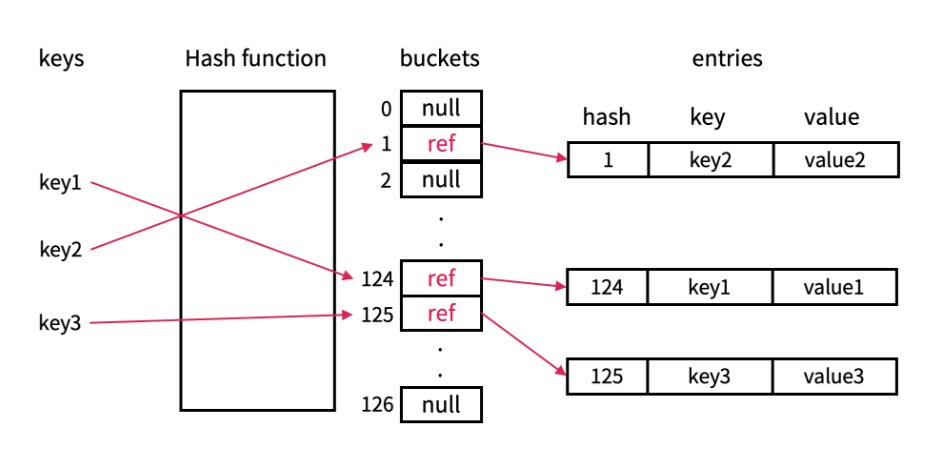

# 자료구조 개념 스터디

안녕하세요 김도겸입니다.  
이번 달 스터디는 해싱(Hashing)과 해시 테이블(Hash Table)를 공부하고 간단한 코드 예제로 구현해본 내용을 정리해보았습니다.

- **해싱(Hashing)**
  - 탐색을 빨리 하고 싶을 땐?
  - 개념 및 구조
  - 암호화와의 비교
- **해시 테이블(Hash Table)**
  - 개념 및 구조
  - 작동 원리
  - 장점 및 단점
  - 예제

<br>

## 1. 해싱(Hashing)

### 🔍 탐색을 빨리하고 싶을 땐?

대부분의 탐색 방법들은 탐색 키를 저장된 키 값과 반복적으로 비교하면서 탐색을 원하는 항목에 접근합니다.  
일반적으로 이러한 방식으로 탐색을 거친다면 정렬이 되어있을 경우와 정렬이 되어 있지 않은 경우의 성능 차이는 매우 클 것입니다.

예를 들어 만약 아무런 시스템 없이 운영하는 큰 도서관이 있다고 가정해보도록 하겠습니다.


원하는 책을 찾으려면 아무런 정리가 안되어 있기 때문에 책장에 꽂혀있는 수많은 책들을 하나하나 비교하면서 찾아봐야 합니다. 운이 안좋다면 처음부터 끝까지 모두 확인해야 하는 것이죠.  
만약 책 제목을 기준으로 정렬이 되어 있다면 찾는 방식에 따라 속도는 조금 차이나겠지만 정렬이 안되어 있는 상태에서 찾는 것보다 훨씬 빠르게는 찾을 수 있을 것입니다.

  
하지만 그럼에도 불구하고 위 사진과 같은 도서관이라면 무수한 책 중에 원하는 책을 찾는 건 알래스카에서 김상덕씨를 찾는 것 만큼..어려울 것입니다. 😅

효율적으로 책을 찾기 위해서는 기준을 만들어 책을 정리하고 일련의 과정을 거쳐 검색 시스템을 만들어주면 금방 찾을 수 있습니다.  
간단한 3가지 과정을 통해 검색 시스템을 구성할 수 있습니다.

```
1. 서가 별로 기준을 잡고 특정 규칙을 세워 서가 번호를 매깁니다. (분야, 제목 등)
2. 규칙에 맞게 책장에 책을 넣고 책별로 서가 번호를 시스템에 매치 시킵니다.
3. 도서 제목을 검색하면 해당 도서 정보 및 서가번호를 노출시켜줍니다.
```

<br>


이렇게 설정해놓으면 흔히 볼 수 있는 도서관 도서 관리 방식에 검색 시스템을 추가한 것과 유사합니다.  
이제 책을 찾을 땐 책 제목만 검색해도 규칙으로 정해진 구역의 번호가 노출되고, 그 구역의 책들만 찾아보면 되는 것이죠.

이러한 시스템을 컴퓨터 속 데이터 구조에 빗대어 데이터를 효율적으로 저장하고, 빠르게 탐색할 수 있는 구조로 만드는 일련의 과정이 바로 오늘 공부하게 될 <b>해싱</b>입니다.

<br>

### 🚀 개념 및 구조


<b>해싱(Hashing)</b>은키에 산술적인 연산을 적용하여 항목이 저장되어 있는 테이블의 주소를 계산하여 항목에 빠른 접근하는 방식을 의미하고 데이터를 일정한 규칙에 따라 변환하여, 효율적으로 저장하고 검색할 수 있도록 하는 기법입니다.

기존 탐색 방식인 선형 탐색, 이진탐색과 같은 방법들과 같이 반복적으로 저장된 값을 비교하는 방식보다 더욱 빠른 탐색을 필요로 하는 경우에 사용되기도 하며, 데이터 노출을 막기 위한 보안의 수단으로써도 사용되기도 합니다.

데이터를 일정한 규칙에 따라 변환해주는 역할을 담당하는 함수를 <b>해시 함수(Hash Function)</b>라고 하며 해시 함수에 의해 각 데이터 별로 매핑되는 고정 크기의 값을 <b>해시 코드(해시 값)</b>라고 합니다.

<br>

### 암호화와의 비교

해싱의 개념과 구조를 간단히 정리하면 `데이터를 특정 함수를 거쳐 코드로 매핑을 해준다`인데 이 개념은 암호화와 유사한 점이 많습니다.  
하지만 해싱의 주요 이점은 `빠른 탐색을 돕는다`이기 때문에 분명한 차이가 있으니 한번 비교해보며 해싱의 특징을 이해해보도록 하겠습니다.
아래 표로 간단히 정리해 보았습니다.

| 특징             | 해싱 (Hashing)                                 | 암호화 (Encryption)                         |
| ---------------- | ---------------------------------------------- | ------------------------------------------- |
| **복구 가능성**  | 일방향, 복구 불가                              | 양방향, 키가 있으면 복구 가능               |
| **주요 목적**    | 데이터 무결성 확인                             | 데이터 기밀성 유지와 안전한 통신            |
| **출력 길이**    | 고정 길이 (입력 크기와 무관)                   | 가변적 또는 암호화 알고리즘 요구사항에 따름 |
| **사용 사례**    | 비밀번호 저장, 데이터 무결성 검사, 디지털 서명 | 안전한 통신, 데이터 저장, 인증              |
| **키 필요 여부** | 키 불필요                                      | 암호화 키 필수                              |

해싱은 직접적인 탐색을 위해 데이터를 변환하고 다시 복구하지 않습니다. 즉, 해시 값만 비교하여 빠르게 값의 비교가 가능한 구조이기 때문에 데이터를 파악하기 위해 복호화가 필요한 암호화와 달리 탐색이 빠르다는 특징을 가졌다는 것을 위 비교 표를 통해 알 수 있겠습니다.

<br>

### ✅ 장점 및 단점

&nbsp; **장점**  
 &nbsp;&nbsp; 1. 빠른 데이터 접근이 가능하다.  
 &nbsp;&nbsp; 2. 중복이 제거된다.  
 &nbsp;&nbsp; 3. 보안이 강화된다.

&nbsp; **단점**  
 &nbsp;&nbsp; 1. 해시 함수가 서로 다른 키에 대해 같은 해시 값을 반환하는 경우 충돌이 발생할 수 있다.  
 &nbsp;&nbsp; 2. 출력 길이 고정이기 때문에 정보 손실 가능성이 있다.  
 &nbsp;&nbsp; 3. 메모리 사용량이 증가할 수 있다.

<br><br>

## 2. 해시 테이블(Hash Table)

### 🚀 개념 및 구조

해시 테이블은 key-value 구조로 데이터를 저장하는 자료구조로 위에서 설명드린 해싱 처리를 거쳐 데이터가 저장될 저장소 역할을 해줍니다.



매우 큰 숫자 데이터나 문자열 같이 임의의 길이를 가진 key값을 고정된 작은 값으로 매핑하여 테이블의 index로 사용하여 key에 해당하는 해시값만 계산하여 value를 찾을 수 있습니다.

기본적인 구성요소는 <b>해시 함수</b>와 처리된 해시 값을 인덱스로 사용하여 데이터가 저장되는 공간인 <b>버킷(bucket)</b>으로 이루어져 있습니다.

<br>

### ⚙️ 데이터 삽입 과정

1. <b>해시 함수 적용</b>: 데이터의 key를 해시 함수에 넣어 해시 값을 계산한다.
2. <b>해시 값의 인덱스 결정</b>: 해시 값을 기반으로 배열에서 저장될 위치인 인덱스를 결정한다.
3. <b>데이터 저장</b>: 결정된 인덱스에 데이터를 저장한다.
4. <b>충돌 해결</b>: 충돌이 발생했을 경우에는 충돌 해결 방안을 사용하여 저장한다.

<br>

### 🗒️ 해시 테이블이 사용되는 곳

- **데이터베이스 인덱싱**: 빠른 조회를 위해 사용됨.
- **캐싱 시스템**: 웹 페이지, DNS 캐싱 등에 활용됨.
- **컴파일러**: 식별자(Symbol Table) 저장.
- **암호화 및 보안**: 해시 기반 데이터 저장 및 인증.

<br>

### ✅ 장점 및 단점

&nbsp; **장점**  
 &nbsp;&nbsp; 1. 기존 탐색 방식보다 데이터 검색이 빠릅니다.  
 &nbsp;&nbsp; 2. 정렬된 데이터 구조가 필요하지 않습니다.  
 &nbsp;&nbsp; 3. 다양한 데이터 형식을 저장 가능하다.

&nbsp; **단점**  
 &nbsp;&nbsp; 1. 해시 함수가 서로 다른 키에 대해 같은 해시 값을 반환하는 경우 충돌이 발생할 수 있다.  
 &nbsp;&nbsp; 2. 정렬이 불가능하고 순서가 보장되지 않는다.  
 &nbsp;&nbsp; 3. 해시 함수 성능에 따라 속도 차이가 클 수 있다.

<br>

### 💥 충돌을 해결하는 방법

위에서 설명드렸듯이 해시함수는 특정 규칙을 만들어 해시값으로 변환하는 역할을 합니다.  
만약 그 규칙이 단순하고 쉬운 구조로 되어 있다면 많은 형태의 데이터들 중 분명히 같은 해시 값으로 변환 되는 경우가 생길 가능성이 있을 것입니다.

타 데이터와 연관성이 없기 때문에 해시 함수에 따라 해시 값이 생성될 때 같은 값을 가졌을 때 <b>'충돌이 발생했다'</b> 라고 합니다.  
충돌이 발생하게 되면 정확한 데이터를 못가져오고 혼동이 발생하게 되는데 이를 방지하려면 어떤 방법들이 있는 지 설명드리도록 하겠습니다.

- <b>1. 체이닝(Chaining)</b>  
  동일할 해시 값을 가지는 key들을 같은 버킷 내에 연결 리스트 등의 데이터 구조를 사용하여 항목을 저장하는 방식입니다.
- <b>2. 개방 주소법(Open Addressing)</b>  
  충돌이 발생했을 때, 새로운 키를 위해 해시 테이블의 다른 위치를 찾아 사용하는 방식입니다.

  - <b>2-1. 선형 조사법(Linear Probing)</b>  
    충돌이 발생하였을 경우 기존 해시값에 +1을 더하는 처리를 해줍니다.  
    연속되는 충돌이 발생 시 계속해서 순차적인 데이터 저장이 이루어지며, 데이터 검증 시 key를 일일이 비교하기 때문에 빠른 탐색의 이점이 사라진다는 군집화 문제가 발생합니다.

  - <b>2-2. 제곱 조사법(Quadratic Probing)</b>  
    선형 조사법의 문제점을 해결하고자 나온 방법으로 상수를 제곱한 값을 더하여 최초 해시 충돌 지점에 데이터가 몰리는 현상을 방지합니다.  
    하지만 이 또한 연속된 충돌이 많이 발생할 경우 약한 군집화 문제가 발생하고, Bucket에 공간이 있어도 이를 찾지 못할 수 있습니다.

  - <b>2-3. 이중 해시(Double Hashing)</b>  
    위 두 가지 방법은 해시 충돌 발생 시 일정한 규칙으로 동일하게 index를 증가시키기 때문에 군집화 문제가 발생하는 것이기 때문에 아예 해시 함수를 2개로 사용하는 것으로 해결하는 방안입니다.  
    이 방안은 충돌의 발생 가능성은 낮아지나,해시 함수의 연산 과정에 따라 성능이 좌지우지된다는 한계점이 있습니다.

### ⌨️ 예제

해시테이블을 간단히 구현해본 예제입니다.  
완벽한 성능을 추구하는 예제는 아니지만 그래도 해시테이블 자체를 이해하는 것에 초점을 맞추어 구현해보았습니다. (충돌 해결 방안은 연결리스트를 활용한 체이닝 방식을 사용하였습니다.)

```java
import java.util.LinkedList;

class HashTable<K, V> {
    private static class Entry<K, V> {
        K key;
        V value;

        Entry(K key, V value) {
            this.key = key;
            this.value = value;
        }
    }

    private LinkedList<Entry<K, V>>[] table;
    private int size;

    public HashTable(int capacity) {
        table = new LinkedList[capacity];
        for (int i = 0; i < capacity; i++) {
            table[i] = new LinkedList<>();
        }
    }

    // 키의 해시 값을 계산하여 인덱스를 결정.
    private int hash(K key) {
        return Math.abs(key.hashCode()) % table.length;
    }

    // 키-값을 저장하며, 충돌 시 체이닝(LinkedList) 기법 사용.
    public void put(K key, V value) {
        int index = hash(key);
        for (Entry<K, V> entry : table[index]) {
            if (entry.key.equals(key)) {
                entry.value = value;
                return;
            }
        }
        table[index].add(new Entry<>(key, value));
        size++;
    }

    //키를 이용해 값을 검색.
    public V get(K key) {
        int index = hash(key);
        for (Entry<K, V> entry : table[index]) {
            if (entry.key.equals(key)) {
                return entry.value;
            }
        }
        return null;
    }

    // 특정 키를 삭제.
    public void remove(K key) {
        int index = hash(key);
        table[index].removeIf(entry -> entry.key.equals(key));
    }

    public int size() {
        return size;
    }
}

public class HashTableExample {
    public static void main(String[] args) {
        HashTable<String, Integer> hashTable = new HashTable<>(10);
        hashTable.put("apple", 10);
        hashTable.put("banana", 20);
        hashTable.put("orange", 30);

        System.out.println("apple: " + hashTable.get("apple")); // 10
        System.out.println("banana: " + hashTable.get("banana")); // 20

        hashTable.remove("banana");
        System.out.println("banana: " + hashTable.get("banana")); // null
    }
}
```

<br><br>

## 마무리

해싱과 해시 테이블에 대해 알아보았습니다.

해시 테이블 자체 자료구조는 개발을 하다보면 직접적으로 사용한 경험은 적었지만, 여러 분야에서 해싱의 개념과 저장하는 과정은 광범위하게 응용되고 활용되고 있기 때문에 알고 계시면 좋을 것 같습니다.

감사합니다.☺️
