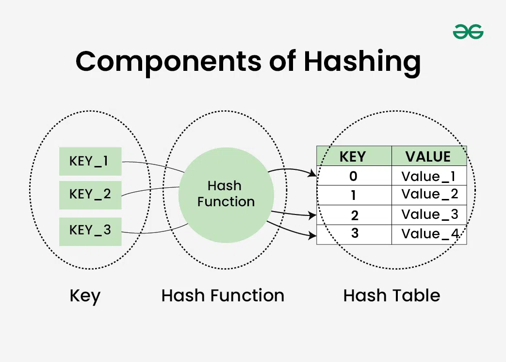

# 자료구조 개념 스터디

안녕하세요 김도겸입니다.  
이번 달 스터디는 해싱(Hashing)과 해시 테이블(Hash Table)를 공부하고 간단한 코드 예제로 구현해본 내용을 정리해보았습니다.

- **해싱(Hashing)**
  - 탐색을 빨리 하고 싶을 땐?
  - 개념
  - 특징
  - 장점 및 단점
- **해시 테이블(Hash Table)**
  - 개념 및 구조
  - 장점 및 단점
  - 예제

<br>

## 1. 해싱(Hashing)

### 🔍 탐색을 빨리하고 싶을 땐?

대부분의 탐색 방법들은 탐색 키를 저장된 키 값과 반복적으로 비교하면서 탐색을 원하는 항목에 접근합니다.  
일반적으로 이러한 방식으로 탐색을 거친다면 정렬이 되어있을 경우와 정렬이 되어 있지 않은 경우의 성능 차이는 매우 클 것입니다.

예를 들어 만약 아무런 시스템 없이 운영하는 도서관/서점이 있다고 가정해보도록 하겠습니다.


원하는 책을 찾으려면 아무런 정리가 안되어 있기 때문에 책장에 꽂혀있는 수많은 책들을 하나하나 비교하면서 찾아봐야 합니다. 운이 안좋다면 처음부터 끝까지 모두 확인해야 하는 것이죠.  
만약 책 제목을 기준으로 정렬이 되어 있다면 찾는 방식에 따라 속도는 조금 차이나겠지만 정렬이 안되어 있는 상태에서 찾는 것보다 훨씬 빠르게는 찾을 수 있을 것입니다.

하지만 그럼에도 불구하고 위 사진과 같은 도서관/서점이라면 무수한 책 중에 원하는 책을 찾는 건 알래스카에서 김상덕씨를 찾는 것 만큼..어려울 것입니다. 😅


그렇기 때문에 효율적으로 책을 찾기 위해서는 기준을 만들어 책을 정리하고 일련의 과정을 거쳐 검색 시스템을 만들어주면 금방 찾을 수 있습니다.  
아래 과정을 보시죠.

```
1. 서가 별로 기준을 잡고 특정 규칙을 세워 서가 번호를 매깁니다. (분야, 제목 등)
2. 규칙에 맞게 책장에 책을 넣고 책별로 서가 번호를 시스템에 매치 시킵니다.
3. 도서 제목을 검색하면 해당 도서 정보 및 서가번호를 노출시켜줍니다.
```

<br>


이렇게 설정해놓으면 흔히 볼 수 있는 서점의 검색 시스템과 유사합니다.  
책 제목을 검색할 시 규칙으로 정해진 구역의 번호가 노출되면 그 구역의 책들만 찾아보면 되는 것이죠.

이러한 시스템을 컴퓨터 속 데이터 구조에 빗대어 데이터를 효율적으로 저장하고, 빠르게 탐색할 수 있는 구조로 만드는 일련의 과정이 바로 오늘 공부하게 될 <b>해싱</b>입니다.

### 개념 및 구조

해싱(Hashing)은 데이터를 일정한 규칙에 따라 변환하여, 효율적으로 저장하고 검색할 수 있도록 하는 기법입니다.  
데이터 별로 크기나, 구조적 특징이 다르므로 고정 크기의 값인 <b>해시 코드(해시 값)</b>으로 매핑하는 과정을 거치는 것을 말하고, 해당 과정에서 해시 코드로 변환해주는 역할을 해주는 함수를 <b>해시 함수</b>라고 합니다.

<br>

### 주요 특징

1. 규칙성: 같은 입력값은 항상 동일한 해시 값을 생성해야 합니다.
2. 빠른 속도: 특정 데이터를 검색하거나 저장할 때 빠른 접근이 가능합니다.
3. 충돌 문제: 서로 다른 입력값이 동일한 해시 값을 갖는 충돌이 발생할 수 있습니다.
4. 비가역성: 해시 값을 통해 원본 데이터를 복원할 수 없습니다.

<br>

### 장점 및 단점

&nbsp; **장점**  
 &nbsp;&nbsp; 1. 빠른 데이터 접근이 가능하다.  
 &nbsp;&nbsp; 2. 중복이 제거된다.  
 &nbsp;&nbsp; 3. 보안이 강화된다.

&nbsp; **단점**  
 &nbsp;&nbsp; 1. 해시 함수가 서로 다른 키에 대해 같은 해시 값을 반환하는 경우 충돌이 발생할 수 있다.  
 &nbsp;&nbsp; 2. 출력 길이 고정이기 때문에 정보 손실 가능성이 있다.  
 &nbsp;&nbsp; 3. 메모리 사용량이 증가할 수 있다.

<br><br>

## 2. 해시 테이블(Hash Table)

### 개념 및 구조

해시 테이블은 **키(Key)**를 해시 함수로 변환하여, 배열의 인덱스로 매핑하는 자료구조입니다.



이를 통해 데이터의 저장과 검색 속도를 획기적으로 향상시킬 수 있다.

- **버킷(Bucket)**: 데이터를 저장하는 공간.
- **슬롯(Slot)**: 버킷 내 개별 저장 위치.
- **해시 함수(Hash Function)**: 키를 특정 인덱스로 매핑하는 함수.
- **충돌 해결 전략(Collision Resolution)**: 같은 해시 값을 가지는 키들의 처리 방법.

### 2.3 해시 테이블 원리

1. 키를 해시 함수에 적용하여 해시 값을 얻음.
2. 해시 값을 이용해 배열(버킷) 내 저장 위치 결정.
3. 동일한 해시 값이 존재하면 충돌 해결 기법 적용.

## 3. 해시 테이블 사용 예시

### 3.1 해시 테이블이 사용되는 곳

- **데이터베이스 인덱싱**: 빠른 조회를 위해 사용됨.
- **캐싱 시스템**: 웹 페이지, DNS 캐싱 등에 활용됨.
- **컴파일러**: 식별자(Symbol Table) 저장.
- **암호화 및 보안**: 해시 기반 데이터 저장 및 인증.

<br>

### ✅ 장점 및 단점

&nbsp; **장점**  
 &nbsp;&nbsp; 1. 기존 탐색 방식보다 데이터 검색이 빠릅니다.  
 &nbsp;&nbsp; 2. 정렬된 데이터 구조가 필요하지 않습니다.  
 &nbsp;&nbsp; 3. 다양한 데이터 형식을 저장 가능하다.

&nbsp; **단점**  
 &nbsp;&nbsp; 1. 해시 함수가 서로 다른 키에 대해 같은 해시 값을 반환하는 경우 충돌이 발생할 수 있다.  
 &nbsp;&nbsp; 2. 정렬이 불가능하고 순서가 보장되지 않는다.  
 &nbsp;&nbsp; 3. 해시 함수 성능에 따라 속도 차이가 클 수 있다.

<br>

### 💥 충돌을 해결하는 방법

해싱 자체의 개념은 타 데이터와 연관성이 없기 때문에 해시 함수에 따라 해시 값이 생성될 때 같은 값을 가졌을 때 <b>'충돌이 발생했다'</b> 라고 합니다.  
충돌이 발생하게 되면 정확한 데이터를 못가져오고 혼동이 발생하게 되는데 이를 방지하려면 어떤 방법들이 있는 지 설명드리도록 하겠습니다.

- <b>1. 체이닝(Chaining)</b>
  동일할 해시 값을 가지는 key들을 다른 버킷
- <b>2. 개방 주소법(Open Addressing)</b>
- <b>2-1. 선형 탐색(Linear Probing)</b>
- <b>2-2. 제곱 탐색(Quadratic Probing)</b>
- <b>2-3. 이중 해시(Double Hashing)</b>

### ⌨️ 예제

```java
import java.util.LinkedList;

class HashTable<K, V> {
    private static class Entry<K, V> {
        K key;
        V value;

        Entry(K key, V value) {
            this.key = key;
            this.value = value;
        }
    }

    private LinkedList<Entry<K, V>>[] table;
    private int size;

    public HashTable(int capacity) {
        table = new LinkedList[capacity];
        for (int i = 0; i < capacity; i++) {
            table[i] = new LinkedList<>();
        }
    }

    private int hash(K key) {
        return Math.abs(key.hashCode()) % table.length;
    }

    public void put(K key, V value) {
        int index = hash(key);
        for (Entry<K, V> entry : table[index]) {
            if (entry.key.equals(key)) {
                entry.value = value;
                return;
            }
        }
        table[index].add(new Entry<>(key, value));
        size++;
    }

    public V get(K key) {
        int index = hash(key);
        for (Entry<K, V> entry : table[index]) {
            if (entry.key.equals(key)) {
                return entry.value;
            }
        }
        return null;
    }

    public void remove(K key) {
        int index = hash(key);
        table[index].removeIf(entry -> entry.key.equals(key));
    }

    public int size() {
        return size;
    }
}

public class HashTableExample {
    public static void main(String[] args) {
        HashTable<String, Integer> hashTable = new HashTable<>(10);
        hashTable.put("apple", 10);
        hashTable.put("banana", 20);
        hashTable.put("orange", 30);

        System.out.println("apple: " + hashTable.get("apple")); // 10
        System.out.println("banana: " + hashTable.get("banana")); // 20

        hashTable.remove("banana");
        System.out.println("banana: " + hashTable.get("banana")); // null
    }
}
```

### 5.1 코드 설명

- `hash()` 메서드: 키의 해시 값을 계산하여 인덱스를 결정.
- `put()` 메서드: 키-값을 저장하며, 충돌 시 체이닝(LinkedList) 기법 사용.
- `get()` 메서드: 키를 이용해 값을 검색.
- `remove()` 메서드: 특정 키를 삭제.

## 6. 결론

해싱과 해시 테이블은 데이터 저장 및 검색의 효율성을 극대화하는 핵심 자료구조이다. 다양한 충돌 해결 기법과 해시 함수 최적화를 통해 성능을 높일 수 있으며, 여러 분야에서 광범위하게 활용되고 있다.
