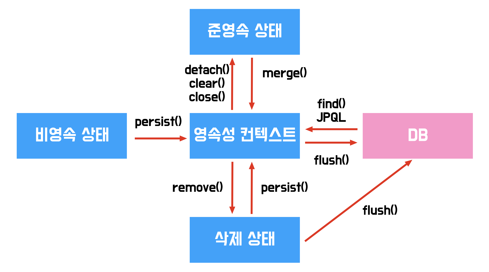

# ORM & JPA 개념 스터디

안녕하세요 김도겸입니다.  
이번 달 스터디는 eLink 4.5를 위해 필요한 기초 개념인 ORM과 JPA 개념에 대해 공부해보고 이를 정리해보았습니다.

<br>

## 1. ORM(Object Relational Mapping)

### 🔍 영속성 개념 짚고 넘어가기

ORM 개념을 설명하기 위해선 먼저 데이터의 특성 중 하나인 **영속성**을 한 번 짚고 넘어가는 것이 좋습니다.


영속성(persistence)은 데이터를 생성한 프로그램의 실행이 종료되더라도 사라지지 않는 데이터의 특성을 의미합니다.  
쉽게 말하면 프로그램에서의 데이터 관련 작업이 이루어진다면, 그것이 프로그램이 실행되고 있는 메모리상에서만 처리가 되는 것만이 아닌 변경 사항을 DB에 저장하여 데이터의 현재 상태를 유지하여야 한다는 거죠.

<br>

### ✏️ 개념

<b>ORM(Object Relational Mapping)</b>은 객체 지향 프로그래밍 언어를 사용하여 호환되지 않는 유형의 시스템 간에 데이터를 변환하는 프로그래밍 기술입니다.


즉, 객체와 관계형 데이터베이스를 매핑하여 객체를 조작하는 것만으로도 데이터를 관리할 수 있는 개념을 말합니다.

위 사진을 보시면 간단한 User 데이터를 만든다고 가정하였을 때 id, name, email 요소가 있다면 객체 지향 언어 상에선 당 User 객체를 만들고, DB에선 해당 요소를 column화하여 하나의 Table을 만듭니다.

이렇게 객체와 테이블이 있을 때 객체의 속성(property)과 DB 테이블의 컬럼(column)을 1:1로 매핑합니다.
이렇게 매핑되어 생성될 객체를 테이블의 한 행(row)로 취급하고 이를 <b>엔티티(Entity)</b>라고 부릅니다.
애플리케이션에서의 객체 상태가 변화(신규, 수정, 삭제) 되었을 때 이를 추적하여 DB에 반영합니다.

ORM과 반대되는 개념인 SQL Mapping 방식에선 연결된 DB 정보를 바탕으로 SQL을 직접 작성하고 호출했을 경우의 결과만 객체로 매핑을 시키는 방식으로 이루어집니다.  
SQL을 중심으로 명시적으로 작성된 쿼리를 바탕으로 움직인다고 보시면 되는데, 반대로 ORM은 객체에 테이블 정보를 연결시키고 선언만 해주면 자동으로 매핑을 시켜주고, 관련 쿼리를 메소드 형식으로 호출할 수 있도록 자동 생성해주는 방식으로 이루어집니다.

<br>

### ⚙️ 기본 작동 원리

위에서 ORM의 작동 방식을 간단히 설명드렸는데요.  
위 작동 방식이 어떤 과정을 거치는 지 한 번 알아보겠습니다.

1. <b>매핑 정보 설정</b>  
   먼저 ORM은 클래스(객체)와 DB테이블의 매핑 정보를 아래와 같은 과정으로 설정해둡니다.

   - 클래스와 테이블 대응
   - 클래스의 필드와 테이블의 컬럼 대응
   - 기본 키, 외래 키와 같은 관계를 정의

   해당 정보는 보통 어노테이션, 설정 파일, 데코레이터 등을 통해 선언됩니다.

2. <b>영속성 컨텍스트 관리</b>  
   ORM은 **영속성 컨텍스트(Persistence Context)**라는 공간을 통해 객체의 상태를 메모리에서 추적하고 관리합니다.

   

   영속성 컨텍스트는 ORM 개념에서 가장 중요한 중간 다리 개념을 해주는 메모리 상의 관리 공간으로 객체와 관계형 DB 테이블을 연결시켜줌으로써 이 둘 사이의 일관성을 유지하고 효율적인 동기화를 위해 캐시 같은 역할을 부여해준 것이라고 보시면 될 것 같습니다.

3. <b>상태 변화 감지</b>  
   ORM이 객체의 값이 바뀐 것을 감지하고, 자동으로 SQL을 생성합니다.

   - 언제?  
     객체의 값이 바뀌었다는 것을 감지하는 기준은 아래 조건 3가지를 만족해야합니다.

     1. 객체가 영속 상태일 때
     2. 객체의 속성 값이 변경되었을 때
     3. 트랜잭션을 커밋하거나 강제 DB 반영 메서드를 호출할 때

   - 어떻게?
     ORM은 객체를 영속성 컨텍스트에 등록할 때, 원본 스냅샷(초기값)을 메모리에 저장해둡니다.

     이후 트랜잭션이 끝나기 직전에 개발자가 수정한 값인 현재 객체의 상태와 최초 저장된 값인 스냅샷의 상태를 비교합니다.

4. <b>SQL 자동 실행</b>  
   위 과정을 거친 후 트랜잭션이 커밋이 되거나, 명시적으로 강제 DB 반영 메서드를 호출하면, ORM은 영속성 컨텍스트에 있는 객체들의 변경 내용을 확인하고 그에 맞는 SQL(INSERT, DELETE, UPDATE)을 자동 생성한 후 실제 DB에 SQL을 실행합니다.

5. <b>데이터 조회 및 매핑</b>  
   데이터를 조회할 때도 ORM이 생성해놓고 사전에 정의된 특정 SQL 문을 사용하거나 상황에 따라 커스텀 쿼리를 만들어낼 수 있습니다.  
   그렇게 생성된 쿼리를 실행하여 결과를 다시 Entity로 매핑에 개발자에게 반환해줍니다.  
   즉, 개발자는 별도의 객체에 결과값을 매핑하여 setting할 필요가 없어집니다.

   > 속성이 많은 객체를 사용하면.... 일일이 setter로 하나하나 값 설정해주거나 생성자로 일일이 값을 넣어주는 건 너무나 번거로운 일이었습니다.

위 5가지의 과정을 거쳐 ORM이 어떻게 작동하는 지를 보았는 데 한 마디로 정리하자면 **"객체의 상태 변화를 감지하여, 그에 맞는 쿼리를 자동으로 생성하고 실행한다."** 라고 할 수 있겠습니다.

<br>

### ✅ 장단점

&nbsp; **장점**  
 &nbsp;&nbsp; 1. SQL이 아닌 Method를 통해 DB 조작이 가능하고 비즈니스 로직을 구성하는데만 집중할 수 있다.  
 &nbsp;&nbsp; 2. Query와 같이 필요한 선언문, 할당 과정 관련된 부수적인 코드를 줄일 수 있고, 가독성을 높일 수 있다.  
 &nbsp;&nbsp; 3. DB가 변경되는 상황에 새로운 쿼리를 다시 짤 필요가 없어진다.

&nbsp; **단점**  
 &nbsp;&nbsp; 1. 프로젝트의 규모가 크고 복잡한 경우에 설계가 잘못되었을 시 속도 저하 및 일관성을 무너뜨릴 수 있다.  
 &nbsp;&nbsp; 2. 복잡하고 무거운 Query는 별도의 튜닝 작업이 필요할 수 있다.  
 &nbsp;&nbsp; 3. 단순 코드에 대한 이해도 뿐만 아니라 작동 원리를 이해하는 데 학습 난이도가 높을 수 있다.

<br><br>

## 2. JPA(Java Persisence API)

### ✏️ 개념 및 기능 설명

앞서 설명드린 ORM은 하나의 범주에 속합니다. 다양한 언어에서 활용되는 통합적인 개념인데요.
언어 별로 많은 ORM 프레임워크/라이브러리가 존재하는데 그 중 JAVA를 대표하는 것이 바로 JPA입니다.


JPA는 자바 진형에서 ORM 기술 표준으로 사용하는 인터페이스 모음(API)입니다.  
자바 어플리케이션에서 관계형 데이터베이스를 사용하는 방식을 정의한 인터페이스이기 때문에 규칙들이 정의되어 있고, 실제로 이 JPA를 기준으로 다양한 구현체들이 존재하며 이를 활용하여 개발할 수 있습니다.  
객체 중심의 프로그래밍과 관계형 데이터베이스의 간극을 해소하고, 코드 속 수동으로 매핑을 진행하고, 쿼리를 작성하는 등의 시간이 많이 걸리는 작업들을 자동으로 처리해주며 불필요한 작업을 줄일 수 있으며 트랜잭션 및 CRUD 처리, 매핑 등을 선언적으로 관리하도록 기능을 제공합니다.

JPA가 가지는 주요 기능은 다음과 같습니다.

| 기능                                       | 설명                                                                                                                                                                                     |
| ------------------------------------------ | ---------------------------------------------------------------------------------------------------------------------------------------------------------------------------------------- |
| **엔티티(Entity)**                         | 데이터베이스 테이블과 매핑되는 자바 클래스. 클래스에 `@Entity`를 붙여 정의하며, 각 필드는 테이블 컬럼에 해당. 객체 지향적으로 데이터 모델을 구성할 수 있게 해준다.                       |
| **영속성 컨텍스트**                        | Entity를 1차 캐시로 관리하는 메모리 공간. Entity의 상태(영속/비영속 등)를 추적하고 변경 사항을 감지해 DB 반영을 자동 처리. 같은 트랜잭션 내 동일 객체는 1개만 유지되어 성능 이점도 있다. |
| **더티 체킹(Dirty Checking)**              | Entity 객체의 필드 값이 변경되면 자동으로 감지하고, 트랜잭션 커밋 시점에 필요한 SQL(UPDATE 등)을 생성해 실행한다. 수동으로 SQL을 작성하지 않아도 변경을 DB에 반영할 수 있다.             |
| **지연 로딩(Lazy Loading)**                | 연관된 Entity를 실제 사용할 때까지 DB에서 조회하지 않고 대기. 성능 최적화에 유리하지만, 사용에 주의가 필요하다 (예: 영속성 컨텍스트 종료 후 사용 시 오류 발생).                          |
| **JPQL (Java Persistence Query Language)** | SQL과 유사하지만, Entity 객체와 그 필드를 기준으로 작성하는 쿼리 언어. 테이블/컬럼이 아닌 클래스/속성을 사용하며, JPA가 이를 SQL로 변환해 실행한다.                                      |
| **CRUD 자동 처리**                         | `EntityManager`의 `persist()`, `find()`, `remove()` 같은 메서드를 사용해 기본적인 INSERT, SELECT, DELETE를 처리할 수 있다. 비즈니스 로직에 집중할 수 있게 도와준다.                      |
| **트랜잭션 처리 지원**                     | `@Transactional` 등의 애노테이션을 통해 선언적으로 트랜잭션 범위를 지정할 수 있다. DB 일관성을 유지하면서 개발자의 부담을 줄여준다.                                                      |

<br>

단순 어노테이션을 붙이는 거 만으로 테이블과 매핑이 되고, Entity가 변경됨을 감지하여 DB에 자동으로 반영하며, 트랜잭션 범위를 임의로 지정하여 하나의 flow를 거칠 때 순차적으로 쿼리가 실행되던 도중 문제가 발생했을 경우 오류를 반환하고 자동으로 롤백하여 상태를 유지할 수 있습니다.

### ⚙️ EntityManager와 Entity의 생명 주기

JPA를 이해하기 위해서 기본 구조와 동작 방식을 알아야 하는데, 이를 설명하기 전에 먼저 알아야 될 핵심 인터페이스가 있습니다.  
바로 EntityManager입니다.

EntityManager는 JPA에서 Entity의 생명주기를 관리하고, 영속성 컨텍스트를 생성/관리하는 핵심 인터페이스입니다.  
주요 기능은 아래 표로 간단히 정리해보았습니다.

## 📌 주요 역할

| 기능                      | 설명                                                                          |
| ------------------------- | ----------------------------------------------------------------------------- |
| **Entity 영속화**         | `persist(entity)` 호출 시 객체를 영속성 컨텍스트에 등록함 (영속 상태 진입)    |
| **조회**                  | `find()`, `getReference()` 등으로 DB 또는 캐시에서 Entity를 조회함            |
| **수정 감지 (더티 체킹)** | 트랜잭션 중 객체의 속성이 바뀌면, 커밋 시 자동으로 UPDATE 실행                |
| **삭제**                  | `remove(entity)` 호출 시, 삭제 예약 상태로 관리됨                             |
| **상태 전환**             | `detach(entity)`로 준영속 상태로 만들거나, `merge(entity)`로 다시 영속화 가능 |
| **Flush**                 | `flush()` 호출 시 영속성 컨텍스트의 변경 내용을 DB에 반영함 (SQL 실행됨)      |
| **트랜잭션 관리**         | 트랜잭션 범위 내에서 EntityManager가 유효하게 유지되어야 함                   |

다음과 같은 기능을 메서드로 제공하여 영속성 컨텍스트를 쉽게 관리할 수 있습니다.

> 비유하자면, EntityManager는 공장 관리자, Entity는 제품, 영속성 컨텍스트는 제품 창고라고 보시면 됩니다.

EntityManager를 알아 보았으니 이제 EntityManager가 관리하는 Entity의 생명주기에 대해 알아보도록 하겠습니다.



- <b>비영속 (Transient)</b>: 아직 DB와 아무런 연관이 없습니다. EntityManager가 모르는 상태입니다.
- <b>영속 (Persistent)</b>: JPA에서 이 객체를 관리할 수 있도록 영속화되어 객체를 Entity로 설정한 상태입니다.
- <b>준영속 (Detached)</b>: 영속 상태였지만 EntityManager에 의해 관리가 중단된 상태로 객체는 남아있지만 JPA가 감시하지 못하는 상태입니다.
- <b>삭제 예정 (Removed)</b>: Entity가 삭제 처리가 될 상태로 트랜잭션 커밋 시 DELETE SQL이 발생합니다.

하나의 Entity가 생성되고 나서 가질 수 있는 4가지의 대표적인 상태입니다.  
간단히 메서드를 호출하는 것만으로 Entity를 설정하여 쿼리를 호출할 수 있는 과정까지 할 수 있다는 것을 보실 수 있습니다.

## ⌨️ 예제로 동작 과정 파보기

EntityManager와 생명 주기를 개념으로 알아보았으니 코드를 활용하여 동작 과정을 간단히 알아보도록 하겠습니다.
실무에선 모두 자동으로 처리해주는 프레임워크, 라이브러리를 사용하기 때문에 내부에선 어떤 동작을 진행하면서 해당 엔티티가 생명 주기를 어떻게 가지고 관리하는 지 모를 수 있어 이를 이해하는 것을 돕는 코드입니다.

### 0. Member 클래스 생성

```java

@Entity
public class Member {

    @Id
    @GeneratedValue(strategy = GenerationType.IDENTITY)
    private Long id;

    @Column(nullable = false)
    private String name;

    // 기본 생성자 (JPA에서 필수)
    public Member() {
    }

    // 편의 생성자
    public Member(String name) {
        this.name = name;
    }

    // Getter/Setter
    public Long getId() {
        return id;
    }

    public String getName() {
        return name;
    }

    public void setName(String name) {
        this.name = name;
    }
}
```

어노테이션을 활용해 엔티티 객체임을 설정해줍니다.

```

 @Entity: 이 클래스가 JPA가 관리하는 엔티티임을 표시
 @Id: 기본 키(PK) 지정
 @GeneratedValue: 자동 생성 전략 (auto_increment와 유사)
 @Column: 컬럼 옵션 지정(table 컬럼과 매핑 작업)

```

### 1. EntityManager 선언 및 트랜잭션 시작

```java
EntityManagerFactory emf = Persistence.createEntityManagerFactory("myUnit");
EntityManager em = emf.createEntityManager(); // 엔티티 매니저 생성
EntityTransaction tx = em.getTransaction();   // 트랜잭션 객체 획득

tx.begin(); // 트랜잭션 시작
```

기본 설정 코드입니다. EntityManager를 생성하고, 트랜잭션 객체를 받아 트랜잭션을 시작합니다.

### 1. Entity 객체 생성 (비영속)

```java
Member member = new Member("userA"); // Memeber 객체 생성
```

먼저 아직 DB와는 전혀 관련 없는 순수한 자바 객체를 생성합니다. 즉, 비영속 상태인 객체인 것입니다.

### 2. EntityManager를 통한 영속화

```java
em.persist(member);
```

객체가 영속성 컨텍스트에 등록되어 영속 상태를 가졌습니다.  
이제 EntityManager에선 해당 member 객체를 관리할 수 있습니다.

### 3. EntityManager 내부 메서드 활용 (조회)

```java
Member found = em.find(Member.class, member.getId());
```

find 메서드는 `SELECT * FROM member WHERE id = ${id}` 쿼리의 역할을 해줍니다.  
별도의 DB 접근 및 setter 코드 없이 해당 메서드를 호출하여 값을 받고, Member Entity에 자동 할당합니다.

### 4. 변경 감지

```java
member.setName("userB");
```

일반 객체라면 단순 setter역할이지만, 영속상태인 Entity라면 이를 통해 변경 감지를 수행합니다.  
즉 해당 메서드를 호출하고 트랜잭션이 커밋될 경우, `UPDATE member SET name = ${name} WHERE id = ${id}` 쿼리가 실행된다고 보시면 됩니다.

### 5. 삭제 (비영속 상태)

```java
Member found = em.find(Member.class, member.getId());
em.remove(found);
```

remove는 Entity를 삭제하는 역할을 합니다.  
즉 해당 메서드를 호출하고 트랜잭션이 커밋될 경우, `DELETE FROM member WHERE id = ${id}` 쿼리가 실행되며 영속성 컨텍스트에서 해당 객체는 제거가 되어 비영속 상태가 됩니다.

### 6. Flush -> Commit

```java
tx.commit(); // flush → SQL 생성 및 실행 → commit
```

변경된 내용을 DB에 반영(flush) 하고 트랜잭션 확정(commit)을 짓습니다.  
트랜잭션이 확정되지 않은 경우에 DB에 반영된 데이터를 Rollback할 수 있습니다.

> @Transactional이라는 어노테이션을 활용하는 것이 대표적입니다.

### 7. 준영속상태 & EntityManager 종료

```java
em.detach(member); // 해당 Entity를 영속성 컨텍스트에서 분리, 준영속 상태로 변경
em.close(); // 영속성 컨텍스트 종료
```

detach 메서드는 해당 Entity를 영속성 컨텍스트에서 분리합니다.
close 메서드는 영속성 컨텍스트 종료로 준영속 상태로 전환합니다.

<br><br>

## 마무리

ORM과 JPA에 대해 알아보았습니다.

ORM과 JPA 개념은 현대적인 Java 개발에서의 필수적인 기술이기 때문에 알고 계시면 도움이 많이 될 것 같습니다.

감사합니다.☺️
