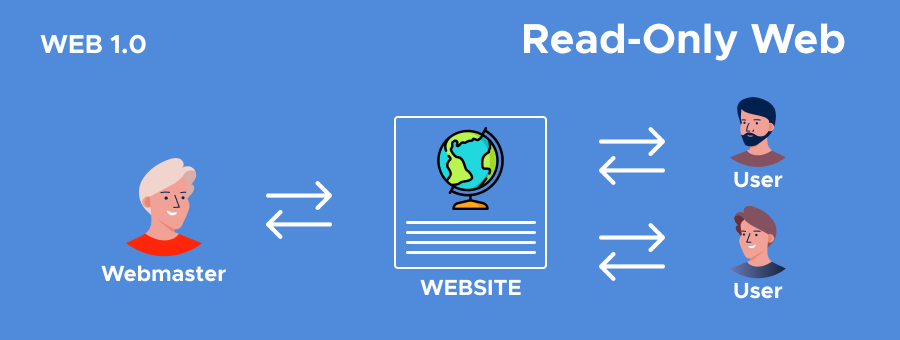
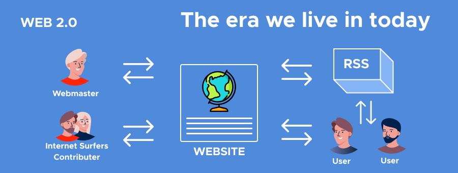
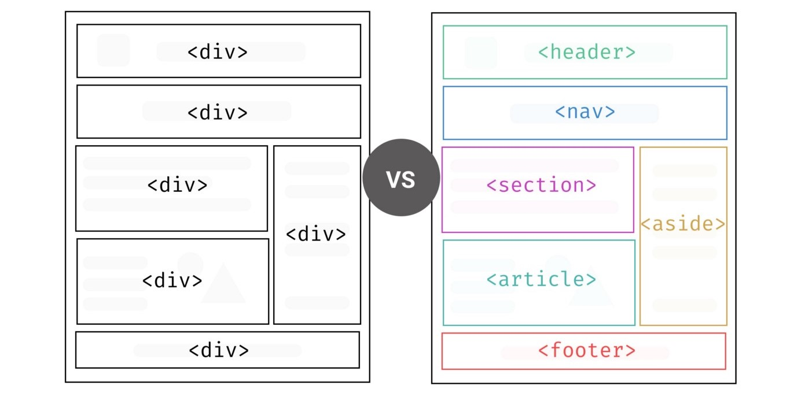
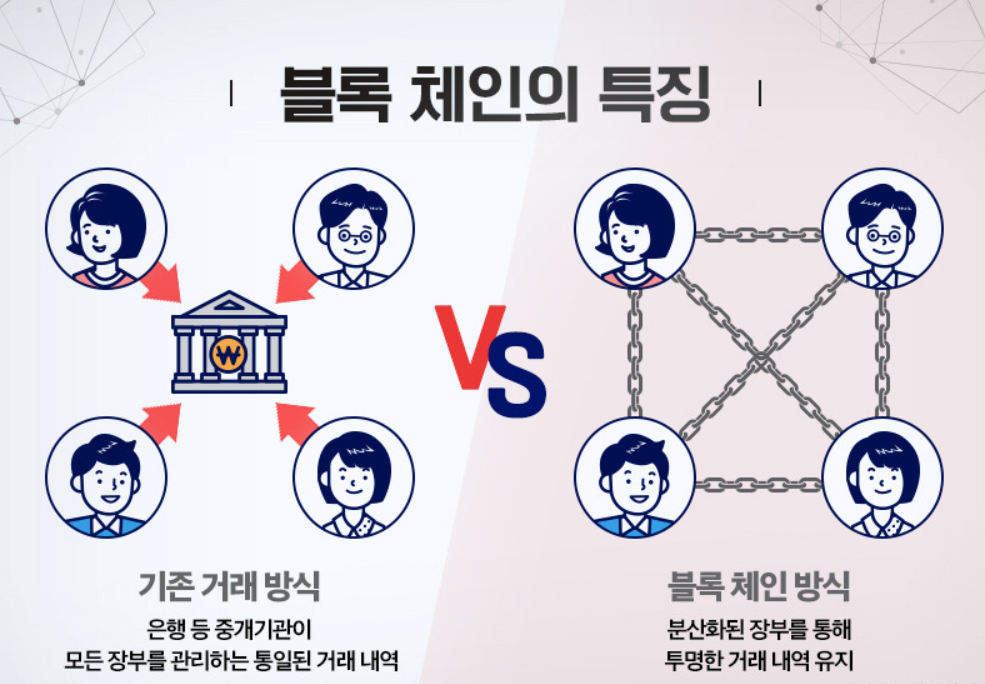
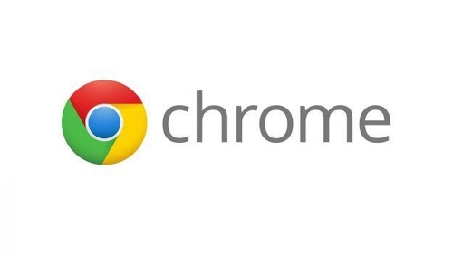

# 웹의 변천사와 프론트엔드 분야의 변화

안녕하세요. 김도겸입니다. <br>
4월엔 교육 지원 프로그램을 활용하여 리액트를 공부해보는 중입니다.  
물론 현재 업무하고 계시는 분야나, 공부하고 계시는 서버쪽 분야와는 거리가 멀 수도 있지만, 흥미로운 분야이면서 꽤나 상용화 되고 있는 기술이기 때문에 소개드리고자 이렇게 발표를 하게 되었습니다.  
리액트를 배우기 전 가장 기초적인 지식인 웹과 프론트엔드 분야의 변화 과정에 대해 알면 좋을 것 같아 정보를 정리해보았습니다.

<br><br>

# 1. 웹의 변천사

웹은 다른 학문이나 기술에 비해 굉장히 빠르게 진화하고 있습니다.  
웹의 역사가 30년 정도 되었지만 큰 패러다임이 2번이나 바뀌었고, 웹 전문 분석가들은 패러다임이 바뀌는 분기점을 기준으로 웹을 1.0, 2.0, 3.0으로 구분하고 있습니다.  
<br>
시기별로 특징과 주요 개념 등을 소개하겠습니다.

## 🌍 Web 1.0

웹 1.0은 웹이 처음 탄생한 1990년부터 웹 2.0이 유행하기 전인 약 2004년까지의 구간을 의미합니다.  
웹이 등장한 이후로 기존의 아날로그 방식과는 비교할 수 없을 정도로 빠르게 필요한 정보를 탐색하고 볼 수 있게 되었습니다.  
넷스케이프, 인터넷 익스플로러 같은 1세대 웹 브라우저가 탄생하였고, 구글 야후와 같은 검색포털이 유행, 이베이, 아마존 등의 온라인 커머스 서비스도 등장하였습니다.  
핵심 기술은 HTML과 ActiveX가 있습니다.


<br>

이 웹 1.0 시대의 핵심 키워드 <b>Read Only</b>입니다.  
정보 공급자 이외의 대부분의 사용자는 정보를 단순히 읽고 소비하는 기능이 가장 큰 시점이었다는 것을 말합니다.
유저들은 단순히 웹에서 뉴스와, 논문, 궁금한 정보 검색, 원하는 물건들을 탐색하고 구매하는 공간 정도였으니 정보 공급자와 소비자의 역할이 엄격하게 구분되었다는 것이 큰 특징 중 하나입니다.

## 🌍 Web 2.0

2004년 이후로는 여러가지 플랫폼 서비스가 등장하며 웹 시장은 큰 혁신이 찾아오게 됩니다.
웹 2.0에서는 단방향으로 소통하던 웹 1.0과는 달리 양방향 소통이 가능하다는 것이 가장 큰 혁신이라고 볼 수 있는데요.  
크롬, 파이어 폭스 같은 확장 브라우저가 탄생하였고, 위키피디아, 블로그, 싸이월드, 페이스북, 트위터, 유튜브 등과 같은 수많은 소셜 미디어 서비스가 등장하였습니다.
핵심 기술은 AJAX, XML, RSS, Tagging 등이 있습니다.


<br>

웹 2.0의 핵심 키워드는 <b>Read and Write</b>입니다.
사용자들은 게시글을 읽는 소비자임과 동시에 글을 작성해 등록할 수 있는 생산자 또한 될 수 있다는 것을 의미합니다.  
이제 웹에서 더 이상 유저들은 보고 읽기만 하지 않고, 자신이 원하는 것과 알고 있는 것을 다른 사람들에게 전달하고 함 게 소통할 수 있게 되었습니다.
또한 여러 제약이 해결된 스마트폰을 만나며 더욱 활성화하고, 더욱 발전하였습니다.

하지만 웹 2.0에서도 고민해볼만한 사항이 한 가지 생겼습니다.  
사용하는 서비스에서 발생하는 데이터는 모두 기업이 소유하고, 정보 소유권도 모두 기업이 가져가는 중앙 집권적 구조를 갖는데, 이를 웹 개발자와 전문가들은 데이터를 분산 저장하여 정보 소유권을 해당 소유자에게 전달해주는 방향으로 중앙의 통제에서 벗어날 수 없을 지 고민하였습니다.

## 🌍 Web 3.0

웹 3.0은 갑자기 생긴 개념이 아닌 웹 2.0의 시대가 진행된 2004년부터 꾸준히 나온 고민과 단점들을 해결하기 위해 꾸준히 거론되었으며 현재까지도 완전하지 않고 개발 진행 중인 시점이라고 보시면 되겠습니다.  
<br>
현재 진행된 웹 3.0의 핵심 키워드는 3가지가 있는데, <b>Semantic Web</b>, <b>탈중앙화</b>, <b>메타버스</b>입니다.

- <b>Semantic Web</b>  
   시맨틱 웹은 웹에 존재하는 수많은 웹페이지들에 메타데이터를 부여하여, 기존의 잡다한 데이터 집합이었던 웹페이지를 '의미'와 '관련성'을 가진 거대한 DB를 구축하고자 하는 발상입니다.  
   HTML에서 사용하는 시맨틱 태그(form, table, img)들이 브라우저, 검색엔진, 개발자 모두에게 콘텐츠의 의미를 명확히 설명하는 역할을 해준다는 것입니다.

  한가지 예로 들자면 바로 이것입니다.

  ```html
  <font size="6"><b>hello</b></font>
  <h1>
    hello
    <h1></h1>
  </h1>
  ```

  위 코드는 동일한 외형을 갖게 되지만, 이는 큰 차이점을 가지고 있습니다.  
   1행의 코드는 아무런 의미가 없이 그냥 font 태그와 b태그를 활용하여 텍스트를 꾸몄지만, 2행의 코드는 header(제목)중 가장 상위 레벨이라는 의미를 가진 h1 태그를 활용하였습니다.

  2행의 요소는 의미를 가지고 있으니 여러가지 측면에서 많은 이점이 있습니다.  
   개발자의 입장에서는 의도한 요소의 의미가 명확히 드러나기 때문에 코드의 가독성을 높이고 유지보수가 용이해집니다.  
   검색엔진에서는 대체로 h1 요소내의 컨텐츠를 웹 문서의 중요한 제목으로 인식하고, 인덱스에 포함 시킬 확률이 높습니다.

  

  > 위 사진처럼 단순 div 태그가 아닌 영역 구분이 가능한 sematic tag들로 더욱 보기 쉬운 시맨틱 웹을 구축할 수 있습니다.

    <br>

  이처럼 시맨틱 웹은 이전 방식의 웹들보다 훨씬 빠르고 정확한 정보를 탐색하고 수집할 수 있게 되었고, 보다 쉬운 웹이 개발되었다는 큰 발전을 이루었습니다.

- <b>탈중앙화</b>  
   탈중앙화는 위 Web 2.0 파트에서 설명드린 고민 사항에 대한 해결방안으로, 데이터를 일부 기업이나 플랫폼이 독점하는 현상에서 벗어난다는 의미를 가집니다.  
   웹 서비스를 이용하는 과정에서 생성된 데이터를 개인이 온전히 소유해 데이터에 대한 통제권을 사용자 본인이 가져오는 형태를 의미합니다.

  이 탈중앙화의 가장 큰 예로는 바로 '블록체인'입니다.

  

  블록체인의 개념은 굉장히 복잡하지만 간단하게 설명하서 데이터를 기록한 장부를 데이터를 만드는데 참여한 사람들에게 나눠주는 기술로, 데이터를 만드는 데 기여한 사람들끼리 정보를 나눠 갖는 구조입니다.  
   이렇게 데이터를 분산 저장할 수 있게 되며, 위변조를 위해서는 정보를 가져간 사람 중 과반수의 동의가 필요했기 때문에 해킹 등 외부 위험으로부터 데이터를 안전하게 보관할 수도 있게 되었습니다.

- <b>메타버스</b>  
   요즘 굉장히 핫한 키워드인 메타버스도 web 3.0의 주요한 키워드입니다.  
   과거의 메타버스는 단순히 3차원으로 구현된 가상 공간이었지만 정보통신기술의 혁신이 더해지면서 가상과 현실이 융합된 디지털 세계로 진화했습니다.
  VR, AR, MR 기술의 발전은 현실과 가상의 경계를 허문 사용자 경험을 제공하였고, NFT를 통해 디지털 자산의 소유권 증명이 가능해지는 등 새로운 디지털 생테계를 형성하고 있습니다.  
   <br>
  메타버스는 경제, 사회 활동이 가능한 공간이자 웹 3.0이 제시하는 새로운 삶의 패러다임이며 많은 분야에서 사업화 시도 중입니다.  
   게임, 엔터테인먼트 뿐만 아니라 공공, 교육 등 거의 모든 분야에서 주목하고 있다는 것입니다.

  

  Web 3.0은 위에서도 말씀드렸다 싶이 현재 진행형입니다.  
   위에서 설명드린 3가지 키워드 뿐만 아니라 인공지능, IOT 등 다양한 기술들이 접목 되어 사회 전반의 엄청나고 새로운 변화와 발전을 이뤄가고 있습니다.  
   Web 3.0이 완성될 때쯤엔 어떤 세상이 되어있을지 굉장히 궁금하고 기대됩니다.

   <br>

# 2. 프론트엔드의 발전

프론트엔드는 웹 서비스 파트에서 갑작스럽게 생겨난 포지션이지만 엄청나게 성장하고 변화하며, 영향력이 확장되고 있습니다.  
비록 프론트엔드라는 포지션은 갑작스럽게 생겨났지만 관련 기술들은 웹이 만들어진 1990년부터 점진적으로 개발되고 발전되고 있었습니다.

모두 세분화하여 개념부터 원리까지 설명하기는 매우 힘들기 때문에 큼직큼직한 기술의 등장과 발전 과정을 간략하게 정리하여 설명드리도록 하겠습니다.

## - CSS의 등장과 웹 디자인의 발전

혹시 업무/스터디를 진행하시면서 아래와 같은 inline 방식으로 HTML에 스타일을 작성해보신 적 있으신가요?  
있으실 수도, 없으실 수도 있지만 추후에 다양한 프로젝트를 경험하다보면 흔히 얘기하는 때려넣기 식의 개발을 진행한 코드를 많이 보실 수 있습니다.

```html
<p>
  안녕!
  <strong style="color:red; text-decoration:underline">
    여기를 빨간색과 밑줄 표기로 강조
  </strong>
  하고 싶어
</p>
```

지금 저 코드만 봤을 땐 크게 문제가 없어보이는데? 라고 생각하실 수 있지만, 많은 분들이 해보셨다시피.. html은 그리 호락호락하지 않습니다.  
만약에 예를 들어 저런 p 태그가 100개가 필요하다면 저 과정을 100번 하셔야 합니다. 일부 태그에 수정이 필요하다면 일일이 찾아서 수정해야 하는 거죠.. 😂
최악의 경우엔 태그 하나를 수정할 때 HTML을 다 뜯어 고쳐야 할 수도 있는 상황이 발생합니다.


이러한 문제때문에 성능과 유지보수 상의 문제가 발생하며 '컨텐츠와 서식을 분리하자'라는 의견이 나오며 탄생한 것이 바로 CSS입니다.  
CSS가 탄생하면서 간결한 코드를 사용해 유용하게 웹 유지보수가 가능해짐과 동시에 브라우저에서 페이지 렌더링 시 발생하는 레이아웃 계산 및 리페인트 작업으로 인한 성능 저하를 줄일 수 있게 되면서 웹 디자인의 엄청난 발전을 이루었습니다.

## - Javascript의 탄생


초반기의 웹 사이트는 모두 정적(static)인 웹사이트였습니다. 여기 계신 모든 분들이 아시겠지만 당연히 HTML만으로 이루어져있기 때문이었죠.  
하지만 당시 개발자들은 이에 대한 한계를 빨리 느꼈습니다. 정적인 페이지로 표현 및 제공하는 웹페이지는 너무나 한정적이니까요..  
이러한 한계점으로 인해 서버뿐만이 아니라 브라우저에서 실행이 가능한 스크립트 언어가 필요해지면서 만들어 진 것이 바로 Javascript입니다.  
이제 서버와 통신을 하기 전에 화면을 조작하거나 서버에 데이터를 전달하기 전에 검증을 하는 등의 기능을 할 수 있게 되었습니다.

## - IE 대중화, 웹 상업화

Windows가 대중화되고, IE가 기본 탑재가 되면서 홈페이지가 모든 기업의 필수가 되어가고 있는 시대가 왔었습니다.  
이로 인해 소비자들의 관심을 사로잡기 위해서, 기업으로서의 경쟁력을 가지기 위해서는 전문적으로 HTML과 CSS, javascript를 다루는 웹 페이지 개발자가 필요했습니다.  
이런 웹 개발자들에게는 실력없는 개발자라는 인식이 만들어진 시기기도 했습니다.

> 웹 개발은 다른 개발자들에 비해 상대적으로 쉬운 개발 난이도와 로직 자체가 중요하지 않은 부분이었기 때문에 실력없는 개발자라는 인식이 생겼다고 합니다.

## - Google의 프로젝트

 

2000년대 중반, 구글에선 Gmail, Google Maps 같은 혁신적인 웹 앱을 내세웠습니다.  
하지만 당시 주류 브라우저는 IE, Firefox, Safari였고, 이 브라우저들의 엔진으로는 JavaScript를 빠르게 실행할 수 없었을 뿐더러 비효율적인 렌더링 구조를 가져 Google은 자사 서비스를 위해 큰 결심을 합니다.

`우리가 제공하는 서비스를 위한 엔진과 브라우저를 만들자`

구글은 웹 개발에 용이해야 했기에 디버그 기능에 공을 들이기 시작했고, js의 성능을 올리기 위해 자체적인 자바스크립트 엔진도 만들기 시작합니다.
그리하여 JavaScript 실행 속도를 획기적으로 개선시킨 V8엔진을 개발하였고, 모던한 UI와 멀티 프로세스, 디버그 기능의 강점을 내세운 Chrome을 등장시켜 웹 시장에 혁신을 일으켰습니다.

이 당시엔 구글 뿐만 아니라 이 시점에서 IE의 독점에 대항하기 위해 여러가지 브라우저들이 이 시기에 만들어지기 시작했고, IE 강점기의 시대에 있었던 하나의 혁명이 되었으며, 웹 브라우저의 발전과 동시에 프론트엔드라는 포지션의 개념에 한 단계 접근하기 시작하게 되었습니다.

## - 프론트엔드의 토대, Ajax

기존에 웹 어플리케이션은 브라우저에서 폼을 채우고 이를 웹서버로 제출하면 하나의 요청으로 웹 서버는 요청 내용에 따라 데이터를 가공하여 새로운 웹페이지를 작성하고, 응답을 되돌려주는 방식이었습니다.  
이 방식은 HTML 코드를 다시 한번 전송받으면서 대역폭의 낭비로 금전적인 손실이 발생할 수도 있고, 상호 반응 서비스를 개발하기엔 어려운 부분도 있었습니다.

이러한 문제의 해결 방안으로 Ajax가 등장하면서 이제 웹 어플리케이션은 비동기로 필요한 데이터만을 웹서버에 요청하여 클라이언트에서 데이터 처리를 할 수 있게 되었습니다.  
ajax가 생겨나면서 javascript는 자원을 그대로 활용해 동적인 화면들을 만들 수 있다는 점에서 다시 재평가를 받게 되었고, 이로 인해 지금의 프론트엔드 포지션이 대충 잡히기 시작했습니다.

## - 웹 표준, 웹 접근성, 크로스 브라우징

웹 종사자들이 다 같이 웹을 쓸 수 있도록 웹 표준을 만들게 되고, 그에 맞춰 HTML, CSS, Javascript를 표준에 맞게 개발하는 능력이 요구되었으며 이때 웹 표준과 함께 장애인들과 같은 경우에도 쉽게 웹을 사용할 수 있도록하는 웹 접근성에 대해서 강조되었습니다.  
또한 웹 표준이 생기면서 최대한 많은 종류의 웹 브라우저에서 정상적으로 작동하는 웹페이지를 만드는 방법론인 크로스브라우징 개념도 등장하였습니다.

이로써 웹디자인의 개념만 존재했던 HTML, CSS, Javascript는 더욱 더 전문성을 요구하는 시점이 오게 되었습니다.

## - jQuery의 등장

javascript가 웹 개발 도구의 대표격이 되면서 개발자들의 관심을 받게 되었고, 아직 열악했던 개발환경에서 대체재가 없었기 때문에 많은 개발자들의 손을 거쳐가며 라이브러리가 발전하였고,
사용법이 발전하게 되었습니다.  
이러한 노력의 결과로 2008년, 웹 표준 API를 모두 포함하면서 훨씬 더 쉬운 문법과 IE 크로스 브라우징, Ajax까지 해결한 괴물 jQuery가 탄생하면서 웹개발의 제2의 전성시대를 맞이하게 되었습니다.

> 이때부터 조금씩 프론트엔드에서 웹 디자이너와 웹 개발자의 영역이 조금 더 분리하기 시작하였습니다.
> 웹 디자인의 결과물을 디자이너가 만들어 넘겨주면 개발자가 사용하여 서버와 이어주는 업무를 해주는 프로세스가 탄생하였습니다.

## - 크롬브라우저, V8 엔진

웹을 통한 OS와 웹 어플리케이션을 다음 목표로 삼았던 구글은 위에서 말했던 과제인 성능 개선에 초점을 두게 되었습니다.  
javascript의 성능을 개선한 V8엔진을 만들어내게 되고 오픈소스로 공유하였습니다.
그리고 그 당시 apple의 safari 오픈소스 웹브라우저 엔진인 webkit을 결합시킨 크롬 브라우저가 탄생하였습니다.  
크롬 브라우저는 매우 빠른 속도와 함께 풍부한 디버깅 환경을 제공함으로써 웹 개발자들의 희망이 되었습니다.

> 크롬이 IE를 완전히 넘어서기엔 한참의 시간이 걸렸습니다만, 웹이 하나의 OS가 되었고, 디버깅 환경으로 인해 웹 개발의 수준이 많이 상승하였습니다.

## - node, npm의 등장

javascript의 발전은 무궁무진이었습니다. 결국엔 javascript를 가지고도 서버 사이드 환경도 개발이 가능한 Node가 개발되었습니다.  
js 개발자 입장에선 새로운 언어의 학습도 필요가 없고, 반대로 서버개발자 역시 js를 활용해 겸사겸사 브라우저 개발도 할 수 있도록 영역이 넓어졌습니다.  
또한 node에서 module이라는 방법을 채택하게 되면서 js에도 module방식의 개념이 조금 더 보편화하게 됩니다.

> module 개념은 필요한 함수들의 집합을 의미하고, 이는 파일을 쪼갬으로써 프로젝트의 규모를 키울 수 있는 계기가 되었습니다.
