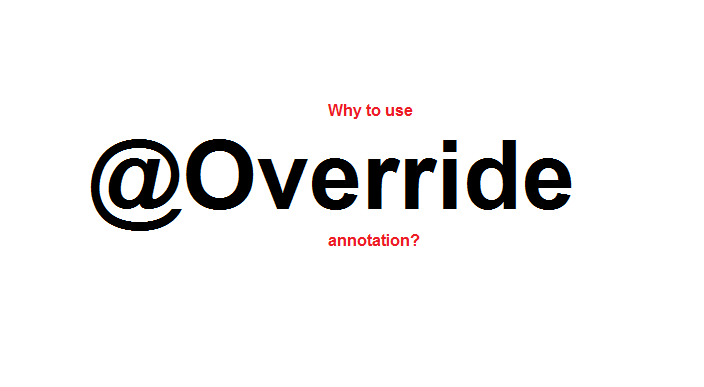

# JPA 매핑 어노테이션 스터디

안녕하세요 김도겸입니다.  
JPA에서의 다양한 매핑 어노테이션에 대해 공부해보고 이를 정리해보았습니다.

<br>

## 어노테이션이란? (Annotation)

먼저 가장 많이 나올 용어인 어노테이션 개념을 한 번 짚고 넘어가 봅시다.



어노테이션은 프로그램 소스코드에 추가하여 사용하는 메타데이터의 일종입니다.  
사전적 의미로는 주석을 뜻하지만 프로그래밍에서는 코드에 추가적인 정보를 제공하여 컴파일러나 다른 프로그램이 특정 기능을 수행하도록 돕습니다.  
주로 `@`기호를 사용하여 표현하고, 이미 정의된 어노테이션뿐만 아니라 원하는 기능을 제공할 수 있도록 어노테이션을 커스터마이징할 수 있습니다.

어노테이션을 사용함으로써 코드가 깔끔해지고 재사용이 가능하고 스프링에선 주로 Bean 객체를 관리하고, 각 클래스별 역할(controller, service, repository) 부여해주는 기능들이 존재합니다.

> 핵심개념이기 때문에 추후 어노테이션의 개념과 원리를 깊게 파고 들어가보도록 하겠습니다.

## 엔티티 매핑 (Entity Mapping)

지난 글에서 개념 정리와 간단한 예제를 통해 엔티티를 설명드렸었습니다.  
엔티티(Entity)는 데이터베이스 테이블과 매핑되는 자바 클래스를 말하며, 객체 지향적으로 데이터 모델을 구성할 수 있게 해주는 역할을 가지고 있는데요.  
이 엔티티 매핑을 위해서 JPA에서는 관련 어노테이션을 사용하여 매핑합니다.  
매핑에 필요한 필수 어노테이션들과 자주 사용하는 어노테이션들을 분야별로 상세히 알아보도록 하겠습니다.

### 📘 1. 클래스 매핑 어노테이션

클래스를 엔티티 객체로 선언해줘야만 JPA를 사용할 수 있기 때문에 클래스 매핑 어노테이션은 가장 먼저 알아야 하는 기본적인 매핑 어노테이션입니다.

대표적인 어노테이션은 Entity 어노테이션과 Table 어노테이션이 있습니다.

**@Entity — 엔티티 선언**

`@Entity`는 클래스가 JPA에서 관리되는 엔티티임을 선언합니다.  
클래스 선언부에 사용하며, final 클래스, enum, interface, inner 클래스엔 사용할 수 없습니다.

| **주요 속성** | 설명                        | 기본값   |
| ------------- | --------------------------- | -------- |
| `name`        | JPQL에서 사용할 엔티티 이름 | 클래스명 |

<br>

✅ 예시

```JAVA
@Entity(name = "MemberEntity")
public class Member { ... }
```

> ✔️ 필수 조건: 기본 생성자, 식별자(@Id)가 포함되어야 합니다.

**@Table — 테이블 매핑**

`@Table`은 DB 테이블과 명칭이 다른 클래스를 매핑합니다.
`@Entity`와 함께 클래스 선언부에 사용하며 @Table이 없으면 @Entity의 이름따라 매핑합니다.

| **주요 속성**       | 설명                              | 기본값      |
| ------------------- | --------------------------------- | ----------- |
| `name`              | 매핑할 테이블 이름                | 엔티티 이름 |
| `catalog`           | DB에 catalog 매핑                 |             |
| `schema`            | DB에 schema 매핑                  |             |
| `uniqueConstraints` | DDL 생성 시 유니크 제약 조건 생성 |             |

<br>

✅ 예시

```java
@Table(
  name = "member",
  uniqueConstraints = @UniqueConstraint(columnNames = {"email"})
)
```

### 📗 2. 필드 매핑 어노테이션

**@Column - 태이블 컬럼 매핑**

`@Column`은 엔티티의 필드를 DB 컬럼을 매핑하는 역할을 합니다.  
필드 선언부에 사용하며 다양한 속성을 활용하여 각종 DB 컬럼 설정을 연동할 수 있습니다.

| **주요 속성**              | 설명                                                                                                             | 기본값         |
| -------------------------- | ---------------------------------------------------------------------------------------------------------------- | -------------- |
| `name`                     | 필드와 매핑할 테이블의 컬럼 이름                                                                                 | 객체 필드 이름 |
| `insertable`, `updateable` | 등록, 변경 가능 여부. false로 설정 시 등록, 변경 불가                                                            | true           |
| `nullable(DDL)`            | null 값 허용 여부. false로 설정 시 DDL 생성 시에 not null 제약 조건 붙음                                         | true           |
| `unique(DDL)`              | @Table의 uniqueConstraints 속성과 같지만 단일 컬럼에만 적용 가능. DDL 생성 시 유니크 제약조건 이름 랜덤으로 설정 | false          |
| `columnDefinition`         | DB의 컬럼 정보 직접 줄 수 있음                                                                                   |                |
| `length(DDL)`              | 문자 길이 제약 조건, String 타입에만 사용 가능                                                                   |                |

<br>

✅ 예시

```java
@Column(name = "username", nullable = false, length = 50, unique = true)
private String name;
```

### 📕 3. 키 매핑 어노테이션

**@Id - 기본 키 매핑**

`@Id`는 엔티티의 기본 키를 매핑합니다. 기본 키는 테이블에서 각 행을 고유하게 식별하는 데 사용합니다.  
@Column과 동일하게 필드 선언부에 사용하고, @Entity 선언 시 포함되어야 할 조건 중 하나입니다.

**@GeneratedValue - PK 자동 생성 전략 매핑**

`@GeneratedValue`는 기본 키 생성 전략을 지정합니다. MySQL에서 auto_increment 역할과 동일한 역할을 해준다고 보시면 됩니다.
@Id와 함께 필드 선언부에 사용하고, strategy 속성에 따라 기본키 생성 전략을 설정할 수 있습니다.

| 속성                                                  | 설명                                      |
| ----------------------------------------------------- | ----------------------------------------- |
| `@GeneratedValue(startegy = GenerationType.IDENTITY)` | 기본 키 생성을 DB에 위임 (Mysql)          |
| `@GeneratedValue(startegy = GenerationType.SEQUENCE)` | DB시퀀스를 사용해서 기본 키 할당 (ORACLE) |
| `@GeneratedValue(startegy = GenerationType.TABLE)`    | 키 생성 테이블 사용 (모든 DB 사용 가능)   |
| `@GeneratedValue(startegy = GenerationType.AUTO)`     | 선택된 DB에 따라 자동으로 전략 선택       |

<br>

✅ 예시

```java
@Id
@GeneratedValue(strategy = GenerationType.IDENTITY)
private Long id;
```

### 📙 4. 관계 매핑 어노테이션

db에서는 테이블 간 관계를 올바르게 설정하는 것이 데이터 무결성과 성능을 유지하는 데 매우 중요한 요소입니다.

예를 들어 쇼핑 사이트가 있다고 가정해봅시다.  
주문 내역을 조회할때 유저 정보를 포함해야 합니다.  
일반적으로 SQL에선 key값을 활용하여 join을 활용해 조회하지만, 코드 상에선 다음과 같은 과정을 거쳐야 만 합니다.

- 주문 데이터를 조회
- 주문 데이터에 존재하는 회원 id 값을 따로 변수에 저장
- 해당 회원 id값으로 회원 데이터를 조회
- 주문 데이터 별로 회원 데이터를 포함한 별도의 객체에 저장

만약 주문 데이터가 단일 데이터가 아닌 복수 데이터라면 리스트에서 반복문을 돌려 객체 별로 key값을 통해 다시 회원 데이터를 가져와야하는 불필요한 과정을 비즈니스 로직 상에서 반복해야 합니다.

그렇기 때문에 관계가 연결된 테이블들에서 데이터 조회 시 효율을 위해 엔티티 간의 관계를 매핑해줘야 하는데 당연히 JPA에는 관계를 쉽게 매핑할 수 있는 관계 매핑 어노테이션들이 존재합니다.

**@ManyToOne - N:1 관계 매핑**

`@ManyToOne`은 다대일 관계를 매핑할 때 사용하는 어노테이션으로 여러개의 엔티티가 하나의 엔티티를 참조하는 구조를 의미합니다.  
 위 예로 가정하면, 한 명의 회원이 여러개의 주문이 가능하기 때문에 주문(Order) 엔티티 관점에서 회원(User) 엔티티를 @ManyToOne으로 매핑할 수 있는 것입니다.

@ManyToOne은 참조할 객체를 선언하고 해당 객체 상단에 사용하고, `@JoinColumn` 어노테이션과 함께 사용하여 외래 키(FK)를 설정하여 컬럼을 참조하도록 합니다.

<br>

✅ 예시

```java
@Entity
public class Order {

    @Id @GeneratedValue
    private Long id;

    @ManyToOne
    @JoinColumn(name = "user_id") // 외래 키 설정 (FK)
    private User user;

    // Getter, Setter 생략
}

```

**@OneToMany - 1:N 관계 매핑**

`@OneToMany`는 일대다(1:N) 관계를 매핑할 때 사용하는 어노테이션으로, 하나의 엔티티가 여러 개의 엔티티를 가질 수 있는 구조를 의미합니다.  
위 예로 가정하면, 한 명의 회원이 여러개의 주문이 가능하기 때문에 회원(User) 엔티티 관점에서 주문(Order) 엔티티를 @OneToMany로 매핑할 수 있는 것입니다.

@OneToMany는 @JoinColumn을 활용하여 단방향 매핑이 가능하며, mappedBy 속성을 활용하여 @ManyToOne을 설정한 엔티티와 양방향으로 매핑이 가능합니다.

<br>

✅ 예시

```java
@Entity
public class User {
    @Id @GeneratedValue
    private Long id;

    @OneToMany
    @JoinColumn(name = "user_id") // Order 테이블의 user_id (FK)
    private List<Order> orders = new ArrayList<>();

    @OneToMany(mappedBy = "user") // Order 엔티티의 user 필드와 매핑
    private List<Order> orders = new ArrayList<>();

    // Getter, Setter 생략
}

```

**@OneToOne - 1:1 관계 매핑**
이번엔 좀 다른 예를 들어보도록 하겠습니다.

### ✏️ Lombok 라이브러리 간단 정리

Lombok 라이브러리는

| 어노테이션            | 설명                                                                                                                                         |
| --------------------- | -------------------------------------------------------------------------------------------------------------------------------------------- |
| `@Getter`             | 모든 필드에 대한 getter 메서드를 자동 생성합니다.                                                                                            |
| `@Setter`             | (필요한 경우) 모든 필드에 대한 setter 메서드를 자동 생성합니다. 엔티티에서는 setter 남발을 지양하고, 필요한 필드에만 사용하는 것이 좋습니다. |
| `@NoArgsConstructor`  | 파라미터가 없는 기본 생성자를 생성합니다. JPA 엔티티는 반드시 기본 생성자가 필요하므로 필수입니다.                                           |
| `@AllArgsConstructor` | 모든 필드를 파라미터로 받는 생성자를 생성합니다.                                                                                             |
| `@Builder`            | 빌더 패턴을 적용한 객체 생성을 지원합니다. 가독성이 좋고, 생성자 파라미터 순서 실수를 방지할 수 있습니다.                                    |
| `@ToString`           | toString() 메서드를 자동 생성합니다. 디버깅에 유용합니다.                                                                                    |
| `@EqualsAndHashCode`  | equals()와 hashCode() 메서드를 자동 생성합니다. 엔티티 비교에 사용됩니다.                                                                    |

<br>

<br><br>

## 마무리

JPA 활용을 위한 가장 기본적인 매핑 어노테이션에 대해 알아보았습니다.

감사합니다.☺️
