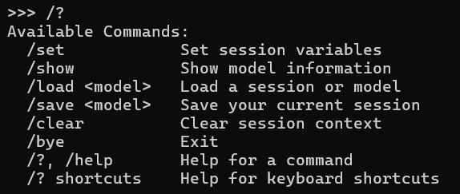
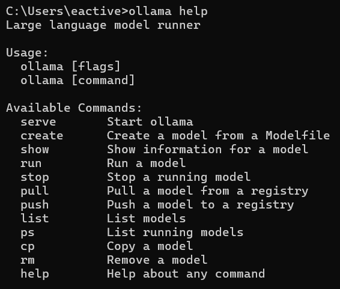

# Ollama 소개

안녕하세요 김도겸입니다.  
이번 달 2주차 스터디는 Ollama에 대해 간략히 소개해보고 직접 사용해보며 느낀 점에 대해 발표해보도록 하겠습니다.

 

## LLM 짚고 넘어가기

본격적인 소개에 앞서 가장 기반이 되는 개념인 LLM에 대해 알아보도록 하겠습니다.

요즘 ChatGPT와 같은 대화형 인공지능 서비스는 굉장히 주목할 만한 핵심 분야이자, 실생활에서 유용하게 사용되고 있는데요.  
특히 저희와 같은 개발자들에겐 없어서는 안 될 서비스입니다.

 

> 수많은 개발자들의 스트레스성 질환을 해결해주는 명의가 되어가고 있지만, 가끔 발목을 심하게 잡을 때도 있습니다 😅  
> 제 미래 진로에 있어... 위협을 가할 때도 있구요.. 😂

LLM(Large Language Model)이란 방대한 양의 대규모 텍스트 데이터셋로 사전 학습된 초대형 딥러닝 모델입니다.  
단순한 텍스트 생성, 번역, 요약, 질문 응답에서 나아가 최근엔 자율적으로 실시간 검색을 통해 이공계열 문제 및 상식 등을 추론해내는 기능도 해내고 있습니다.

LLM은 입력 텍스트를 토큰화하여 벡터로 변환하고, Transformer 레이어를 통해 문맥적 의미를 파악하여, 다음에 올 토큰을 예측하는 방식으로 텍스트를 생성해 과정을 거쳐 데이터를 제공합니다.

대표적인 LLM으론 Claude, Gemini, GPT 등이 있습니다.

  

## Local LLM

### 🔍 Local LLM 기본 설명

흔히 우리가 사용하는 인공지능 서비스들은 웹 상에서 사이트를 접속하거나, 앱을 실행하여 제공되는 서비스를 활용합니다.  
즉 Online 상의 각 기업에서 제공하는 클라우드 서버에 LLM이 내장되어 있고, 이를 활용하기 위해선 인터넷에 접속하여 해당 서비스 사이트에 접속하여 사용해야 하는 것이죠.  
그런데 저희가 주로 업무하는 금융권 회사들은 폐쇄적인 환경 속에서 개발 업무를 진행해야 합니다.
내부에서 chat gpt를 사용하려고 한다면 외부망이 연결된 PC를 활용해야 하거나, 이 또한 없으면 핸드폰으로 접속하여야 하는데 실제로 업무해보신 분들은 아시겠지만.. 굉장히 번거롭고 힘든 과정입니다. 특히 검색할 내용이 많다면 복/붙이 안된다는 단점도 있으며 민감한 개인정보가 오가는 경우가 많기 때문에 더더욱 쓰기가 두려워지죠.

이러한 문제를 해결하기 위해 나온 것이 바로 Local LLM입니다.

Local LLM은 용어 그대로 개인 PC 또는 서버에 설치하여 local 환경에서 실행 가능한 LLM을 의미합니다.
ChatGpt와 같은 기존 서비스에선 인터넷을 통해 서비스 제공자의 서버로 전송되며 거기에서 처리된 후 결과를 반환 시켜주는 것과 달리 파일로서 공개된 모델을 자신의 PC에 설치하여 개인 PC 내부에서 이 과정을 처리합니다.

최근엔 이 Local LLM을 위해 Llama, Mistral, Phi, Gemma 등의 오픈소스 모델들이 공개되어 개인 PC에서도 잘 작동하도록 크기 및 성능을 조절하여 최적화한 모델도 늘고 있습니다.

### ✅ 장단점

&nbsp; **-장점-**

- **보안:** 데이터 유출 위험 감소
- **개인 정보 보호:** 민감한 정보 안전하게 처리
- **오프라인 사용:** 인터넷 연결 없이 사용 가능
- **커스터마이징:** 특정 목적에 맞게 모델 fine-tuning 가능
  > <b>fine-tuning:</b> 학습된 모델을 특정 작업이나 응용 프로그램에 맞게 조정하는 과정을 의미합니다.

&nbsp; **-단점-**

- **높은 초기 비용:** 고성능 GPU 필요
- **기술적 지식 필요:** 설치 및 설정에 대한 이해 필요
- **모델 관리:** 모델 업데이트 및 유지보수 필요

  

## Ollama

Local LLM에 대해 알아 보았는데요.  
모두 아시다시피 이 Local LLM만 있어서는 우리와 같은 일반 사용자들은 관리하거나, 사용하고 실행할 수 없습니다.  
그렇기 때문에 Local LLM을 실행하기 위한 다양한 툴을 각종 기업에서 제공하고 있고, 그 중 가장 많이 사용하는 툴이 바로 오늘 발표 주제인 <b>Ollama</b>입니다.

### 🔍 What is Ollama?

<b>Ollama</b>는 Local LLM을 로컬 환경에서 실행할 수 있게 해주는 오픈 소스 도구입니다.  
LLM 사용의 진입 장벽을 낮추고 개발자들이 쉽게 LLM을 활용할 수 있도록 도우며, Local LLM 생태계를 활성화시키는 것이 Ollama의 목표로, 현재 다양한 개발 분야에 쉽게 사용될 수 있도록 200명 이상의 기여자가 GitHub에서 활발히 활동하고 있고 타 도구에 비해 가장 활발한 커뮤니티를 가졌습니다.

 

### 🛠️ 핵심 특징 & 아키텍처

 

&nbsp; **컨테이너 기반 아키텍처**

- LLM을 컨테이너 이미지로 관리
- 모델, 의존성, 설정 등을 하나의 패키지로 묶어 배포
- 격리된 환경에서 실행하여 안정성 확보

&nbsp; **레이어링 시스템**

- 기본 모델 위에 추가적인 레이어를 쌓아 커스터마이징
- 프롬프트 템플릿, 시스템 메시지 등을 레이어로 관리
- 재사용성 및 유지보수성 향상

&nbsp; **API 서버**

- Local LLM을 API 형태로도 제공.
- HTTP 엔드포인트를 통해 LLM 기능 사용 \* 다양한 프로그래밍 언어에서 LLM 활용 가능

 

### ✅ 장단점

&nbsp; **-장점-**

- **간편한 설치 및 사용:** 몇 번의 명령어로 LLM 설치 및 실행 가능
- **다양한 모델 지원:** Llama 2, Mistral, Gemma 등 다양한 모델 지원
- **크로스 플랫폼:** macOS, Linux, Windows 지원
- **커뮤니티 지원:** 활발한 커뮤니티를 통해 정보 공유 및 문제 해결 가능

&nbsp; **-단점-**

- **GPU 성능 의존적:** LLM 추론 속도는 GPU 성능에 따라 달라짐
- **모델 크기 제한:** GPU 메모리 크기에 따라 사용 가능한 모델 크기 제한
- **초기 모델 다운로드 시간:** 모델 크기가 클 경우 다운로드 시간 소요

 

### ⚙️ 기본 사용법

Ollama의 특징과 장단점을 알아보았으니 이제 Ollama의 기본 기능을 사용해보도록 하겠습니다.  
(예시 이미지는 윈도우를 기준으로 하였습니다.)

- <b>Ollama 설치</b>
    
  [https://ollama.com/download](https://ollama.com/download)에 접속하여 본인이 원하는 OS를 클릭한 후 다운로드받습니다.

    
  다운로드가 완료되었다면 이 OllamaSetup.exe 파일이 있을 것입니다. 클릭하여 실행시켜주세요.

    
  실행하시고 Install 버튼을 클릭하여 설치하면 됩니다.

    
  설치가 제대로 되었는 지 확인해보기 위해 cmd를 키고 `ollama` 명령어를 쳐봅시다.  
  관련 명령어에 대한 설명을 보여주는 것을 보니 정상적으로 설치된 것 같습니다.👍

  > 설치 확인은 `localhost:11434` 에 접속하여 확인도 가능합니다.

   

- <b>Ollama 자체 실행하기</b>  
  이제 설치가 완료되었으니 이제 cmd에서 Ollama를 활용해 Local LLM을 install하여 실행해보도록 하겠습니다.  
  먼저 사용할 Local LLM을 찾아봐야겠죠?

    
   [https://ollama.com/search](https://ollama.com/search)에 접속하여 찾아본 후 마음에 드는 LLM을 선택합니다.

  실행하는 방법은 간단합니다. `ollama run [활용할 LLM]` 명령어를 입력하면 됩니다.  
  만약 해당 모델이 이미 설치되어 있다면 실행이 될 것이고 설치가 되어 있지 않다면 아래 이미지와 같이 모델 설치를 진행합니다.

  

  > 저는 LG에서 개발한 Local LLM인 Exaone 3.5를 사용해보았습니다.

  설치가 완료되면 자동으로 실행이 되며 이제 gpt를 사용하는 것처럼 질문해보면 됩니다. 🙂  
    
     
   

  위와 같이 Ollama를 활용하면 간단한 명령어 만으로 로컬 환경에서 LLM을 사용할 수 있습니다!

   

- <b>그 밖의 명령어</b>

  - LLM 실행 상태에서의 Command

    `/?`를 입력하여 LLM 실행상태에서의 명령어들을 알아보도록 하겠습니다.

    

    | 명령어          | 설명                                                                                                                                                                                                                       |
    | --------------- | -------------------------------------------------------------------------------------------------------------------------------------------------------------------------------------------------------------------------- |
    | `/set`          | 세션 변수를 설정합니다. LLM의 동작 방식이나 응답 스타일을 변경하기 위해 사용할 수 있습니다. 구체적인 사용법은 Ollama 버전에 따라 다를 수 있으므로, `/help set` 명령어를 통해 자세한 정보를 확인하는 것이 좋습니다.         |
    | `/show`         | 모델 정보를 보여줍니다. 현재 실행 중인 LLM의 이름, 크기, 레이어 정보, 설정 파라미터 등을 확인할 수 있습니다. 모델의 상세 정보를 파악하고 싶을 때 유용합니다.                                                               |
    | `/load <model>` | 특정 세션 또는 모델을 불러옵니다. 이전에 저장한 세션을 불러와서 대화를 이어가거나, 다른 LLM 모델로 전환하여 사용할 수 있습니다. `<model>` 부분에는 불러올 세션 또는 모델의 이름을 정확하게 입력해야 합니다.                |
    | `/save <model>` | 현재 세션을 저장합니다. 대화 내용, 모델 설정, 세션 변수 등을 저장하여 나중에 다시 불러와서 사용할 수 있습니다. `<model>` 부분에는 저장할 세션의 이름을 입력합니다. 저장된 세션은 `/load` 명령어를 통해 불러올 수 있습니다. |
    | `/clear`        | 세션 컨텍스트를 초기화합니다. 현재 대화 내용을 모두 지우고 새로운 대화를 시작할 때 사용합니다. 이전 대화 내용이 LLM의 응답에 영향을 미치지 않도록 하고 싶을 때 유용합니다.                                                 |
    | `/bye`          | Ollama 세션을 종료합니다. LLM과의 연결을 끊고 Ollama 프롬프트를 종료합니다. 더 이상 LLM을 사용하지 않을 때 사용합니다.                                                                                                     |
    | `/?`, `/help`   | 명령어 도움말을 보여줍니다. 사용 가능한 명령어 목록과 각 명령어에 대한 간단한 설명을 확인할 수 있습니다. 명령어 사용법이 궁금할 때 활용합니다.                                                                             |
    | `/? shortcuts`  | 키보드 단축키 도움말을 보여줍니다. Ollama 프롬프트에서 사용할 수 있는 키보드 단축키 목록을 확인할 수 있습니다. 단축키를 활용하면 Ollama를 더욱 효율적으로 사용할 수 있습니다.                                              |

     

  - Ollama Command

    `ollama help` 명령어를 입력하여 Ollama 자체 명령어를 알아보도록하겠습니다.

    

    | 명령어   | 설명                                                                                          |
    | -------- | --------------------------------------------------------------------------------------------- |
    | `serve`  | Ollama 서버를 시작합니다. API 서버가 실행되어 LLM을 사용할 수 있는 상태가 됩니다.             |
    | `create` | Modelfile을 기반으로 새로운 모델을 생성합니다. 커스터마이징된 모델을 만들 때 사용합니다.      |
    | `show`   | 특정 모델의 정보를 보여줍니다. 모델의 세부 정보, 설정 등을 확인할 수 있습니다.                |
    | `run`    | 선택한 모델을 실행합니다. 대화나 추론 등 실제 LLM 기능을 사용할 수 있습니다.                  |
    | `stop`   | 실행 중인 모델을 중지합니다. 더 이상 해당 모델을 사용하지 않을 때 사용합니다.                 |
    | `pull`   | 레지스트리에서 모델을 다운로드(가져오기)합니다. 공개된 모델을 내 환경에 설치할 때 사용합니다. |
    | `push`   | 모델을 레지스트리에 업로드(올리기)합니다. 내가 만든 모델을 공유하거나 백업할 때 사용합니다.   |
    | `list`   | 현재 설치된 모델 목록을 보여줍니다. 내 환경에 어떤 모델이 있는지 확인할 수 있습니다.          |
    | `ps`     | 현재 실행 중인 모델 목록을 보여줍니다. 어떤 모델이 동작 중인지 확인할 수 있습니다.            |
    | `cp`     | 모델을 복사합니다. 기존 모델을 기반으로 새로운 모델을 만들 때 사용합니다.                     |
    | `rm`     | 모델을 삭제합니다. 더 이상 필요 없는 모델을 정리할 때 사용합니다.                             |
    | `help`   | 명령어에 대한 도움말을 보여줍니다. 각 명령어의 사용법을 확인할 수 있습니다.                   |

 

### 🖥️ 활용 방안

- <b>docker를 활용한 서버 내 LLM 구축</b>  
  Docker를 활용하면 서버 환경에 LLM(대형 언어 모델)을 손쉽게 구축하고 관리할 수 있습니다.

  

  Ollama는 Docker와 유사한 컨테이너 기반 아키텍처를 제공하지만, 실제 Docker 컨테이너로 Ollama를 실행하면 다음과 같은 이점이 있습니다.

  - Docker Image를 활용하여 어떤 환경에서든 LLM을 실행 가능 및 용이한 빌드 및 배포 가능
  - 개발 환경과 운영 환경의 차이 문제 최소화
  - 필요에 따라 여러 컨테이너를 띄워 LLM 서비스를 확장 가능
  - 컨테이너는 호스트 시스템과 격리되어 있어, LLM 실행 시 발생할 수 있는 보안 문제 완화
  - 각 인스턴스를 별도의 컨테이너에서 실행하여 충돌이나 자원 간섭을 방지
  - Docker Compose 등의 도구를 활용해 여러 LLM 서비스와 관련 인프라(예: 데이터베이스, 캐시 등)를 한 번에 관리할 수 있습니다.
  - 컨테이너 상태 모니터링, 자동 재시작 등 운영 관리가 용이합니다.

 

- <b>다양한 기술 연동</b>  
  최근 AI 인프라가 확장되며 단순히 문답을 주고받는 것 뿐만 아니라 시각자료 생성, 내용 분석 및 추론 기능 향상, 하드웨어 연동, 업무 자동화 등이 가능해지고 있습니다.

  Ollama를 활용하여 Local LLM을 구축함과 동시에 다양한 다른 기술을 연동하여 개인적 성향의 AI 시스템을 갖출 수 있습니다.

  아래 기술들은 Local LLM과 연동하여 사용하는 대표적인 기술들입니다.

   

  <b>1. 파이프라인/워크플로우 프레임워크 (MCP, RAG 등)</b>

  | 기술명                               | 설명                                                                               |
  | ------------------------------------ | ---------------------------------------------------------------------------------- |
  | MCP (Multi-Component Pipeline)       | 여러 AI 컴포넌트(LLM, 검색, 요약 등)를 파이프라인으로 연결하여 복합 AI 서비스 구현 |
  | LangChain                            | LLM 기반 워크플로우 및 에이전트 구축 프레임워크                                    |
  | Haystack                             | 검색, LLM, 데이터 파이프라인 등 다양한 AI 컴포넌트 통합 프레임워크                 |
  | RAG (Retrieval-Augmented Generation) | 검색 기반 LLM 응답 생성 아키텍처, Ollama와 연동 가능                               |
  | AutoGen                              | 여러 LLM/에이전트 간 협업 및 파이프라인 구축 프레임워크                            |
  | CrewAI                               | 여러 AI 에이전트 협업 및 워크플로우 자동화 프레임워크                              |

  <b>2. 데이터/검색/연결 프레임워크</b>

  | 기술명                    | 설명                                           |
  | ------------------------- | ---------------------------------------------- |
  | LlamaIndex                | 외부 데이터와 LLM을 연결하는 데이터 프레임워크 |
  | Hugging Face Transformers | Ollama와 모델 교환, 파이프라인 연동 등         |

  <b>3. API/자동화/연동 인프라</b>

  | 기술명                  | 설명                                                                |
  | ----------------------- | ------------------------------------------------------------------- |
  | RESTful API             | Ollama의 HTTP API를 활용한 다양한 외부 시스템 연동                  |
  | Zapier/IFTTT            | Ollama API와 외부 서비스 자동화 연동 (MCP/워크플로우의 인프라 역할) |
  | OpenAI Function Calling | 외부 함수 호출 및 도구 연동을 지원하는 LLM 기능                     |

  <b>4. 웹/앱/서비스 프레임워크</b>

  | 기술명             | 설명                                                |
  | ------------------ | --------------------------------------------------- |
  | FastAPI            | Ollama API와 연동하여 AI 서비스 REST API 서버 구축  |
  | Flask              | 경량 웹 서버로 Ollama와 연동한 챗봇/AI 서비스 구현  |
  | Streamlit          | Ollama 기반 AI 앱의 대시보드 및 인터랙티브 UI 구축  |
  | Gradio             | Ollama LLM을 활용한 AI 데모 및 웹 인터페이스 제공   |
  | VS Code Extensions | Ollama API를 활용한 코드 자동완성, AI 어시스턴트 등 |
  | Slack/Discord Bot  | Ollama LLM을 연동한 챗봇 서비스 구현                |

 

## 마무리

Ollama에 대해 알아보았습니다.  
단순히 `폐쇄된 환경에서 Chat GPT를 사용할 수 없을까` 라는 생각으로 찾아보기 시작한 기술이었지만 생각보다 다양한 방식으로 활용하여 `내 컴퓨터 안의 작은 전용 AI`를 갖출 수 있다는 것에 신기함을 느끼게 되는 시간이었습니다.  
물론 현재 chatGPT, Gemini와 같은 생성형 AI의 기능을 갖추기엔 부족하지만 분명 주목해봐야 할 기술이며, 보안이 중요시되는 분야와 밀접하게 연관된 저희의 업무에도 알아두면 분명 도움이 되지 않을까 생각해봅니다.  
추후에 기회가 된다면 관련 지식을 공부한 후 간단한 로컬 챗봇을 한 번 만들어 봐도 좋을 것 같습니다.

감사합니다😄
