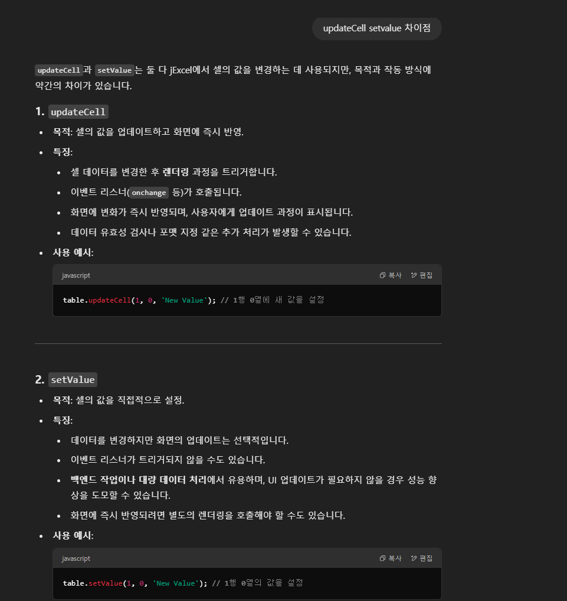
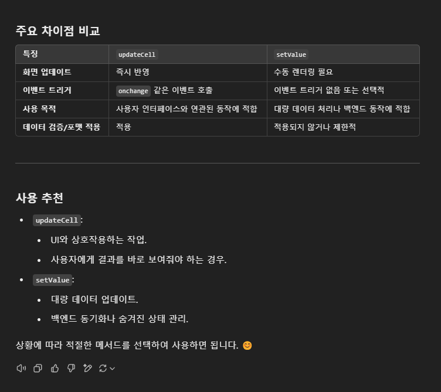
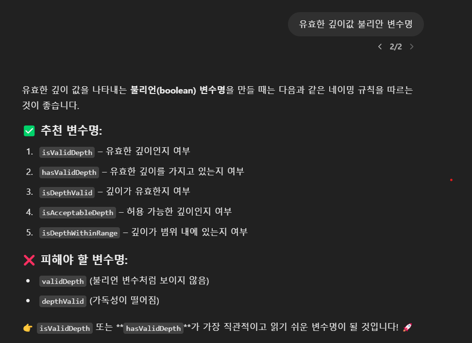
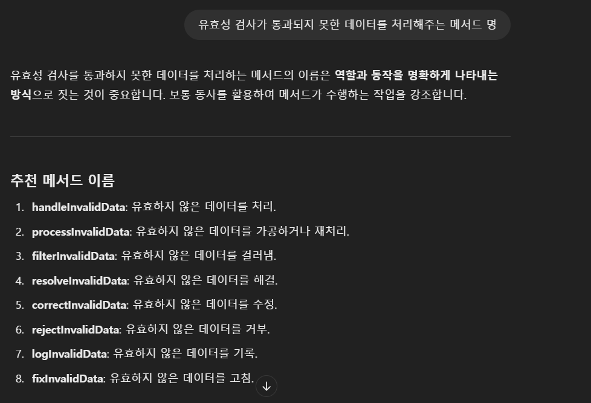
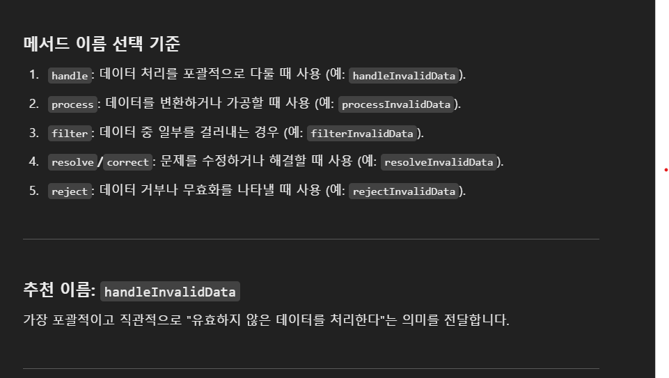

# 생성형 AI 활용 사례

안녕하세요, 김도겸입니다.

제가 실무 속 생성형 AI(ChatGPT)를 활용했던 사례 중 2가지 정도를 채택하였고, 활용하면서 느꼈던 점을 발표하기 위해 간단히 글과 사진을 활용해 정리해보았습니다.

  

## ✅ 활용 사례 1 - 라이브러리 활용 방법

실무를 진행하게 되면서 다양한 라이브러리를 이용하여 개발을 진행하는 경우가 많았습니다.  
이에 따라 라이브러리 공식 document를 참조하여 설치 방법 및 이용법을 익혀야 하는데, 간혹 특정 라이브러리는 document가 가독성이 안좋거나 업데이트가 안되어 있는 경우도 종종 존재하였습니다.

이러한 상황에 효율적인 개발을 위해 ChatGPT를 활용하여 업무를 진행하였습니다.  
아래 예시 사진은 제가 실제 화면 개발 시 사용한 라이브러리에 관한 간단한 코드 및 이벤트를 묻고 사용법을 알려준 화면입니다.

위 예시 사진은 제가 사용한 jExcel이라는 라이브러리의 코드의 기능을 알기 위해 질문하여 얻은 답변입니다.  
제 질문을 위한 적절한 답변과 간단한 예시 코드를 보여줍니다.

이뿐만 아니라 본인이 한 대답을 간단히 정리하여 표 형태로 시각화 및 어떤 코드가 어떤 상황에 적합한지 추천해주는 답변까지 마무리해 주는 모습을 보실 수 있습니다.

 

## ✅ 활용 사례 2 - 변수명, 함수명, 클래스명 추천 받기

변수명/함수명/클래스명을 명명할 때는 각각의 규칙에 맞춰 변수/메서드/클래스가 어떤 기능을 하는 것인지 명확하고 간결히 명시합니다.  
하지만 기능에 따라 너무 길거나, 유사한 의미를 가진 다양한 단어가 있기 때문에 상황 별로 어떤 단어를 사용하여 명명해야 할 지 고민할 때가 종종 존재하였습니다.

이럴 때 ChatGPT를 활용하여 변수명/함수명/클래스명을 추천받아 사용해보았습니다.

  
위 사진처럼 제가 선언하고자 하는 변수명을 물어봤을 때 추천하는 변수명과 피해야 할 변수명을 제공해 준 후 가장 적합한 함수명을 선정해줍니다.  
 

마찬가지로 함수명도 추천하는 함수명과 더불어 기능에 따른 적절한 선택 기준을 제공해주고 적합한 함수명을 선정해줍니다.

 

## 📌 생성형 AI를 활용하며 느낀점

- **너무 남용하지 말자.**  
  처음 ChatGPT를 사용할 때에는 뭔가 신세계를 경험한 기분이었습니다.  
  평소에 많은 시간을 들여 찾아야 하는 것을 질문 하나로 해결되는 것이 매우 편리해 뭔가 고민할 거리가 생겼다 싶으면 ChatGPT를 키려고 했습니다.  
  그렇게 되니 뭔가 제 일을 다 미뤄버리는 거 같고, 제 머리에 남는 것이 없는 것 같다고 느껴 너무 남용해선 안된다는 점을 깨달았습니다.
  (현재는 어떻게 사용하는 지 내용 추가)

- **다시 한 번 짚고 넘어가보자.**  
  질문의 의미를 잘못 이해한 경우나 관련된 정보가 너무 부족하여 교육이 덜 되어있는 경우엔 때때로 잘못된 답변을 주는 경우가 있었습니다.  
  그렇게 될 경우 효율적인 업무가 가능하다는 장점이 사라져버리고, 한 번 해메면 계속 해메는 경우가 존재합니다.  
  특히 예제를 답변으로 제공한 경우엔 너무 맹신해서 예제를 사용해선 안되고 한 번 정도는 검색해보고 관련 문서를 찾아보는 습관을 가졌습니다.

- **deep한 질문은 자제하자.**  
  생성형AI의 보안문제들이 계속해서 대두되고 있어 실무에 직접적인 영향을 미치는 핵심 코드 등을 직접 올리는 행위나 개인 정보 사항을 담아선 안되기 때문에,
  주로 코드 관련된 질문은 규칙, 알고리즘, 사용법 정도만 질문하는 것이 적절하다는 것이 느꼈습니다.
